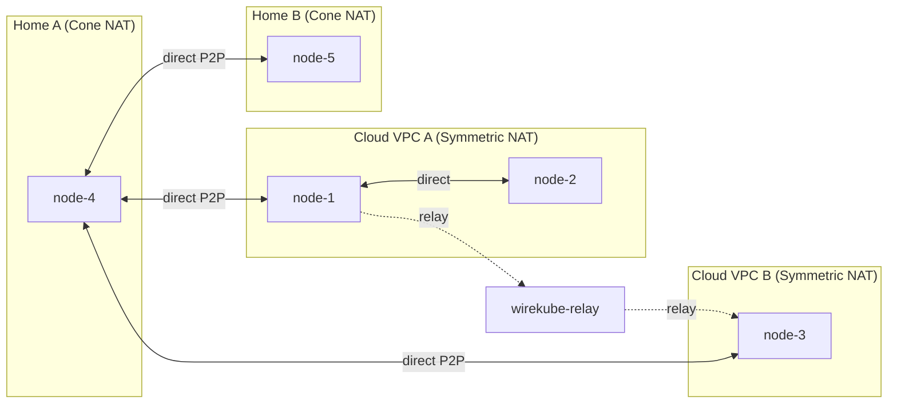

# WireKube

Serverless P2P WireGuard mesh VPN for Kubernetes.

Uses Kubernetes CRDs as the coordination plane — no external etcd, relay server, or coordination server is required by default. Nodes discover each other via `WireKubePeer` CRDs and establish direct WireGuard tunnels. Direct P2P works between Cone NAT peers and even between Cone and Symmetric NAT peers (the Cone side's stable mapping allows handshake initiation). Only when both peers are behind Symmetric NAT is traffic routed through a TCP relay, preserving WireGuard's end-to-end encryption.

The NAT traversal strategy is inspired by [Tailscale's approach](https://tailscale.com/blog/how-nat-traversal-works): start with a relay path for immediate connectivity, probe for direct paths in parallel, and transparently upgrade when a better path is found.

**[Documentation](https://inerplat.github.io/wirekube/)**



## Features

- **Serverless coordination** — No VPN server; Kubernetes CRDs are the only coordination plane
- **ICE-like NAT negotiation** — Evaluates NAT type combinations (cone/symmetric) to select optimal connectivity strategy per peer pair
- **Three-tier NAT traversal** — STUN endpoint discovery → direct P2P → TCP relay fallback
- **Symmetric NAT detection** — RFC 5780 multi-server STUN probing identifies endpoint-dependent mapping
- **Same-NAT detection** — Peers sharing a public IP automatically use internal LAN addresses for direct communication
- **Birthday attack** — Optional symmetric↔symmetric hole punching via concurrent UDP probes (disabled by default, configurable per-peer)
- **Virtual Gateway (WireKubeGateway)** — Cross-VPC routing with HA failover, SNAT, and automatic CIDR injection/reconciliation
- **Relay auto-reconnect** — Exponential backoff reconnection (1s–30s) with proxy persistence across TCP drops
- **Relay pool scaling** — DNS-based multi-instance discovery; agents register on all replicas for seamless failover
- **Direct path recovery** — Periodic probing upgrades relayed peers back to direct when NAT conditions change
- **Prometheus metrics** — Peer latency (ICMP), traffic, connection state, transport mode, NAT type on `:9090/metrics`
- **IPSec coexistence** — `disable_xfrm` + `disable_policy` on the WireGuard interface bypasses existing xfrm policies
- **CNI compatible** — Routes only node IPs (`/32`, metric 200) through WireGuard; pod CIDRs are never touched
- **Crash recovery** — initContainer cleans stale routing rules and interfaces from previous runs
- **Multi-architecture** — `linux/amd64` and `linux/arm64`

## Architecture

WireKube consists of four components:

| Component | Runs as | Purpose |
|-----------|---------|---------|
| **Agent** | DaemonSet (`hostNetwork: true`) | Manages WireGuard interface, discovers endpoints, syncs peers, handles relay failover |
| **Operator** | Deployment | Reconciles `WireKubeMesh` and `WireKubePeer` CRDs, manages defaults |
| **Relay** | Deployment + Service | Bridges WireGuard UDP over TCP for peers behind Symmetric NAT |
| **wirekubectl** | CLI | Status inspection and peer management |

### CRDs

**WireKubeMesh** (cluster-scoped, singleton) — Cluster-wide VPN configuration: listen port, interface name, MTU, STUN servers, relay settings.

**WireKubePeer** (cluster-scoped, one per node) — Per-node state: public key, endpoint, allowedIPs. Status includes `natType` (`cone`/`symmetric`), per-peer `peerTransports` map, aggregate `transportMode` (`direct`/`relay`/`mixed`), ICE candidates, and discovery method.

**WireKubeGateway** (cluster-scoped) — Virtual gateway for cross-VPC routing. Defines `peerRefs` (HA ordered list), `clientRefs` (authorized peers), `routes` (CIDR ranges), SNAT and health check config. The first healthy peer becomes the active gateway with IP forwarding + MASQUERADE.

### NAT Traversal

1. **STUN discovery** — Agent queries two or more STUN servers to discover its public `ip:port`. If the mapped ports differ between servers, the node is classified as Symmetric NAT (RFC 5780).

2. **ICE negotiation** — Each agent gathers connectivity candidates (host/srflx/relay) and publishes them in its WireKubePeer status. The NAT type matrix determines the probe strategy: cone↔cone uses STUN endpoints directly; cone↔symmetric uses the cone side's stable endpoint; symmetric↔symmetric attempts birthday attack (if enabled) or stays on relay.

3. **Same-NAT optimization** — When two peers share the same public IP, the agent detects this and uses the peer's host candidate (internal LAN IP) instead of the unreliable STUN endpoint. Falls back to relay if internal connectivity fails.

4. **Direct P2P** — Nodes within the same network, between Cone NAT peers, or between Cone and Symmetric NAT peers can handshake directly. Once a direct connection succeeds, the agent reflects the actual NAT-mapped endpoint back to the CRD for other nodes to learn.

5. **Relay fallback** — If no handshake completes within `handshakeTimeoutSeconds` (default 30s), traffic routes through the relay. The relay uses a binary frame protocol (`[4B length][1B type][body]`) over TCP. WireGuard encryption is preserved end-to-end.

6. **Direct recovery** — Every `directRetryIntervalSeconds` (default 120s), the agent re-probes relayed peers. If direct connectivity has become available, the relay proxy is removed.

### Routing

- Only `/32` node IPs are added as routes — pod CIDRs (CNI-managed) are never modified
- fwmark `0x574B` prevents WireGuard's own UDP packets from being re-routed into the tunnel
- Custom routing table `22347` (`0x574B`) isolates WireGuard routes from the main table
- Route metric 200 (higher than CNI default ~100) ensures CNI routes take precedence
- `disable_xfrm=1` and `disable_policy=1` on the WireGuard interface bypass IPSec xfrm policies

## Quick Start

### 1. Install CRDs

```bash
kubectl apply -f config/crd/
```

### 2. Create a WireKubeMesh

```bash
kubectl apply -f config/wirekubemesh-default.yaml
```

Or customize:

```yaml
apiVersion: wirekube.io/v1alpha1
kind: WireKubeMesh
metadata:
  name: default
spec:
  listenPort: 51820
  interfaceName: wire_kube
  mtu: 1420
  stunServers:
    - stun.cloudflare.com:3478
    - stun.l.google.com:19302
  relay:
    mode: auto
    provider: managed
    handshakeTimeoutSeconds: 30
    directRetryIntervalSeconds: 120
    managed:
      replicas: 1
      serviceType: LoadBalancer
      port: 3478
```

### 3. Deploy the Agent

```bash
kubectl apply -f config/agent/daemonset.yaml
```

### 4. (Optional) Deploy the Relay

For managed relay:
```bash
kubectl apply -f config/relay/deployment.yaml
```

For external relay on a public server:
```bash
wirekube-relay --addr :3478
```

### 5. Define Peer AllowedIPs

AllowedIPs are intentionally user-managed (site-to-site style). Set them on each WireKubePeer:

```bash
kubectl patch wirekubepeer <node-name> --type=merge -p '{"spec":{"allowedIPs":["<node-ip>/32"]}}'
```

### 6. Verify

```bash
kubectl get wirekubepeers -o wide
kubectl get wirekubemesh
```

## Relay Modes

| Mode | Behavior |
|------|----------|
| `auto` | Try direct P2P first; fall back to relay after handshake timeout |
| `always` | Route all traffic through relay |
| `never` | Disable relay entirely |

| Provider | Description |
|----------|-------------|
| `managed` | Operator deploys relay as a Deployment + Service in the cluster |
| `external` | User provides a pre-existing relay endpoint |

The managed relay auto-discovers its externally-reachable address (ExternalIP → LB Ingress → NodePort) so that NAT'd nodes can connect without relying on CNI tunnel connectivity.

## Configuration Reference

### Node Annotations

```bash
# Override endpoint discovery (highest priority)
kubectl annotate node <node> wirekube.io/endpoint="1.2.3.4:51820"
```

### Agent Environment

The agent runs as a DaemonSet with `hostNetwork: true` and requires `NET_ADMIN` + `SYS_MODULE` capabilities. The initContainer performs cleanup of stale routes and interfaces from previous runs.

## Container Image

```bash
docker pull inerplat/wirekube:latest
```

Multi-arch: `linux/amd64` and `linux/arm64`. Images are built and pushed automatically on tagged releases.

## Building from Source

```bash
make build          # Build all binaries
make docker-build   # Build multi-arch Docker image
make docker-push    # Build and push (IMG=inerplat/wirekube VERSION=v0.0.4)
make test           # Run tests
make generate       # Regenerate deepcopy (after CRD type changes)
make manifests      # Regenerate CRD YAML
```

## Uninstall

```bash
kubectl delete -f config/agent/ --ignore-not-found
kubectl delete wirekubemesh --all
kubectl delete wirekubepeers --all
kubectl delete -f config/crd/ --ignore-not-found
```

## License

Apache 2.0
