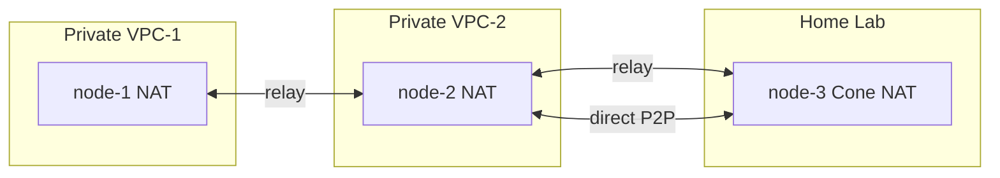

# WireKube

A serverless P2P WireGuard mesh VPN for Kubernetes.

Kubernetes API (CRDs) acts as the coordination plane — no central VPN server required.
Works universally across AWS, GCP, NCloud, bare metal, and home labs.

**[Documentation](https://inerplat.github.io/wirekube/)**



## Features

- **Serverless** — No VPN server; Kubernetes CRDs handle coordination
- **Universal NAT Traversal** — STUN discovery + automatic TCP relay fallback for Symmetric NAT
- **CNI Compatible** — Works alongside Cilium, Calico, AWS VPC CNI without modifications
- **Multi-Architecture** — amd64 / arm64
- **Minimal Privileges** — Only `NET_ADMIN` + `SYS_MODULE` capabilities required

## Quick Start

### 1. Install CRDs and RBAC

```bash
kubectl apply -f config/crd/
kubectl apply -f config/rbac/
```

### 2. Create a WireKubeMesh

```yaml
apiVersion: wirekube.io/v1alpha1
kind: WireKubeMesh
metadata:
  name: default
spec:
  listenPort: 51820
  interfaceName: wire_kube
  mtu: 1420
  stunServers:
    - stun.cloudflare.com:3478
    - stun.l.google.com:19302
  relay:
    mode: auto
    provider: external
    handshakeTimeoutSeconds: 30
    external:
      endpoint: "relay.example.com:3478"
      transport: tcp
```

```bash
kubectl apply -f config/operator/wirekubemesh-default.yaml
```

### 3. Label Nodes

```bash
kubectl label node <node-name> wirekube.io/vpn-enabled=true
```

### 4. Deploy Agent DaemonSet

```bash
kubectl apply -f config/agent/daemonset.yaml
```

### 5. Verify

```bash
kubectl get wirekubepeers -o wide
```

## How It Works

1. The agent DaemonSet runs on every labeled node with `hostNetwork: true`
2. Each agent creates a WireGuard interface (`wire_kube`) and generates a key pair
3. Agents register as WireKubePeer CRDs and watch for peer changes
4. Endpoint discovery finds the best reachable address (STUN, annotation, etc.)
5. Direct WireGuard P2P handshake is attempted first
6. If handshake times out (e.g., Symmetric NAT), traffic routes through a TCP relay

WireKube routes **only node IPs** (/32) through the WireGuard interface (metric 200).
Pod CIDR routes managed by the CNI are never modified.

## Relay Server

For environments with Symmetric NAT (all major cloud NAT gateways), deploy a relay:

```bash
# On a server with a public IP (or behind a TCP load balancer)
wirekube-relay --addr :3478
```

The relay bridges WireGuard UDP packets over TCP. It cannot decrypt traffic —
WireGuard's end-to-end encryption is preserved.

## Node Annotations

```bash
# Manual endpoint override (highest priority)
kubectl annotate node <node> wirekube.io/endpoint="1.2.3.4:51820"
```

## Container Image

```bash
docker pull inerplat/wirekube:v0.0.1
```

Multi-arch: `linux/amd64` and `linux/arm64`.

## Documentation

Full documentation is available at `docs/` (built with [MkDocs Material](https://squidfunk.github.io/mkdocs-material/)):

```bash
pip install mkdocs-material
mkdocs serve
```

## Uninstall

```bash
kubectl delete -f config/agent/ --ignore-not-found
kubectl delete wirekubemesh --all
kubectl delete wirekubepeers --all
kubectl delete -f config/crd/ --ignore-not-found
```

## License

Apache 2.0
