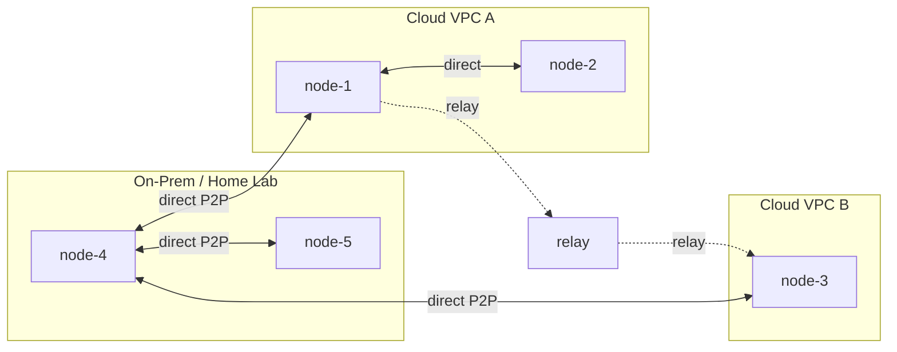

# WireKube

**Connect Kubernetes nodes across any network — no VPN server required.**

WireKube builds a WireGuard mesh between your Kubernetes nodes using only CRDs for coordination. It automatically handles NAT traversal, falls back to TCP relay when direct P2P isn't possible, and preserves WireGuard's end-to-end encryption throughout.

**[Documentation](https://inerplat.github.io/wirekube/)**

## When Do You Need WireKube?

- **Multi-cloud / hybrid clusters** — Your Kubernetes nodes span AWS, GCP, on-prem, or home labs, and they need to communicate directly at the node level without VPC peering or dedicated VPN appliances.

- **Nodes behind NAT** — You have on-premises or edge nodes behind restrictive NATs that need to join a cloud-hosted cluster. WireKube detects NAT types and finds the best path automatically.

- **EKS Hybrid Nodes / managed K8s with remote nodes** — Managed Kubernetes services with remote worker nodes that lack direct network connectivity to the control plane VPC.

- **Lightweight node-to-node encryption** — You want WireGuard encryption between nodes without deploying a full-blown VPN infrastructure or modifying your CNI.

## How It Works



1. An **Agent DaemonSet** runs on each node, creates a WireGuard interface, and discovers its public endpoint via STUN.
2. Each agent registers itself as a **WireKubePeer** CRD. All agents watch all peers and configure WireGuard accordingly.
3. Direct P2P is attempted first. If the handshake times out (default 30s), traffic routes through a **TCP relay** — with WireGuard encryption preserved end-to-end.
4. The agent periodically re-probes relayed peers and upgrades back to direct when possible.

No coordination server, no external etcd, no control plane beyond the Kubernetes API itself.

## Quick Start

```bash
# 1. Install CRDs and create default mesh configuration
kubectl apply -f config/crd/
kubectl apply -f config/wirekubemesh-default.yaml

# 2. Deploy the agent DaemonSet
kubectl apply -f config/agent/

# 3. Verify
kubectl get wirekubepeers -o wide
```

Each agent auto-discovers its endpoint and registers as a WireKubePeer. Set AllowedIPs per peer to define which traffic flows through the mesh:

```bash
kubectl patch wirekubepeer <node-name> --type=merge \
  -p '{"spec":{"allowedIPs":["<node-ip>/32"]}}'
```

See the [Quick Start guide](https://inerplat.github.io/wirekube/getting-started/quickstart/) for detailed setup instructions.

## Key Features

| Feature | Description |
|---------|-------------|
| **No coordination server** | Kubernetes CRDs are the only control plane — no external dependencies |
| **Automatic NAT traversal** | STUN discovery → direct P2P → TCP relay fallback, fully automatic |
| **Direct path recovery** | Periodically re-probes relayed peers and upgrades to direct when possible |
| **Virtual Gateway** | Cross-VPC routing with HA failover via `WireKubeGateway` CRD |
| **CNI compatible** | Routes only node IPs (`/32`); never touches pod CIDRs |
| **Relay pool scaling** | DNS-based multi-instance relay discovery with automatic failover |
| **Prometheus metrics** | Peer latency, traffic, connection state, transport mode on `:9090/metrics` |

## Architecture

| Component | Runs as | Purpose |
|-----------|---------|---------|
| **Agent** | DaemonSet (`hostNetwork: true`) | Manages WireGuard interface, discovers endpoints, syncs peers, handles relay failover |
| **Operator** | Deployment | Reconciles `WireKubeMesh` and `WireKubePeer` CRDs, manages defaults |
| **Relay** | Deployment + Service | Bridges WireGuard UDP over TCP when NAT blocks direct P2P |
| **wirekubectl** | CLI | Status inspection and peer management |

For details on NAT traversal, routing design, and the relay protocol, see the [Architecture documentation](https://inerplat.github.io/wirekube/architecture/overview/).

## Comparison with Alternatives

| | WireKube | Tailscale | Submariner | Cilium ClusterMesh |
|---|---|---|---|---|
| **Coordination** | None (K8s CRDs) | Tailscale control server | Broker cluster | Dedicated etcd |
| **NAT traversal** | STUN + TCP relay | DERP relay servers | None (gateway-based) | None |
| **Fully open-source** | Yes | Client only | Yes | Yes |
| **CNI dependency** | None (works with any CNI) | None | Requires specific CNI | Requires Cilium |
| **Scope** | K8s node-to-node mesh | All devices, any OS | K8s multi-cluster | K8s multi-cluster |
| **External infra** | None required | Tailscale account | Broker cluster | Shared etcd |

**WireKube** is a good fit when you want a lightweight, Kubernetes-native node mesh without external dependencies. **Tailscale** is better if you need to connect non-Kubernetes devices or want a managed service. **Submariner** and **Cilium ClusterMesh** are designed for full multi-cluster service discovery, which is a broader scope than WireKube's node-level connectivity.

## Documentation

Full documentation is available at **[inerplat.github.io/wirekube](https://inerplat.github.io/wirekube/)**.

## Building from Source

```bash
make build          # Build all binaries
make test           # Run tests
make docker-build   # Build multi-arch Docker image
```

## Contributing

Contributions are welcome! Please see the [issues](https://github.com/inerplat/wirekube/issues) for open tasks or file a new one.

## License

Apache 2.0
