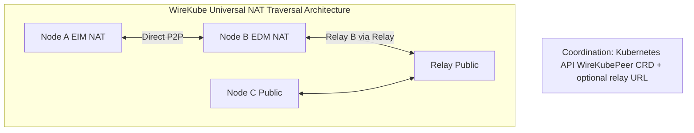

# NAT Traversal & Cloud Provider Behavior — Research & Design

> Comprehensive documentation for WireKube mesh VPN: Symmetric NAT across cloud providers, mesh VPN handling strategies, and universal architecture design.

---

## Table of Contents

1. [NAT Behavior by Cloud Provider](#1-nat-behavior-by-cloud-provider)
2. [How Tailscale Handles Each Case](#2-how-tailscale-handles-each-case)
3. [Generic NAT Traversal Strategy](#3-generic-nat-traversal-strategy)
4. [Relay Server Placement Strategy](#4-relay-server-placement-strategy)
5. [AWS-Specific Considerations](#5-aws-specific-considerations)
6. [Universal Architecture Proposal](#6-universal-architecture-proposal)

---

## 1. NAT Behavior by Cloud Provider

### NAT Type Fundamentals (RFC 4787)

| Mapping Type | RFC Term | Common Name | P2P via STUN? |
|--------------|----------|-------------|---------------|
| **Endpoint-Independent Mapping (EIM)** | EIM | Cone NAT (Full/Restricted/Port-Restricted) | ✅ Yes |
| **Endpoint-Dependent Mapping (EDM)** | EDM | Symmetric NAT | ❌ No (hole punching fails) |

**Key distinction**: With EIM, the same public `ip:port` is used for all destinations. With EDM, each unique destination gets a different `ip:port` — so STUN-discovered addresses are useless for peers because the peer sees a different mapping.

---

### AWS

| Aspect | Behavior |
|--------|----------|
| **NAT Type** | **Endpoint-Dependent (Symmetric)** — AWS NAT Gateway uses per-destination mapping. Each unique (dest_ip, dest_port, protocol) gets its own source port allocation. |
| **UDP Support** | ✅ Yes — NAT Gateway supports TCP, UDP, ICMP. |
| **Connection Limits** | 55,000 simultaneous connections per unique destination per Elastic IP. Can scale with multiple EIPs (up to 8 per NAT GW). |
| **WireGuard/Tailscale** | Tailscale and Netbird work on AWS because they fall back to DERP/relay when both peers are behind NAT. Direct P2P fails when both nodes use NAT Gateway (same-VPC nodes can use InternalIP). |
| **EC2 with Public IP** | VMs with Elastic IP or public IP behave like 1:1 NAT — effectively EIM for outbound; direct connectivity works. |

**Source**: [AWS NAT Gateway basics](https://docs.aws.amazon.com/vpc/latest/userguide/nat-gateway-basics.html) — "per unique destination" implies endpoint-dependent mapping.

---

### GCP

| Aspect | Behavior |
|--------|----------|
| **NAT Type** | **Endpoint-Dependent (Symmetric)** — Cloud NAT reserves ports per unique destination 3-tuple (dest_ip, dest_port, protocol). |
| **UDP Support** | ✅ Yes — Public NAT supports TCP and UDP (NAT44, NAT64). |
| **Port Allocation** | 64,512 UDP source ports per NAT IP; allocation is per-destination. |
| **Private NAT** | Explicitly does **not** support Endpoint-Independent Mapping. |

**Source**: [Cloud NAT ports and addresses](https://docs.cloud.google.com/nat/docs/ports-and-addresses) — "each unique destination 3-tuple" indicates EDM.

---

### Azure

| Aspect | Behavior |
|--------|----------|
| **NAT Type** | **Endpoint-Dependent (Symmetric)** — Azure NAT Gateway uses five-tuple hash (protocol, src_ip, src_port, dest_ip, dest_port) for SNAT port allocation. Distinct destinations get distinct mappings. |
| **UDP Support** | ✅ Yes — Separate SNAT port inventories for TCP and UDP. |
| **Port Allocation** | Dynamic allocation on-demand per connection. |

**Source**: [Azure NAT Gateway SNAT](https://learn.microsoft.com/en-us/azure/nat-gateway/nat-gateway-snat).

---

### NCloud (Naver Cloud Platform)

| Aspect | Behavior |
|--------|----------|
| **NAT Type** | **Endpoint-Dependent (Symmetric)** — Confirmed EDM per user. |
| **UDP Support** | ⚠️ **Limited** — Japan (JPN) region: **No UDP NLB**. TCP NLB only. |
| **Implication** | Relays must run on VMs with public IP or use a cloud that offers UDP LB (e.g., AWS, GCP, Azure). Relay over TCP/443 (WebSocket) is required when UDP is blocked. |

**Source**: [RELAY_NAT_TRAVERSAL_ANALYSIS.md](RELAY_NAT_TRAVERSAL_ANALYSIS.md).

---

### Home Routers

| Aspect | Behavior |
|--------|----------|
| **Typical NAT** | **Restricted Cone** (EIM) — Most home routers use Endpoint-Independent Mapping. Same public port for all destinations. |
| **P2P Success** | High — STUN + hole punching works reliably. |
| **Exceptions** | Some ISPs use CGNAT (double NAT) with symmetric NAT at the carrier layer. Gaming routers may have "NAT type" settings (Open/Moderate/Strict). |
| **UPnP/NAT-PMP** | Often available; can request port mapping to bypass NAT entirely. |

**Source**: [Netbird NAT docs](https://docs.netbird.io/about-netbird/understanding-nat-and-connectivity), [What's My NAT](https://whatsmynat.com/faq).

---

### Summary Table

| Provider | NAT Type | UDP | P2P via STUN | Notes |
|----------|----------|-----|--------------|-------|
| AWS NAT Gateway | Symmetric (EDM) | ✅ | ❌ | Relay fallback |
| GCP Cloud NAT | Symmetric (EDM) | ✅ | ❌ | Relay fallback |
| Azure NAT Gateway | Symmetric (EDM) | ✅ | ❌ | Relay fallback |
| NCloud | Symmetric (EDM) | ⚠️ No UDP LB (JPN) | ❌ | TCP relay needed |
| Home (typical) | Cone (EIM) | ✅ | ✅ | STUN + hole punch |
| EC2/GCP VM with public IP | 1:1 / EIM-like | ✅ | ✅ | Direct works |

---

## 2. How Tailscale Handles Each Case

### Connection Hierarchy

1. **Direct P2P** (lowest latency, highest throughput)
2. **Peer Relay** (route through another peer in the tailnet)
3. **DERP Relay** (fallback when direct fails)

All paths use end-to-end WireGuard encryption.

---

### Case-by-Case Handling

| Scenario | Both Public | One Symmetric | Both Symmetric | Firewall blocks UDP |
|----------|-------------|---------------|----------------|---------------------|
| **Direct P2P** | ✅ | ❌ | ❌ | ❌ |
| **STUN + Hole Punch** | N/A | ✅ (if other side EIM) | ❌ | ❌ |
| **Birthday Paradox Trick** | N/A | ✅ (one hard NAT) | ⚠️ ~0.01% (28 min brute) | ❌ |
| **DERP Relay** | N/A | Fallback | ✅ | ✅ (TCP/443) |

---

### Tailscale NAT Traversal Flow

1. **netcheck** — STUN probes for ~3s to detect NAT type. If no reply, assumes UDP blocked → HTTP probing.
2. **Candidate gathering** — Host, server reflexive (STUN), relay (DERP).
3. **ICE-style probing** — Try all candidate pairs in parallel; pick best (lowest latency) that works.
4. **Start on DERP** — Connections begin via DERP relay for immediate connectivity; path discovery runs in parallel.
5. **Transparent upgrade** — When better path found, switch to direct or peer relay.
6. **Birthday paradox** — For one hard NAT: open 256 ports on hard side, probe randomly from easy side; ~50% success in 2s; ~99.9% in 20s.

**Source**: [Tailscale: How NAT traversal works](https://tailscale.com/blog/how-nat-traversal-works), [Connection types](https://tailscale.com/kb/1257/connection-types).

---

### When DERP Is Required

- Both peers behind symmetric NAT
- UDP blocked (e.g., corporate firewall, UC Berkeley guest Wi‑Fi)
- CGNAT without hairpinning
- Double NAT where port mapping protocols fail

---

## 3. Generic NAT Traversal Strategy

### Strategy Matrix

| Case | Both Public | One Symmetric | Both Symmetric | Firewall blocks UDP |
|------|------------|---------------|----------------|-------------------|
| **Strategy** | Direct | STUN + hole punch (or birthday paradox) | Relay | Relay over TCP/443 |
| **Endpoint** | Direct IP:port | STUN-discovered | Relay endpoint | Relay endpoint |

---

### Implementation Order

1. **Direct** — Use IPv6 or public IP if available.
2. **STUN** — Discover NAT-mapped endpoint; share via coordination (Kubernetes CRD).
3. **Hole Punch** — Both peers send simultaneously; stateful firewalls allow return traffic.
4. **Birthday Paradox** — If one hard NAT: open 256 ports, probe randomly (optional, complex).
5. **Relay** — Fallback when direct fails. Use UDP relay if available; else TCP/WebSocket on 443.

---

### WireKube Current vs. Target

| Layer | Current | Target |
|-------|---------|--------|
| Endpoint discovery | annotation → IPv6 → STUN → AWS → UPnP → InternalIP | Same + NAT type detection |
| Hole punching | Implicit (WireGuard handshake) | Same + explicit simultaneous send |
| Relay | Design only (docs/relay-design.md) | Implement UDP + TCP/WS relay |
| NAT type detection | None | STUN + multi-destination probe |

---

## 4. Relay Server Placement Strategy

### Where to Deploy

| Location | Use Case | Latency |
|----------|----------|---------|
| **Same region as cluster** | Primary for in-region nodes | Low |
| **Multi-region** | Cross-region clusters | Medium |
| **Edge (e.g., Cloudflare Workers)** | Not applicable for WireGuard UDP | N/A |
| **User's own VPS** | Self-hosted, full control | Depends |

---

### How Many Relays

| Mesh Size | Recommendation |
|-----------|-----------------|
| Single region | 1 relay (same region) |
| 2–3 regions | 1–2 relays (one per major region) |
| Global | 3–5 relays (US, EU, APAC) |

---

### Self-Hosted vs. Managed

| Option | Pros | Cons |
|--------|------|------|
| **Self-hosted** | Control, privacy, no vendor lock-in | Ops burden, TLS, scaling |
| **Managed (Tailscale DERP, etc.)** | Zero ops | Third-party dependency, cost |

**WireKube recommendation**: Self-hosted relay as default; optional integration with managed DERP for users who prefer it.

---

### Can a WireKube Node Be a Relay?

| Scenario | Feasibility |
|----------|-------------|
| **Node with public IP** | ✅ Yes — Node can run relay; other nodes use it as fallback. |
| **Node behind NAT** | ❌ No — Relay must be reachable from all peers. |
| **Node behind NLB** | ✅ If NLB supports UDP (AWS NLB ✅, NCloud JPN ❌). |

**Best practice**: Dedicated relay VM with public IP or UDP NLB. Avoid overloading cluster nodes.

---

### Scaling

- **Relay capacity**: ~1–10 Gbps per instance depending on spec.
- **Session count**: Thousands of concurrent connections per relay.
- **Horizontal scaling**: Deploy multiple relays; agents pick nearest (latency-based).

---

## 5. AWS-Specific Considerations

### Multi-VPC WireGuard Setup

| Approach | Description |
|----------|-------------|
| **Single WireGuard server** | One VM with public IP; all VPCs connect to it. No VPC peering required. |
| **Distributed relays** | One relay per region; relays form backbone; clients connect to regional relay. |
| **Transit Gateway** | AWS native; expensive ($36+/month per region); overkill for mesh VPN. |

---

### AWS NAT Gateway + WireGuard

- **Outbound**: WireGuard UDP works (NAT supports UDP).
- **Inbound**: STUN-discovered endpoint is useless — different port per peer (symmetric).
- **Result**: Direct P2P fails between two NAT-backed nodes. Use relay.

---

### AWS NLB UDP Support

| Feature | Support |
|---------|---------|
| **UDP listeners** | ✅ Yes |
| **TCP_UDP** | ✅ Same port for both |
| **Dual-stack (IPv6)** | ✅ As of 2024 |
| **PrivateLink UDP** | ✅ As of 2024 |

**Implication**: Relay can sit behind NLB with UDP; no need for public IP on relay VM.

---

### AWS Optimizations

1. **Same-VPC nodes**: Use InternalIP; no NAT traversal.
2. **Cross-VPC**: Use relay in shared region or VPC with public IP.
3. **EC2 with Elastic IP**: Direct connectivity; no relay needed for those nodes.
4. **Private subnet + NLB**: Deploy relay behind NLB; open UDP 51820 (or configured port).

---

## 6. Universal Architecture Proposal

### Design Principles

1. **Self-hosted relay** — Simple deployment; no third-party SaaS required.
2. **Automatic NAT detection** — Agent probes STUN; infers EIM vs EDM.
3. **Graceful degradation** — P2P → STUN → Relay.
4. **Minimal config** — User provides relay URL (optional); rest is automatic.

---

### Architecture Diagram



---

### Agent Flow

```
1. Discover endpoint: annotation → IPv6 → STUN → AWS/UPnP → InternalIP
2. If STUN: probe multiple STUN servers/destinations → infer EIM vs EDM
3. Sync peers from WireKubePeer CRD; get peer endpoints
4. For each peer:
   a. Try direct (peer's endpoint)
   b. If no handshake within 30s and relay configured → switch to relay
   c. If on relay and handshake stale → stay on relay
5. reflectNATEndpoints: patch CRD with actual observed endpoints (NAT-learned)
```

---

### Relay Deployment (Simple)

```yaml
# WireKubeMesh spec addition
spec:
  relayServer: "relay.example.com:443"   # Optional; empty = no relay
  relayMode: "auto"                      # auto | always | never
  stunServers:
    - "stun:stun.l.google.com:19302"
    - "stun:stun1.wirekube.io:3478"
```

```bash
# Deploy relay (single VM, public IP)
wirekube-relay --listen :443 --mesh-key <secret> --tls-cert /path/to/cert
```

---

### Transport Fallback

| Priority | Transport | When |
|----------|-----------|------|
| 1 | UDP direct | Both EIM or one public |
| 2 | UDP via relay | Both EDM, relay has UDP |
| 3 | TCP/WebSocket 443 | UDP blocked; relay supports WS |

---

### Checklist for Production

- [ ] STUN servers (self-hosted or public)
- [ ] Relay binary + deployment (Docker/K8s)
- [ ] TLS for relay (Let's Encrypt or internal CA)
- [ ] NAT type detection in agent
- [ ] Relay fallback logic (handshake timeout → relay)
- [ ] UDP proxy for WireGuard over TCP relay
- [ ] Regional relay placement for multi-region

---

## References

- [RFC 4787](https://tools.ietf.org/html/rfc4787) — NAT Behavioral Requirements for UDP
- [RFC 5128](https://rfc-editor.org/rfc/rfc5128.html) — State of P2P Communication across NATs
- [Tailscale: How NAT traversal works](https://tailscale.com/blog/how-nat-traversal-works)
- [Netbird: Understanding NAT and Connectivity](https://docs.netbird.io/about-netbird/understanding-nat-and-connectivity)
- [AWS NAT Gateway](https://docs.aws.amazon.com/vpc/latest/userguide/nat-gateway-basics.html)
- [GCP Cloud NAT](https://docs.cloud.google.com/nat/docs/ports-and-addresses)
- [Azure NAT Gateway](https://learn.microsoft.com/en-us/azure/nat-gateway/nat-gateway-snat)
- [WireKube relay-design.md](relay-design.md)
- [WireKube RELAY_NAT_TRAVERSAL_ANALYSIS.md](RELAY_NAT_TRAVERSAL_ANALYSIS.md)
