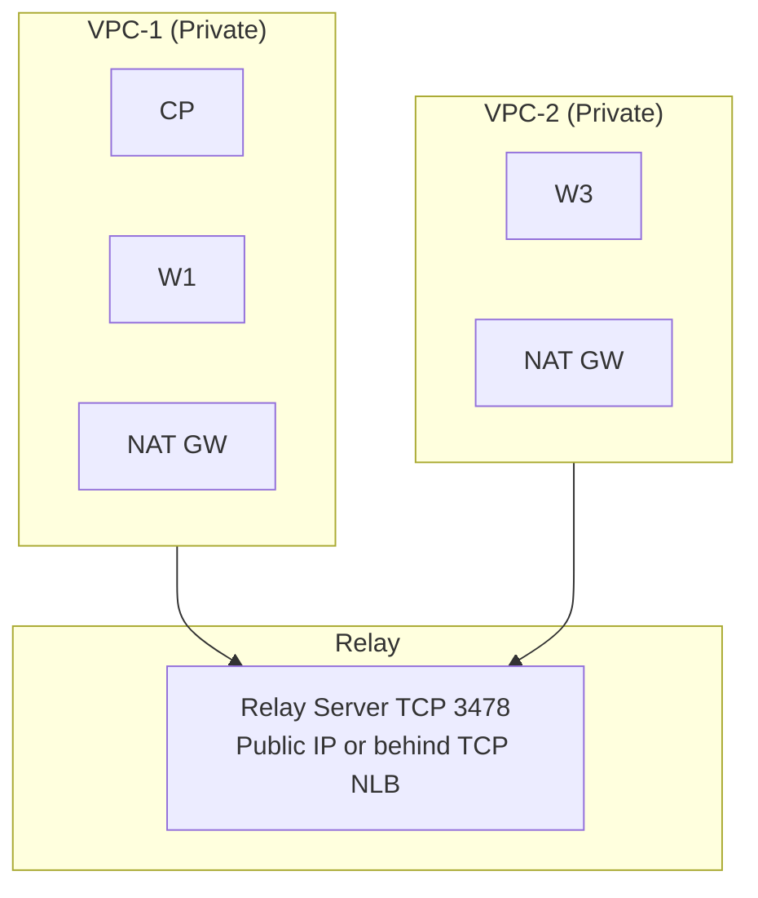
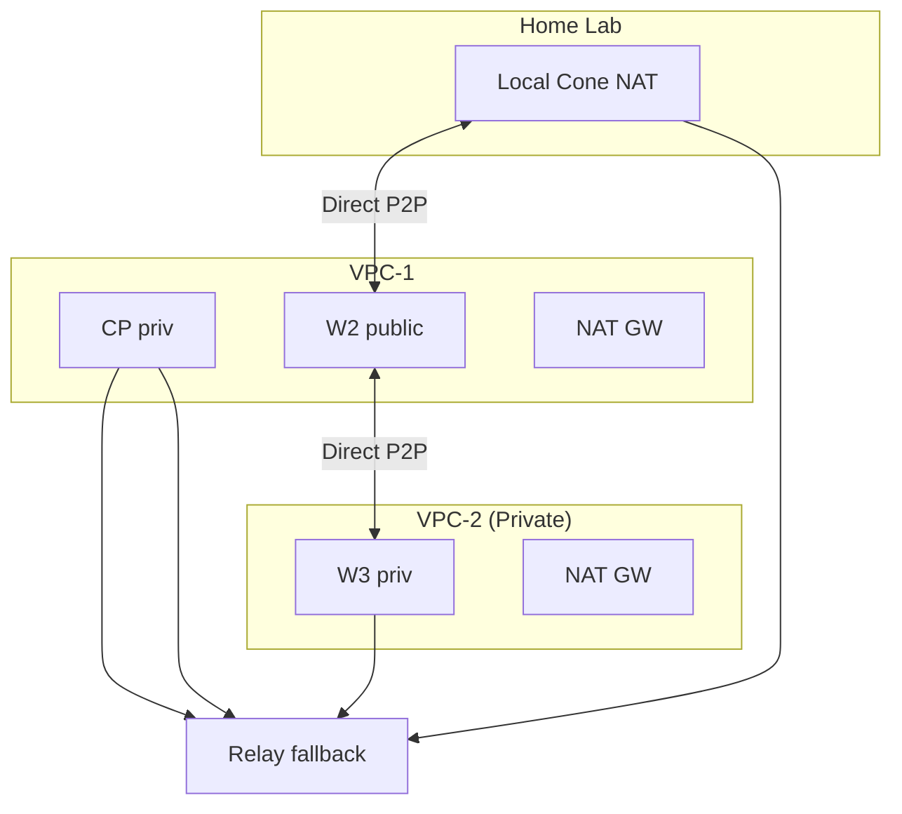
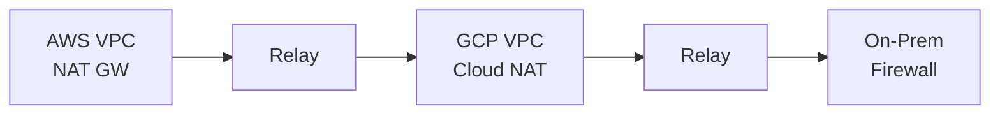
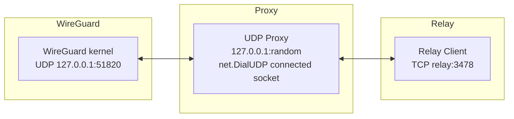
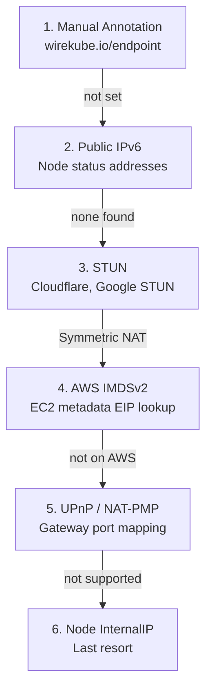
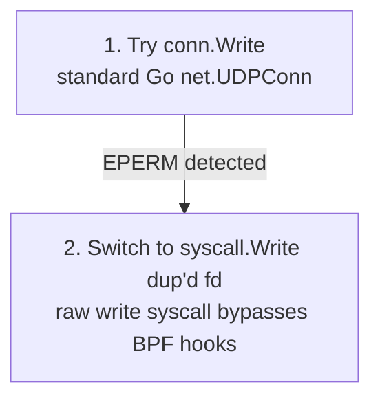

# WireKube Operations & Troubleshooting Guide

A comprehensive guide for deploying, operating, and debugging WireKube mesh VPN across diverse environments.

---

## Table of Contents

1. [Deployment Topologies](#deployment-topologies)
2. [NAT Classification & Detection](#nat-classification--detection)
3. [Relay Architecture](#relay-architecture)
4. [Endpoint Discovery Deep Dive](#endpoint-discovery-deep-dive)
5. [CNI Compatibility (Cilium)](#cni-compatibility-cilium)
6. [Troubleshooting Scenarios](#troubleshooting-scenarios)
7. [Monitoring & Observability](#monitoring--observability)
8. [Cloud Provider Notes](#cloud-provider-notes)
9. [Security Considerations](#security-considerations)

---

## Deployment Topologies

### Topology 1: All Nodes Private (Cloud NAT)



All nodes behind Symmetric NAT. Direct P2P impossible between VPCs.
Every inter-VPC pair uses TCP relay fallback.

**Intra-VPC**: Direct WireGuard (same subnet, no NAT involved).
**Inter-VPC**: TCP relay (Symmetric NAT prevents STUN-based P2P).

### Topology 2: Mixed (Private + Public + Local)



Nodes with public IPs accept direct WireGuard connections from any peer.
Private nodes behind Symmetric NAT can only reach other private nodes through relay.

### Topology 3: Multi-Cloud



WireKube works identically across clouds. The relay server can be deployed
on any publicly reachable machine or behind a TCP load balancer.

---

## NAT Classification & Detection

### NAT Types and Impact

| NAT Type | UDP Hole Punch | WireKube Behavior |
|----------|---------------|-------------------|
| **Full Cone** | Works | Direct P2P via STUN |
| **Restricted Cone** | Works (with keepalive) | Direct P2P via STUN |
| **Port Restricted Cone** | Usually works | Direct P2P via STUN |
| **Symmetric (EDM)** | Fails | Auto-fallback to relay |

### How WireKube Detects NAT Type

1. Agent performs STUN binding request to two different STUN servers
2. If the mapped address (IP:port) differs between servers → **Symmetric NAT**
3. If mapped address is consistent → **Cone NAT** (direct P2P viable)

### Cloud Provider NAT Types

| Provider | NAT Gateway Type | Notes |
|----------|-----------------|-------|
| AWS | Symmetric | All NAT Gateways use EDM |
| GCP | Symmetric | Cloud NAT is port-dependent |
| Azure | Symmetric | Azure NAT Gateway |
| NCloud | Symmetric | Verified via STUN testing |
| Home/ISP | Usually Cone | Most residential routers are Full/Restricted Cone |

---

## Relay Architecture

### Protocol

- **MsgRegister** (0x01): 32-byte WireGuard public key
- **MsgData** (0x02): 32-byte dest pubkey + WG UDP payload
- **MsgKeepalive** (0x03): empty (30s interval)
- **MsgError** (0xFF): error message

Frame format: `[4-byte length][1-byte type][body]` over TCP (port 3478).

### Connection Flow

```
1. Agent starts → connects to relay via TCP
2. Sends MsgRegister with its WireGuard public key
3. Relay maps pubkey → TCP connection in memory
4. When agent A sends MsgData(destPubKey, payload):
   - Relay looks up destPubKey → finds agent B's TCP connection
   - Forwards payload to agent B
5. Agent B's UDP proxy delivers payload to local WireGuard
```

### Local UDP Proxy

Each relayed peer gets a dedicated local UDP proxy:



The proxy uses `net.DialUDP` to create a **connected** UDP socket.
WireGuard sees the proxy's local address as the peer's endpoint.

### Relay Deployment Options

#### Option A: External Relay (Manual)

Deploy the relay binary on any server with a public IP:

```bash
wirekube-relay --addr :3478
```

Configure in WireKubeMesh:

```yaml
spec:
  relay:
    provider: external
    external:
      endpoint: "relay.example.com:3478"
      transport: tcp
```

#### Option B: Managed Relay (Operator-deployed)

The operator deploys a Deployment + LoadBalancer Service:

```yaml
spec:
  relay:
    provider: managed
    managed:
      replicas: 1
      serviceType: LoadBalancer
```

#### Option C: Systemd Service on Control Plane

For simple setups, run relay as a systemd service:

```ini
[Unit]
Description=WireKube Relay Server
After=network.target

[Service]
ExecStart=/usr/local/bin/wirekube-relay --addr :3478
Restart=always
RestartSec=5

[Install]
WantedBy=multi-user.target
```

Expose via TCP NLB (port 3478).

---

## Endpoint Discovery Deep Dive

### Priority Chain



### STUN Flow

```go
// Agent sends STUN Binding Request to multiple servers
stunServers := []string{"stun.cloudflare.com:3478", "stun.l.google.com:19302"}

// Compare mapped addresses:
// - Same IP:port from all servers → Cone NAT → use this as endpoint
// - Different ports → Symmetric NAT → STUN endpoint unreliable, flag for relay
```

### When Endpoint Discovery Fails

If all methods yield only an internal IP (e.g., `10.0.0.5:51820`),
the peer will be registered with that internal IP. Other peers behind
different NATs cannot reach it directly → relay fallback triggers
after `handshakeTimeoutSeconds`.

---

## CNI Compatibility (Cilium)

### The BPF cgroup Hook Problem

Cilium attaches eBPF programs to cgroup socket hooks:
- `BPF_CGROUP_UDP4_SENDMSG` → `cil_sock4_sendmsg`
- Triggers on `sendto()` / `sendmsg()` with `msg_name` set

When the WireKube agent runs as a DaemonSet pod (even with `hostNetwork: true`),
Cilium's BPF program intercepts UDP `sendto()` calls. In some configurations,
this returns `EPERM` (Operation not permitted).

### Solution: Connected UDP Socket

```go
// net.DialUDP creates a connected socket (connect(2) called)
conn, _ := net.DialUDP("udp4", localAddr, remoteAddr)

// conn.Write() uses write(2) on a connected socket
// write(2) does NOT trigger BPF_CGROUP_UDP4_SENDMSG
// (only sendto/sendmsg with msg_name trigger it)
conn.Write(payload)  // ← Works even under Cilium BPF
```

### Adaptive Fallback

The UDP proxy implements a two-tier approach:



In testing, `conn.Write()` on a connected `DialUDP` socket has been verified
to work without triggering EPERM. The `syscall.Write` fallback exists as a
safety net for future kernel/Cilium versions that might change behavior.

### Alternative Cilium Configuration

If you control the Cilium deployment, you can disable socket-level
load balancing in host namespace pods:

```yaml
# Cilium Helm values
socketLB:
  hostNamespaceOnly: true
```

This prevents Cilium from attaching `cil_sock4_sendmsg` to `hostNetwork: true` pods.

---

## Troubleshooting Scenarios

### Scenario 1: Handshake Never Completes (Direct Mode)

**Symptoms:**
```
wg show wire_kube
  peer: <pubkey>
    endpoint: 1.2.3.4:51820
    latest handshake: (none)
    transfer: 0 B received, 1.2 KiB sent
```

**Diagnosis:**
1. Check if both nodes are behind Symmetric NAT:
   ```bash
   # On each node
   stun stun.cloudflare.com 3478
   stun stun.l.google.com 19302
   # If mapped ports differ → Symmetric NAT
   ```

2. Check firewall / security groups allow UDP 51820:
   ```bash
   # From node A
   nc -u -w3 <node-B-public-ip> 51820
   ```

3. Check if relay is configured:
   ```bash
   kubectl get wirekubemesh default -o yaml | grep relay
   ```

**Fix:**
- Ensure relay is deployed and reachable
- Set `spec.relay.mode: auto` (or `always` for testing)
- Verify `handshakeTimeoutSeconds` is reasonable (default: 30s)

### Scenario 2: EPERM on UDP Proxy Write

**Symptoms:**
```
relay-proxy: write to wg: sendto: operation not permitted
```

**Diagnosis:**
- Cilium BPF cgroup hook intercepting `sendto()` in the container
- Check if BPF programs are attached:
  ```bash
  bpftool cgroup show /sys/fs/cgroup/kubepods/... | grep sock
  ```

**Fix:**
- The adaptive proxy should auto-switch to `syscall.Write` mode
- Check agent logs for: `"EPERM detected, switching to raw syscall.Write mode"`
- If not auto-switching, verify the agent binary is up to date (`v0.0.1+`)
- Alternative: set `socketLB.hostNamespaceOnly: true` in Cilium config

### Scenario 3: Relay Connection Timeout

**Symptoms:**
```
relay-client: dial tcp relay.example.com:3478: i/o timeout
```

**Diagnosis:**
1. Verify relay server is running:
   ```bash
   ssh relay-host 'ss -tlnp | grep 3478'
   ```

2. Test TCP connectivity from the node:
   ```bash
   nc -zv relay.example.com 3478
   ```

3. If behind an NLB, check health check status:
   ```bash
   # NLB health checks need 60+ seconds to detect healthy targets
   # After relay restart, wait at least 60s before testing
   ```

4. Check security groups / ACG rules allow TCP 3478 inbound

**Fix:**
- Add TCP 3478 inbound rule to relay server's security group
- If using NLB, ensure health check is configured for TCP 3478
- After fixing, restart the DaemonSet to re-establish connections:
  ```bash
  kubectl rollout restart ds/wirekube-agent -n kube-system
  ```

### Scenario 4: Relay Flip-Flop (Unstable Mode Switching)

**Symptoms:**
```
peer <pubkey>: switching to relay mode
peer <pubkey>: direct handshake detected, switching to direct
peer <pubkey>: handshake timeout, switching to relay mode
(repeats)
```

**Diagnosis:**
- Handshake through relay is being misinterpreted as "direct connectivity proven"
- The relay proxy's local `127.0.0.1:xxxxx` endpoint is being reflected to the CRD

**Fix:**
- Agent v0.0.1+ includes anti-flip-flop logic: once a peer enters relay mode
  via handshake timeout, it stays in relay mode
- `resolveEndpointForPeer` no longer interprets relay-mediated handshakes
  as proof of direct reachability
- `reflectNATEndpoints` explicitly ignores `127.0.0.1:*` addresses

### Scenario 5: NAT Endpoint Reflection Corrupts CRD

**Symptoms:**
```
kubectl get wirekubepeer node-xxx -o yaml
# spec.endpoint shows 127.0.0.1:xxxxx instead of real public endpoint
```

**Diagnosis:**
- The NAT reflection feature was writing the relay proxy's local address
  back into the CRD

**Fix:**
- Agent v0.0.1+ filters out `127.0.0.1:*` from NAT reflection
- To manually fix corrupted CRDs:
  ```bash
  kubectl patch wirekubepeer node-xxx --type merge \
    -p '{"spec":{"endpoint":"<correct-public-ip>:51820"}}'
  ```

### Scenario 6: Nodes in Same VPC Cannot Communicate

**Symptoms:**
- Nodes in the same VPC/subnet with private IPs cannot establish WireGuard handshake
- `wg show` shows packets sent but never received

**Diagnosis:**
- `fwmark` routing may be causing a loop (WG packet goes out wire_kube → encrypted again)
- Check routes:
  ```bash
  ip rule show
  ip route show table 51820
  ```

**Fix:**
- WireKube uses `fwmark` 0x4000 to mark WireGuard's own UDP packets
- A routing rule skips the wire_kube interface for marked packets:
  ```bash
  ip rule add fwmark 0x4000 lookup main priority 100
  ```
- Verify the rule exists on both nodes

### Scenario 7: WireGuard Interface Conflicts

**Symptoms:**
```
RTNETLINK answers: File exists
```

**Diagnosis:**
- A WireGuard interface with the same name already exists
- Previous agent crash left a stale interface

**Fix:**
- Agent performs cleanup on startup: deletes existing `wire_kube` interface
- For manual cleanup:
  ```bash
  ip link del wire_kube 2>/dev/null
  ```
- The interface name is configurable via `spec.interfaceName` in WireKubeMesh

### Scenario 8: AllowedIPs Not Set for New Peers

**Symptoms:**
- New node joins the mesh, WireKubePeer CRD created
- But `spec.allowedIPs` is empty → no routes added → no traffic

**Diagnosis:**
```bash
kubectl get wirekubepeer node-xxx -o jsonpath='{.spec.allowedIPs}'
# Returns empty array []
```

**Fix:**
- Manually patch the AllowedIPs:
  ```bash
  kubectl patch wirekubepeer node-xxx --type merge \
    -p '{"spec":{"allowedIPs":["<node-internal-ip>/32"]}}'
  ```
- This is resolved in future versions where the agent auto-populates
  `allowedIPs` with the node's InternalIP/32

### Scenario 9: High Latency Through Relay

**Symptoms:**
- Ping between relayed nodes: 40-60ms (compared to 1-2ms direct)

**Diagnosis:**
- This is expected for long-distance relay paths
- Relay adds: Node→NAT→Relay→NAT→Node overhead
- Geographic distance is the primary factor

**Benchmark Reference (NCloud JPN + Local macOS):**

| Path | Mode | Latency |
|------|------|---------|
| Same VPC (private↔private) | Direct | ~0.5ms |
| Cross VPC (private↔private) | Relay | ~1.5-2ms |
| Same VPC (private↔public) | Direct | ~0.7ms |
| Cross region (Japan↔Korea) | Relay | ~42-54ms |

**Optimization:**
- Deploy relay geographically close to the majority of nodes
- Use public IP nodes as "anchor points" for direct P2P
- Consider multiple relay endpoints for different regions (future)

---

## Monitoring & Observability

### Key Metrics to Watch

```bash
# WireGuard interface status
wg show wire_kube

# Per-peer handshake status and transfer bytes
wg show wire_kube dump

# Route table
ip route show dev wire_kube

# Relay TCP connection status
ss -tnp | grep 3478

# Agent logs
kubectl logs -n kube-system -l app=wirekube-agent --tail=100
```

### WireKubePeer Status Fields

```bash
kubectl get wirekubepeers -o custom-columns=\
  NAME:.metadata.name,\
  CONNECTED:.status.connected,\
  TRANSPORT:.status.transportMode,\
  METHOD:.status.endpointDiscoveryMethod,\
  ENDPOINT:.spec.endpoint
```

### Health Check Commands

```bash
# Full mesh connectivity test
for peer in $(kubectl get wirekubepeers -o jsonpath='{.items[*].spec.allowedIPs[0]}' | tr ' ' '\n' | sed 's|/32||'); do
  echo -n "$peer: "
  ping -c 3 -W 2 $peer | tail -1
done
```

---

## Cloud Provider Notes

### AWS

- NAT Gateway: Symmetric NAT → relay required for inter-VPC
- EIP on nodes: Direct P2P possible
- Security Groups: Allow UDP 51820 inbound for direct mode
- NLB: Supports both UDP and TCP → can use UDP NLB for WireGuard or TCP NLB for relay
- IMDSv2: Agent auto-detects EIP via metadata service

### GCP

- Cloud NAT: Symmetric NAT → relay required for inter-VPC
- External IP on VM: Direct P2P possible
- Firewall Rules: Allow UDP 51820
- TCP LB: Supports global TCP for relay

### NCloud

- NAT Gateway: Symmetric NAT (verified)
- **UDP Load Balancer: NOT supported in JPN region** (API error 1200053)
- TCP NLB: Works for relay (verified)
- Public IP: Only available on public subnet servers (cannot assign to private subnet)
- ACG: Must explicitly allow TCP 3478 for relay

### Azure

- Azure NAT Gateway: Symmetric NAT
- Public IP on VM: Direct P2P possible
- NSG: Allow UDP 51820

### Bare Metal / Home Lab

- Usually behind ISP router (Cone NAT) → STUN-based direct P2P works
- Port forwarding (UPnP/NAT-PMP) may help
- For restrictive firewalls, relay is the universal fallback

---

## Security Considerations

### DaemonSet Capabilities

The agent requires only:
- `NET_ADMIN` — Create/configure WireGuard interface, manage routes
- `SYS_MODULE` — Load `wireguard` kernel module if not already loaded

`privileged: true` is **not required** and should not be used.

### WireGuard Key Management

- Private keys stored at `/var/lib/wirekube/privatekey` on each node
- File permissions: `0600` (owner read/write only)
- Keys generated on first agent startup, persisted across restarts
- Each node has a unique key pair; compromise of one node does not affect others

### Relay Security

- Relay only forwards opaque WireGuard-encrypted UDP packets
- Relay cannot decrypt traffic (no access to WireGuard private keys)
- Relay identifies peers by WireGuard public key (32 bytes)
- TCP connection between agent and relay is **not encrypted** (TLS planned for future)
  - WireGuard's own encryption provides end-to-end security regardless
  - Adding TLS to relay would provide defense-in-depth against traffic analysis

### Network Segmentation

- WireKube only adds `/32` routes for node IPs (not pod CIDRs)
- CNI routing is completely untouched
- Route metric 200 ensures CNI routes take priority for overlapping prefixes
- `fwmark`-based routing prevents WireGuard packet loops
