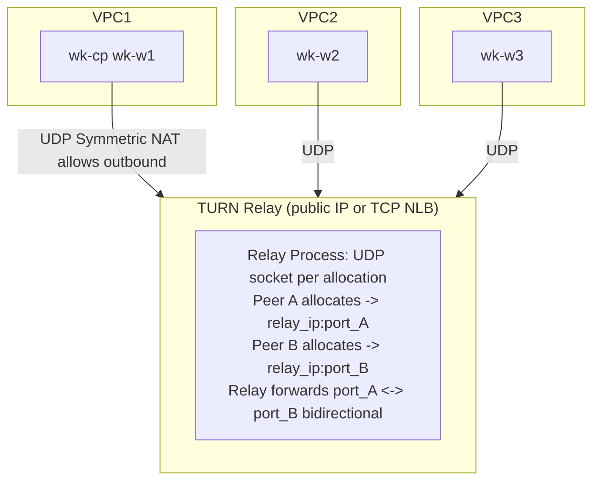
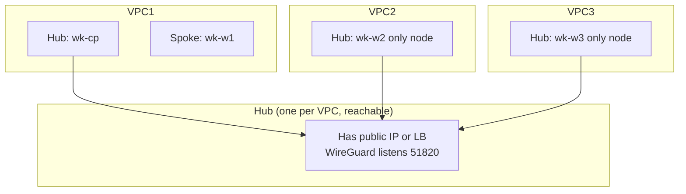
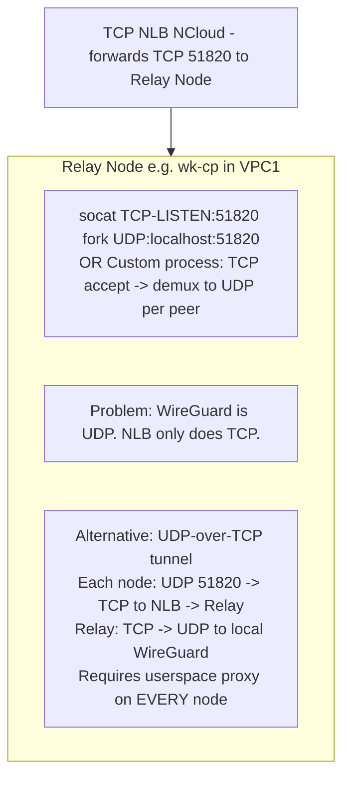
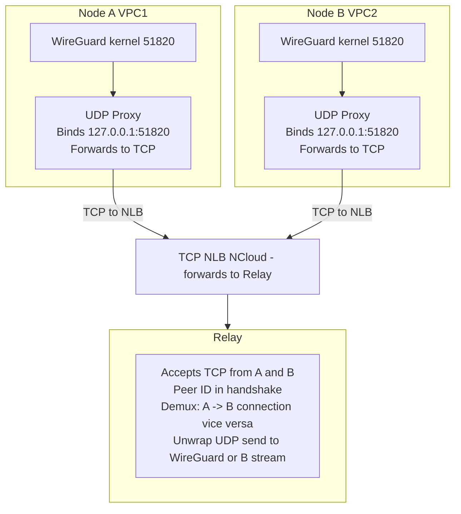

# TURN/Relay-Based NAT Traversal Analysis for WireKube

**Context**: NCloud Japan, 4 nodes across 3 VPCs, all behind Symmetric NAT. Cross-VPC WireGuard UDP fails. TCP NLB available; UDP LB not available.

---

## Executive Summary

| Approach | Feasibility | Latency Impact | Complexity | CRD Integration |
|----------|-------------|----------------|------------|-----------------|
| 1. TURN-style relay | ✅ High | +1–2 RTT | Medium | New CRD or WireKubeMesh extension |
| 2. Hub-and-Spoke | ⚠️ Partial | +1 RTT (same VPC) | High | WireKubePeer endpoint override |
| 3. iptables DNAT relay | ⚠️ Same-VPC only | Minimal | Medium | WireKubeGateway extension |
| 4. Userspace UDP proxy | ✅ High | +1–2 RTT | Medium–High | New CRD or WireKubeMesh |

**Recommendation**: Approach 1 (TURN-style relay on a VPS with public UDP) is simplest. Approach 4 (UDP-over-TCP proxy) is required if you must use NCloud TCP NLB only. Approach 3 helps only for same-VPC relay.

---

## 1. TURN-Style Relay Server

### Architecture



**Packet flow**:
1. Node A (VPC1) sends WireGuard UDP to `relay_ip:port_B` (B's allocation).
2. Relay receives on port_B, forwards to Node B's allocation (which B established via outbound).
3. Node B receives WireGuard packet on its local UDP socket (kernel WireGuard).
4. Reply: B → relay → A.

**Key insight**: Symmetric NAT allows **outbound** UDP. Each node initiates to the relay. The relay has a stable endpoint (public IP or behind TCP NLB with socat). The relay demultiplexes by allocation/session ID.

### WireGuard Peer Configuration

WireGuard peers must use the **relay's address** as their endpoint, not each other's. But WireGuard is 1:1 peer-to-peer—each peer has one endpoint per peer config. So:

- **Option A (per-peer relay)**: Each cross-VPC peer's endpoint = `relay_ip:relay_port_for_that_peer`. The relay maintains a mapping: `(peer_public_key or session_id) → (node_ip:port)`.
- **Option B (relay as TURN server)**: Full TURN protocol. Clients allocate, get `relay_ip:relay_port`. WireGuard would need to use that as endpoint. **Problem**: Standard TURN uses a control channel; WireGuard expects raw UDP. You'd need a **TURN-UDP relay** that:
  - Accepts UDP from known peers (by source IP or pre-registered mapping).
  - Forwards to the correct destination based on an allocation table.

**Simplified relay design** (no full TURN protocol):
- Relay listens on UDP port 51820 (or configurable).
- Relay has a **static mapping** (from CRD/config): `peer_public_key → (node_private_ip:51820, node_vpc_id)`.
- When relay receives UDP from IP X, it looks up: "which peer is at X?" (reverse lookup). Or: each packet carries a small header (4 bytes session ID) — **but WireGuard packets are opaque**, we can't add headers.
- **Solution**: Relay uses **source IP:port** as the session identifier. Each node behind NAT will have a different source when talking to relay. The relay needs to know: "packets from this source IP:port are from Node A, forward to Node B's registered address."
- **Symmetric NAT wrinkle**: Node A's source IP:port when sending to relay might change per destination. Actually no—when A sends to relay, the destination is always the relay. So A has one (src_ip, src_port) when sending to relay. The relay sees that and can map "A's traffic comes from src_ip:src_port".
- **Bidirectional**: When B sends to A, B's packets go to relay. Relay must forward to A. But A is behind NAT—relay can't initiate to A. **A must have already sent to relay** (outbound), so the relay knows A's mapped address from the NAT. So: A sends to relay → relay sees A's src_ip:src_port (NAT-mapped). Relay stores: "Peer A = src_ip:src_port". When B sends to relay (dest = relay_ip:port_for_A), relay forwards to A's stored address. The NAT will accept it because it's a "response" to A's outbound session... **No!** Symmetric NAT uses different ports per destination. So when A sends to relay, A gets mapped port P1. When B sends to A's address (A's public IP:P1), that's not a "response"—it's a new destination from B's perspective. The NAT on A's side doesn't know about B. So **A's NAT will drop B's incoming packet**.
- **Correct model**: Both A and B send **to the relay**. The relay receives from both. The relay forwards A's packets to B's address (the address the relay saw when B sent to the relay), and vice versa. So:
  - A sends to relay. Relay receives from A at (A_nat_ip, A_nat_port). Relay stores: PeerA → (A_nat_ip, A_nat_port).
  - B sends to relay. Relay receives from B at (B_nat_ip, B_nat_port). Relay stores: PeerB → (B_nat_ip, B_nat_port).
  - Relay forwards: when packet from A arrives, forward to (B_nat_ip, B_nat_port). When packet from B arrives, forward to (A_nat_ip, A_nat_port).
  - **Critical**: A and B must send to the **same relay port** or the relay must demultiplex. With 4 nodes, we have 6 pairs. Each pair (A,B) needs a channel. Options:
    - **Single port, demux by source**: Relay maintains Peer identity by source. When A sends, we know it's A. We need to know "A wants to talk to B". WireGuard packets don't say which peer they're for—the relay would need to know the topology. Actually: the relay could have one port per peer. Peer A gets relay_ip:port_A, Peer B gets relay_ip:port_B. A's WireGuard config: endpoint for B = relay_ip:port_B. So A sends WireGuard packets (destined for B) to relay_ip:port_B. Relay receives, knows "this port is B's", so forward to B's address. And B sends to relay_ip:port_A for A. So we need **N ports** for N peers (one per peer). Each peer's "endpoint" for another peer is relay_ip:port_of_that_peer.
- **WireGuard config**: On node A, for peer B: `Endpoint = relay_ip:port_B`, `AllowedIPs = B's mesh IPs`. On node B, for peer A: `Endpoint = relay_ip:port_A`. The relay just forwards UDP between port_A and the address B uses when sending to the relay. So the relay needs:
  - Port A: receives from anyone. When receives from X:Y, store as "A's correspondent" or actually—port A is for **traffic destined to A**. So when someone sends to port A, relay forwards to A's address. A's address = wherever the relay last received a packet from that was identified as A. How does relay identify A? By the port A sends to. So: A sends to relay port "A" (e.g. 51821). Relay receives from (A_nat_ip, A_nat_port). Relay stores: port 51821 → (A_nat_ip, A_nat_port). When relay receives on port 51821 from someone else (B), it forwards to (A_nat_ip, A_nat_port). So we need A to first "register" by sending to port 51821. Then B sends to port 51821, relay forwards to A. Good.
  - So: **one relay port per peer**. Peer A uses relay_ip:51821. Peer B uses relay_ip:51822. WireKubePeer for A has endpoint relay_ip:51821, for B relay_ip:51822. But wait—each node has multiple peers. Node A's WireGuard has peers B, C, D. For peer B, endpoint = relay_ip:51822. For peer C, endpoint = relay_ip:51823. So the relay has ports 51821, 51822, 51823, 51824 for the 4 nodes. Each node's "identity" on the relay is one port. When A sends to relay:51822 (B's port), the relay forwards to B's address. The relay learns B's address when B sends to the relay (to any port? or to its own port?). B would send to relay:51821 when sending to A. So B sends WireGuard packet (to A) to relay:51821. Relay receives on 51821 from (B_nat_ip, B_nat_port). Relay forwards to (A_nat_ip, A_nat_port). So the relay needs to know A's address. A gets that when A sends to relay:51822 (to B) or relay:51821 (to self? no). A sends to relay:51822 — that's A initiating to B. So the packet goes to relay port 51822. Relay receives from (A_nat_ip, A_nat_port). This packet is "for B", so relay forwards to B's address. But we also need to store A's address for port 51821 (so when B sends to A, we know where to forward). So: when A sends to relay:51822, we learn A's address. We associate it with port 51821 (A's port). So the mapping is: port 51821 ↔ (A_nat_ip, A_nat_port), port 51822 ↔ (B_nat_ip, B_nat_port), etc. When we receive on port 51822 from (A_nat_ip, A_nat_port), we forward to (B_nat_ip, B_nat_port). When we receive on port 51821 from (B_nat_ip, B_nat_port), we forward to (A_nat_ip, A_nat_port). Perfect.

### Integration with WireKube CRDs

| CRD | Changes |
|-----|---------|
| **WireKubeMesh** | Add `relayEndpoint: "relay.example.com:51820"` (optional). When set, cross-VPC peers use relay. |
| **WireKubePeer** | Add `relayPort: 51821` (optional). When relay is used, endpoint becomes `relay_ip:relayPort` for that peer. The agent would override `Endpoint` with relay address when peer is in a different VPC and relay is configured. |
| **WireKubeGateway** | No change (gateway is for non-VPN nodes, not relay). |

**New CRD option**: `WireKubeRelay` — defines relay server address, port range, and which peers use it.

### Latency Impact

- **+1 RTT** for relayed traffic (A → relay → B vs A → B direct).
- Relay adds ~0.5–2 ms processing. Cross-VPC already has ~5–20 ms RTT; relay adds ~2–10 ms depending on relay placement.

### Complexity

- **Relay implementation**: ~500–1000 lines Go. Listens on N UDP ports (one per peer). Maintains `port → (nat_ip, nat_port)` map. Forwards packets. No TURN protocol needed—just UDP forward.
- **Agent changes**: When `relayEndpoint` is set and peer is cross-VPC (different VPC label or annotation), use `relayEndpoint` host with peer's `relayPort` as endpoint.
- **Deployment**: Relay needs a public IP or TCP NLB. **TCP NLB**: NCloud has TCP NLB. The relay needs UDP. So you need a VM with public IP, or a different cloud that offers UDP. **Alternative**: Run relay on a node that has a public IP (e.g. wk-local's network, or a small VPS in a different region). Or: use a cloud that offers UDP LB (AWS NLB supports UDP, but NCloud Japan doesn't).

### Infrastructure Changes

- **Relay host**: One VM with public IP, or use an external VPS (e.g. AWS, GCP) for the relay. NCloud TCP NLB cannot forward UDP.
- **Firewall**: Open UDP ports 51820–51824 (or configured range) on relay.

---

## 2. WireGuard Hub-and-Spoke

### Architecture



**Idea**: One node per VPC is the "hub" (reachable via same-VPC or some mechanism). Other nodes in that VPC route through the hub. Hub-to-hub connectivity uses... what? They're all behind Symmetric NAT. So hub-to-hub still fails.

**Unless**: One hub has a public IP. Then:
- Hub1 (public IP) ↔ Hub2 (NAT): Hub2 initiates to Hub1. Symmetric NAT: Hub2's outbound to Hub1 gets a mapped port. Hub1 receives, responds. **Response works** because Hub1 sends to Hub2's mapped address—Hub2's NAT sees it as a response to Hub2's outbound session. So **1 hub with public IP** can accept connections from all other hubs. The other hubs initiate.
- So we need **at least one node with public IP**. NCloud: all in private subnets. You'd need one VM with public IP (e.g. a small VPS elsewhere, or NCloud public subnet if available).

**Hub-and-spoke with WireGuard AllowedIPs**:
- Spoke wk-w1 has peer: Hub wk-cp, AllowedIPs = [all other mesh IPs]. So wk-w1 sends everything to wk-cp.
- Hub wk-cp has peers: wk-w1 (spoke), wk-w2 (hub), wk-w3 (hub). AllowedIPs for wk-w2 = VPC2's CIDRs, etc.
- wk-cp receives from wk-w1, forwards to wk-w2. WireGuard doesn't "forward"—it's a tunnel. When wk-cp receives encrypted packet from wk-w1, it decrypts, sees inner packet for 10.10.1.6 (wk-w2's mesh IP). wk-cp has route: 10.10.1.6 via wk-w2's peer. So wk-cp re-encrypts and sends to wk-w2. **This works**—wk-cp acts as a router. No WireGuard modification needed.
- **Problem**: wk-cp and wk-w2 are both behind Symmetric NAT. They can't connect to each other. So we still need one reachable hub.

**Verdict**: Hub-and-spoke **reduces** the number of endpoints that need to be reachable (from N to number of VPCs), but we still need at least one hub with a public IP or relay. It doesn't solve Symmetric NAT by itself.

### Integration with WireKube CRDs

| CRD | Changes |
|-----|---------|
| **WireKubePeer** | Add `viaPeer: "node-wk-cp"` — route through this peer to reach the final destination. Agent would need to configure chained routing. |
| **WireKubeMesh** | Add `hubNode: "wk-cp"` — designate one node as the mesh hub. |

**Complexity**: WireGuard doesn't natively support "via" routing. You'd configure AllowedIPs so that spokes only have the hub as peer with AllowedIPs = 0.0.0.0/0 (all mesh). The hub has all other hubs as peers. This requires significant agent logic to compute the right AllowedIPs per peer.

### Latency Impact

- Same-VPC spoke→hub: +1 hop (minimal).
- Cross-VPC: hub→hub still needs relay or public IP. Same as approach 1.

### Complexity

- **High**: Topology awareness, hub election, AllowedIPs computation for partial mesh.

---

## 3. iptables DNAT/SNAT Relay

### Architecture



**Re-evaluation**: TCP NLB forwards TCP. WireGuard is UDP. So we cannot do "TCP NLB → iptables DNAT to UDP" directly for WireGuard traffic. The NLB would receive TCP, and we'd need to convert. **socat** can do `TCP-LISTEN → UDP` but that's for a single destination. The relay would need to:
- Accept TCP connections from multiple nodes.
- Each TCP connection carries UDP packets (encapsulated). Demux by connection: connection from Node A carries A's WireGuard traffic; forward to Node B's UDP address.
- So we need **UDP-over-TCP** encapsulation. Each node runs a proxy: intercepts WireGuard UDP, wraps in TCP, sends to NLB. Relay receives TCP, unwraps, sends UDP to local WireGuard or to another node's proxy. This is approach 4.

**Pure iptables approach** (no TCP):
- If we had **UDP NLB**: Relay node has public UDP. NLB forwards UDP to relay. Relay does iptables DNAT: `-A PREROUTING -p udp --dport 51820 -j DNAT --to-destination 10.10.1.6:51820` (for packets from a certain source). But we don't have UDP NLB.

**iptables with TCP NLB** (UDP encapsulation):
- Relay runs: TCP listener on 51820. Receives TCP streams. Each stream = one node's WireGuard traffic. Relay parses a header (e.g. 4-byte peer ID), forwards UDP to the right peer. This is a **TCP-based UDP relay** — same as approach 4's "TCP NLB → UDP" option.

**Simpler iptables use case**:
- **Within a VPC**: One node has a stable internal IP. Other nodes use it as relay. iptables on relay: `DNAT udp dport 51821 → wk-w1:51820`, `DNAT udp dport 51822 → wk-w2:51820`. But that's for same-VPC. Cross-VPC needs the TCP NLB path.

**Verdict**: iptables alone cannot bridge TCP NLB to UDP WireGuard. We need a process that accepts TCP and emits UDP. iptables can support **same-VPC** relay (one node forwards to others in the VPC). For cross-VPC, combine with UDP-over-TCP proxy (approach 4).

### Integration with WireKube CRDs

| CRD | Changes |
|-----|---------|
| **WireKubeGateway** | Extend to support "relay mode": `relayForPeers: ["node-wk-w2", "node-wk-w3"]`. Gateway pod runs socat or iptables to forward UDP to those peers' internal IPs. Only works for same-VPC or when relay has path to peers. |
| **WireKubeMesh** | Add `relayNode: "wk-cp"` — node that runs relay for cross-VPC. |

### Latency Impact

- Same-VPC iptables relay: sub-ms.
- Cross-VPC with UDP-over-TCP: +1–2 RTT (TCP connection + encapsulation).

### Complexity

- **Medium** for same-VPC relay.
- **High** for cross-VPC (requires UDP-over-TCP, merges with approach 4).

---

## 4. Userspace UDP Proxy/Relay

### Architecture A: UDP Relay (like TURN)

Same as approach 1. A Go process listens on UDP, forwards between peers. Can run on a node with public IP or behind a **UDP** LB (not available on NCloud).

### Architecture B: UDP-over-TCP Proxy (TCP NLB compatible)



**Problem**: WireGuard kernel module binds to one port. If the proxy binds 127.0.0.1:51820 and WireGuard binds 0.0.0.0:51820, they conflict. So we need:
- **Option 1**: WireGuard binds to a different port (e.g. 51821), proxy binds 51820. Agent configures WireGuard with ListenPort 51821. Proxy receives "WireGuard" traffic on 51820 from... from where? The proxy receives from TCP. So the flow is: Application sends to 127.0.0.1:51820 (proxy). Proxy sends to TCP. That doesn't make sense for WireGuard—WireGuard sends to peer endpoints. The proxy must **intercept** traffic between WireGuard and the network.
- **Option 2**: Proxy runs on a **different host**. WireGuard on node A sends to peer B's endpoint. We change B's endpoint to the proxy's address. So from A's perspective, B is at proxy_ip:port. A's WireGuard sends UDP to proxy. The proxy receives... but the proxy is behind TCP NLB. So the proxy receives TCP. So we need the **sender** (A) to wrap UDP in TCP before sending. That means A cannot use kernel WireGuard directly—A would need to send to a local proxy, which wraps and sends TCP. So:
  - A: WireGuard sends UDP to 127.0.0.1:51820 (local proxy). Proxy wraps in TCP, sends to NLB. NLB forwards to relay. Relay unwraps, has UDP. Relay forwards to B. But B is behind NAT. Relay needs to send to B. B receives... how? B is behind TCP NLB. So B has a TCP connection to the relay. Relay sends the UDP packet to B via that TCP connection. B's proxy receives, unwraps, injects UDP. But B's WireGuard expects to receive from A. So B's proxy must send the UDP packet to B's WireGuard. B's WireGuard is listening on 51820. The proxy would need to send a UDP packet to 127.0.0.1:51820 with source = A's address. That's complex—we'd need to spoof the source. Or: B's WireGuard receives from the proxy. The peer config for A on B has endpoint = ?. The endpoint is where B sends to. B sends to the proxy (127.0.0.1:51820). So B's WireGuard → proxy → TCP → relay → A's TCP → A's proxy → A's WireGuard. The flow is symmetric. So we need:
    - Every node runs a local proxy.
    - WireGuard's peer endpoint for cross-VPC peers = 127.0.0.1:51820 (or a different port to avoid conflict).
    - Agent configures WireGuard: for peer B, endpoint = 127.0.0.1:51821. Proxy listens on 51821. When WireGuard sends to 127.0.0.1:51821, the packet goes to the proxy. Proxy knows "this is for peer B" (from the peer config). Proxy wraps, sends TCP to relay with header "B". Relay forwards to B's TCP connection. B's proxy receives, unwraps, sends UDP to B's WireGuard. B's WireGuard listens on 51820. So we need the proxy to **inject** UDP into the WireGuard interface. That's not possible from userspace—we'd need to send to the WireGuard socket. WireGuard is a kernel module. We can't inject into it. We'd need to be the **peer**—i.e. the proxy receives the UDP packet and sends it to the WireGuard interface. The WireGuard interface receives packets from the network. So we need to send a UDP packet **to** the WireGuard interface. The WireGuard interface is a virtual interface—it receives IP packets. So we'd need to send an IP packet to the WireGuard interface's address. That requires raw sockets or routing. Actually, WireGuard receives UDP packets on its socket. The kernel binds the socket. We can't easily inject. **Alternative**: Run WireGuard in userspace (wireguard-go) that reads from a custom transport. That would work but requires switching from kernel to userspace WireGuard—significant change.
    - **Simpler**: The proxy **replaces** the WireGuard endpoint. So from A's view, B is at proxy_ip:51820. The proxy_ip could be the NLB's IP. But NLB is TCP. So we need a TCP listener on the NLB target. When A sends UDP to NLB_ip:51820, that won't work—NLB expects TCP. So we need A to send TCP. So A's WireGuard would need to send TCP. Kernel WireGuard doesn't support TCP. So we're back to: A sends UDP to local proxy, proxy converts to TCP. The local proxy must be in the path. So the flow is: Application → WireGuard (encrypt) → UDP to peer endpoint. We change peer endpoint to 127.0.0.1:51821. WireGuard sends UDP to 127.0.0.1:51821. Our proxy receives. Proxy sends via TCP to relay. Relay forwards to B's proxy. B's proxy sends UDP to... B's WireGuard. B's WireGuard needs to receive this. The only way is if B's WireGuard is listening and we send a UDP packet to it. The packet would need to come from "the network". B's WireGuard listens on 0.0.0.0:51820. We can send a UDP packet from localhost to localhost:51820. So B's proxy sends to 127.0.0.1:51820. The packet will be received by B's WireGuard if the source address matches what WireGuard expects. WireGuard identifies peers by the **inner** encrypted payload (it uses the public key). So the outer UDP source doesn't matter for decryption. But WireGuard might check the source. Let me check—WireGuard uses the peer's endpoint. When a packet arrives, it matches to the peer by the encrypted payload. So we can send from any source. So B's proxy sends UDP to 127.0.0.1:51820 with source 127.0.0.1:random_port. Will that work? WireGuard receives UDP, decrypts, finds matching peer. Yes, it should work. So the design is:
      - WireGuard on each node: ListenPort 51820, normal.
      - For cross-VPC peer B, endpoint = 127.0.0.1:51821 (or a unique port per peer to avoid demux issues—actually we need one port per peer so the proxy knows where to forward. So for peer B, endpoint = 127.0.0.1:51821. For peer C, endpoint = 127.0.0.1:51822. The proxy listens on 51821, 51822, etc. When it receives on 51821, it forwards to B via TCP. So we need one local port per cross-VPC peer. That could be 51821, 51822, 51823 for 3 peers.
      - Proxy: Listens on 127.0.0.1:51821-51823. When receives UDP from WireGuard (WireGuard sends to 127.0.0.1:51821), wrap with peer ID "B", send TCP to relay. Relay forwards to B's connection. B's proxy receives, unwraps, sends UDP to 127.0.0.1:51820 (B's WireGuard). Good.
      - For incoming: B's proxy has TCP connection to relay. Relay receives from A's connection, forwards to B's. B's proxy receives, unwraps, has UDP packet. Sends to 127.0.0.1:51820. B's WireGuard receives. Good.
- **Conflict**: WireGuard sends to 127.0.0.1:51821. The proxy listens on 51821. So the proxy receives. But WireGuard also needs to receive. WireGuard receives on 51820. So no conflict. Good.

### Packet Flow Summary (UDP-over-TCP)

1. **A → B**: A's WireGuard encrypts, sends UDP to 127.0.0.1:51821 (B's proxy port). A's proxy receives, wraps, sends TCP to relay. Relay forwards to B's TCP connection. B's proxy receives, unwraps, sends UDP to 127.0.0.1:51820. B's WireGuard receives, decrypts.
2. **B → A**: Symmetric.

### Integration with WireKube CRDs

| CRD | Changes |
|-----|---------|
| **WireKubeMesh** | Add `tcpRelayEndpoint: "nlb.example.com:51820"`, `useTCPRelayForCrossVPC: true`. |
| **WireKubePeer** | Add `tcpRelayPeerID: "B"` — used by proxy to route. Or derive from peer name. |
| **Agent** | When TCP relay is enabled and peer is cross-VPC, set endpoint to 127.0.0.1:local_proxy_port. Start local proxy process (or sidecar). |

### Latency Impact

- +1–2 RTT from TCP connection and encapsulation.
- TCP head-of-line blocking for UDP: one lost TCP segment blocks subsequent packets. Can be mitigated with multiple TCP connections or QUIC-like multiplexing.

### Complexity

- **High**: Proxy on every node, relay with connection management, peer ID handshake.
- **Medium** for relay (similar to approach 1).

---

## Summary Table

| Approach | Solves Symmetric NAT? | Uses TCP NLB? | WireGuard Change | Deployment |
|----------|------------------------|---------------|------------------|------------|
| 1. TURN relay | ✅ Yes | ❌ No (needs UDP) | Endpoint override | Relay needs public IP or UDP LB |
| 2. Hub-spoke | ⚠️ Partial | ❌ No | AllowedIPs logic | One hub needs public IP |
| 3. iptables | Same-VPC only | ❌ No | None | Same-VPC relay |
| 4. UDP-over-TCP | ✅ Yes | ✅ Yes | Endpoint = localhost | Proxy per node + relay |

---

## Recommended Path

**If you can get a relay with public UDP** (e.g. small VPS on AWS/GCP, or NCloud public subnet):
→ **Approach 1 (TURN-style relay)**. Simplest. No WireGuard changes. Just endpoint override in agent.

**If you must use NCloud TCP NLB only**:
→ **Approach 4 (UDP-over-TCP proxy)**. Requires proxy DaemonSet + relay. More complex but works within constraints.

**Hybrid**: Use approach 1 for the relay logic (UDP forward), but deploy the relay on a VPS with public IP. No NCloud UDP LB needed.

---

## Appendix A: TURN-Style Relay Implementation Sketch (Approach 1)

**Key insight**: Use **one relay port per unordered peer pair**. For N peers, that's N(N-1)/2 ports.

**Data structures**:
```
portToPeers[51821] = ("node-wk-cp", "node-wk-w2")   // port 51821 = (A,B)
pairAddrs[51821]   = (addrA, addrB)                  // learned dynamically
```

**Algorithm** (on receiving UDP on port P from `src`):
1. `(peerA, peerB) := portToPeers[P]`
2. `(addr0, addr1) := pairAddrs[P]`
3. If `src` matches `addr0`, forward to `addr1`; else if `src` matches `addr1`, forward to `addr0`
4. If neither matches (new sender), forward to whichever we have; set the unknown one = `src`
5. Update `pairAddrs[P]` with `src` so we learn both addresses over time

**WireKubePeer endpoint override**: For node A's peer B, `Endpoint = relayIP:port(A,B)`. The agent derives `port(A,B)` from a deterministic mapping (e.g. sorted peer names → port base + index) or from a ConfigMap/CRD.

---
## Appendix B: Infrastructure Options for Relay (Approach 1)

| Option | Cost | Complexity | NCloud Compatible |
|-------|------|------------|-------------------|
| Small VPS (AWS Lightsail, GCP e2-micro, Oracle Free Tier) | $0–5/mo | Low | N/A – external |
| NCloud Public Subnet VM | Check NCloud pricing | Low | Yes |
| Multipass VM (wk-local) as relay | $0 | Low | wk-local has permissive NAT; could run relay if it has stable IP |
| UDP Load Balancer (other clouds) | Variable | Low | No – NCloud JPN doesn't offer |

**Practical choice**: Deploy relay on a $3–5/mo VPS (e.g. AWS Lightsail, DigitalOcean, or Oracle Free Tier) with a public IP. Open UDP 51820–51830. WireKubeMesh gets `relayEndpoint: "relay-vps-ip:51820"` and `relayPortMap` (peer name → port) from a ConfigMap or CRD.
