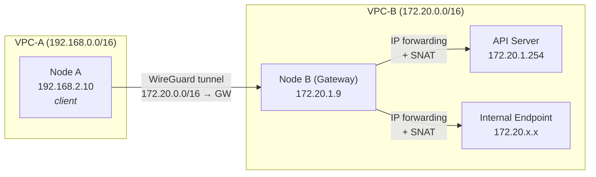
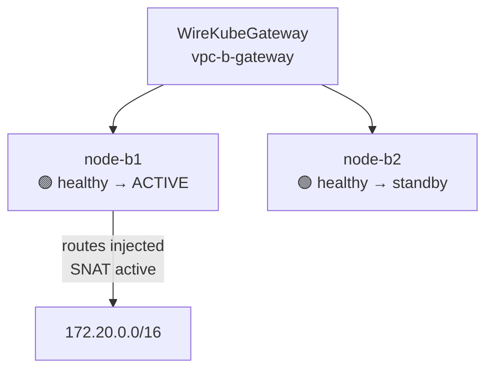

# Virtual Gateway (VGW)

WireKube's Virtual Gateway enables mesh nodes to reach networks behind a
designated gateway node — similar to a VGW in AWS Site-to-Site VPN. This is
essential for multi-VPC topologies where a node in VPC-A needs to access
private link endpoints or internal services in VPC-B.

## Design



A gateway peer acts as a router: it receives WireGuard-encrypted traffic
from client peers, decrypts it, and forwards it into the local network.
Return traffic is SNATed so that the destination sees the gateway's IP as the
source, ensuring correct return path.

## CRD: WireKubeGateway

```yaml
apiVersion: wirekube.io/v1alpha1
kind: WireKubeGateway
metadata:
  name: vpc-b-gateway
spec:
  peerRefs:
    - node-b1    # primary gateway
    - node-b2    # backup (HA failover)

  clientRefs:
    - node-a1    # only these peers route through the gateway

  routes:
    - cidr: "172.20.0.0/16"
      description: "VPC-B private link subnet"

  snat:
    enabled: true

  healthCheck:
    enabled: true
    target: "172.20.1.254:443"
    intervalSeconds: 30
    timeoutSeconds: 5
    failureThreshold: 3
```

### Key Fields

| Field | Description |
|-------|-------------|
| `peerRefs` | Ordered list of WireKubePeer names that can serve as gateway. First healthy peer is elected active. |
| `clientRefs` | Peers that should route through this gateway. If empty, all mesh peers (except gateway peers and same-CIDR peers) are clients. |
| `routes` | CIDR ranges reachable through the gateway. Injected into the active peer's AllowedIPs. |
| `snat` | Source NAT configuration. When enabled, iptables MASQUERADE rules are added on the gateway node. |
| `healthCheck` | TCP probe to verify target network reachability. Triggers failover on consecutive failures. |

## How It Works

### Route Injection

When a WireKubeGateway is created, the agent on the active gateway peer:

1. Adds the gateway CIDRs to its own WireKubePeer's `AllowedIPs`
2. Enables IP forwarding (`net.ipv4.ip_forward = 1`)
3. Adds iptables MASQUERADE rules for each route CIDR

Client peers (those listed in `clientRefs` or all non-gateway, non-same-CIDR peers)
pick up the expanded AllowedIPs during their sync cycle and create:

- WireGuard AllowedIPs entries for the gateway CIDRs on the gateway peer
- Kernel routes in table 22347 pointing the CIDRs through `wire_kube`

### Client Filtering

The agent filters gateway routes based on two criteria:

1. **`clientRefs` membership** — If `clientRefs` is non-empty, only listed peers receive the gateway routes
2. **Same-CIDR exclusion** — Even without `clientRefs`, a peer whose own IP falls within a gateway CIDR is automatically excluded (it already has direct access)

Both WireGuard AllowedIPs and kernel routes are filtered, ensuring zero
unnecessary traffic through the tunnel.

### SNAT (Source NAT)

Without SNAT, packets arriving at the target network carry the client's
mesh IP (e.g. 192.168.2.10) as source. The target has no return route to
that IP, so responses are dropped.

With `snat.enabled: true`, the gateway adds:

```
iptables -t nat -A POSTROUTING -d <cidr> -j MASQUERADE
```

This rewrites the source to the gateway's own IP, which the target network
can route back to.

### Packet Path

```
1. Client (192.168.2.10) sends packet to 172.20.1.254
2. Kernel route: 172.20.0.0/16 → dev wire_kube (table 22347)
3. WireGuard encrypts → tunneled to gateway peer (via relay or direct)
4. Gateway decrypts → IP forwarding → arrives at 172.20.1.254
5. iptables MASQUERADE: src 192.168.2.10 → src 172.20.1.9
6. 172.20.1.254 responds to 172.20.1.9 (gateway)
7. conntrack reverses NAT: dst 172.20.1.9 → dst 192.168.2.10
8. Gateway encrypts → tunneled back to client
9. Client receives response
```

## High Availability

Multiple peers can be listed in `peerRefs`. The agent uses priority-based
election: the first healthy peer is elected active.



### Failover Behavior

1. Each sync cycle, the agent checks all `peerRefs` for health (CRD exists, has public key)
2. If the health check target is configured, a TCP probe is performed
3. First healthy peer in list order becomes active
4. Routes are injected into the new active peer and removed from the old one
5. SNAT rules are updated on the respective nodes

### Status

```yaml
status:
  activePeer: node-b1
  ready: true
  routesInjected: 1
  peerHealth:
    node-b1: healthy
    node-b2: healthy
  lastHealthCheck: "2026-03-04T13:00:00Z"
  conditions:
    - type: Ready
      status: "True"
      reason: AllPeersHealthy
```

## Use Cases

### NKS Private Link API Server

Naver Cloud's NKS uses private link endpoints within the VPC for API server
access. Nodes outside the VPC (e.g. on-premise or other clouds) cannot reach
these endpoints. A gateway node in the VPC bridges access:

```yaml
spec:
  peerRefs: [node-nks-worker1]
  clientRefs: [node-onprem1, node-onprem2]
  routes:
    - cidr: "172.20.0.0/16"
      description: "NKS VPC private link"
  snat:
    enabled: true
```

### Multi-Cloud VPC Access

Connect nodes across AWS, GCP, and on-premise through a gateway node in each
VPC that advertises its local CIDR:

```yaml
# Gateway in AWS VPC
spec:
  peerRefs: [node-aws-gw]
  routes:
    - cidr: "10.0.0.0/16"
      description: "AWS VPC"
  snat:
    enabled: true
---
# Gateway in GCP VPC
spec:
  peerRefs: [node-gcp-gw]
  routes:
    - cidr: "10.128.0.0/16"
      description: "GCP VPC"
  snat:
    enabled: true
```

## Limitations

- Gateway introduces a single point of forwarding (mitigated by HA with multiple peerRefs)
- Additional latency for tunneled + forwarded traffic
- MTU overhead: WireGuard (60 bytes) reduces effective MTU; large CIDR routes may need MTU adjustment
- SNAT hides the original client IP from the target network
