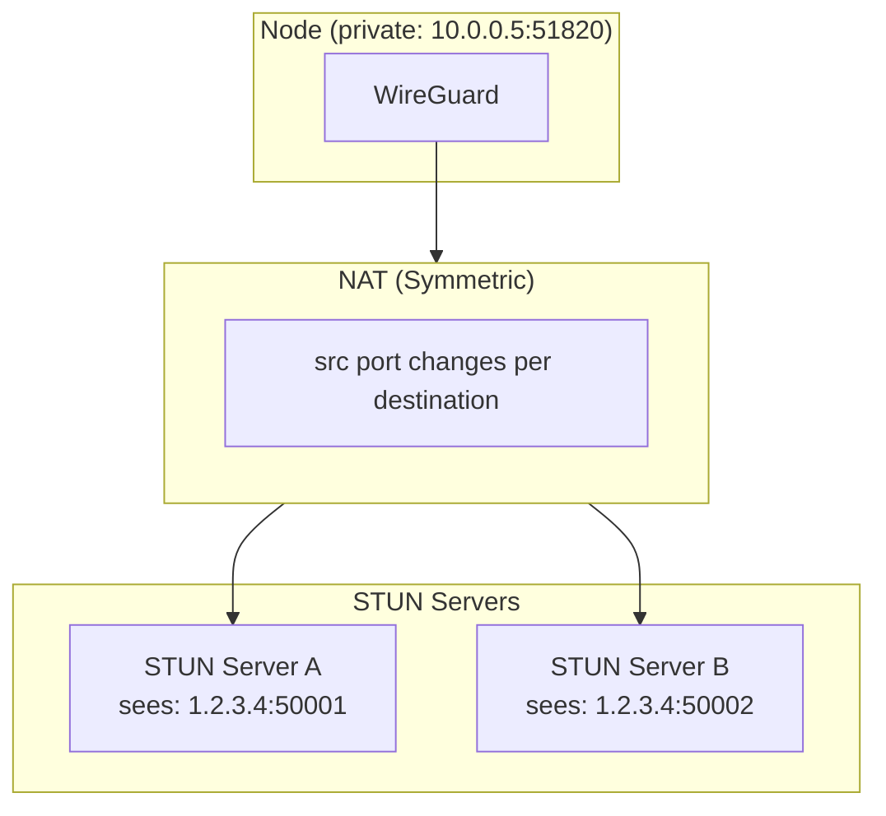
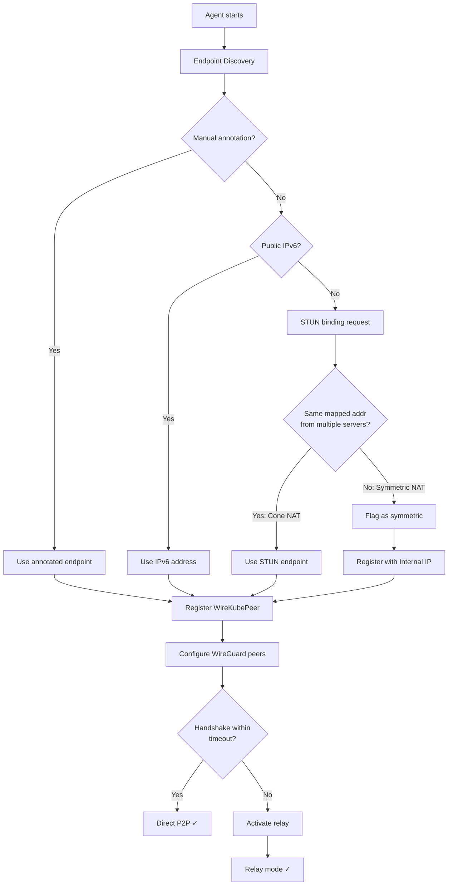

# NAT Traversal

WireKube implements a multi-stage NAT traversal strategy that works across
all major cloud providers and on-premises environments.

## NAT Types

| NAT Type | Mapping Behavior | WireGuard P2P | WireKube Strategy |
|----------|-----------------|---------------|-------------------|
| Full Cone | Endpoint-Independent | Direct | STUN discovery |
| Restricted Cone | Endpoint-Independent | Direct (with keepalive) | STUN discovery |
| Port Restricted Cone | Endpoint-Independent | Usually works | STUN discovery |
| **Symmetric (EDM)** | **Endpoint-Dependent** | **Fails** | **Relay fallback** |

### Why Symmetric NAT Breaks WireGuard

In Symmetric NAT, the NAT gateway assigns a **different external port for each destination**.
STUN discovers `1.2.3.4:50001` when talking to server A, but a peer trying to send to
`1.2.3.4:50001` gets a different mapping — the packet never arrives.

### Cloud Provider NAT Behavior

All major cloud NAT gateways use Symmetric NAT:

| Provider | NAT Product | NAT Type | Verified |
|----------|------------|----------|----------|
| AWS | NAT Gateway | Symmetric | RFC confirmed |
| GCP | Cloud NAT | Symmetric | RFC confirmed |
| Azure | Azure NAT Gateway | Symmetric | RFC confirmed |
| NCloud | NAT Gateway | Symmetric | STUN-tested |

!!! info "This is a universal problem"
    WireKube's relay system is not a workaround for a single cloud provider.
    It is a fundamental requirement for any cross-VPC WireGuard mesh.

## Traversal Strategy

### Stage 1: Endpoint Discovery

The agent runs through the discovery chain on startup:

1. **Manual annotation** (`wirekube.io/endpoint`) — Highest priority, no network calls
2. **Public IPv6** — Global unicast address from node status
3. **STUN** — Binding request to configured STUN servers
4. **AWS IMDSv2** — EC2 metadata service for Elastic IP lookup
5. **UPnP / NAT-PMP** — Request port mapping from gateway router
6. **Node InternalIP** — Last resort fallback

### Stage 2: Direct P2P Attempt

After endpoint discovery, the agent configures WireGuard with the peer's
discovered endpoint. WireGuard attempts a handshake.

### Stage 3: Relay Fallback

If the handshake does not complete within `handshakeTimeoutSeconds` (default: 30s),
the agent activates relay mode for that peer:

1. Establishes TCP connection to the relay server
2. Registers its WireGuard public key
3. Creates a local UDP proxy (`127.0.0.1:random → 127.0.0.1:51820`)
4. Sets the peer's WireGuard endpoint to the proxy's local address
5. All subsequent WireGuard traffic for this peer routes through the relay

!!! warning "Anti-flip-flop"
    Once a peer enters relay mode, it stays in relay mode. A successful
    handshake through the relay is not interpreted as proof of direct
    reachability. This prevents unstable mode switching.

## Relay Protocol

See [Relay System](relay.md) for the full relay protocol specification.

## Performance Impact

| Scenario | Typical Latency | Notes |
|----------|----------------|-------|
| Direct P2P (same region) | 0.5 - 2 ms | WireGuard overhead only |
| Relay (same region) | 1.5 - 3 ms | Added TCP hop through relay |
| Relay (cross-region) | 40 - 60 ms | Dominated by geographic distance |

The relay adds minimal latency within the same region because it only
introduces one additional TCP hop on localhost (agent ↔ proxy) plus the
TCP path to the relay server.
