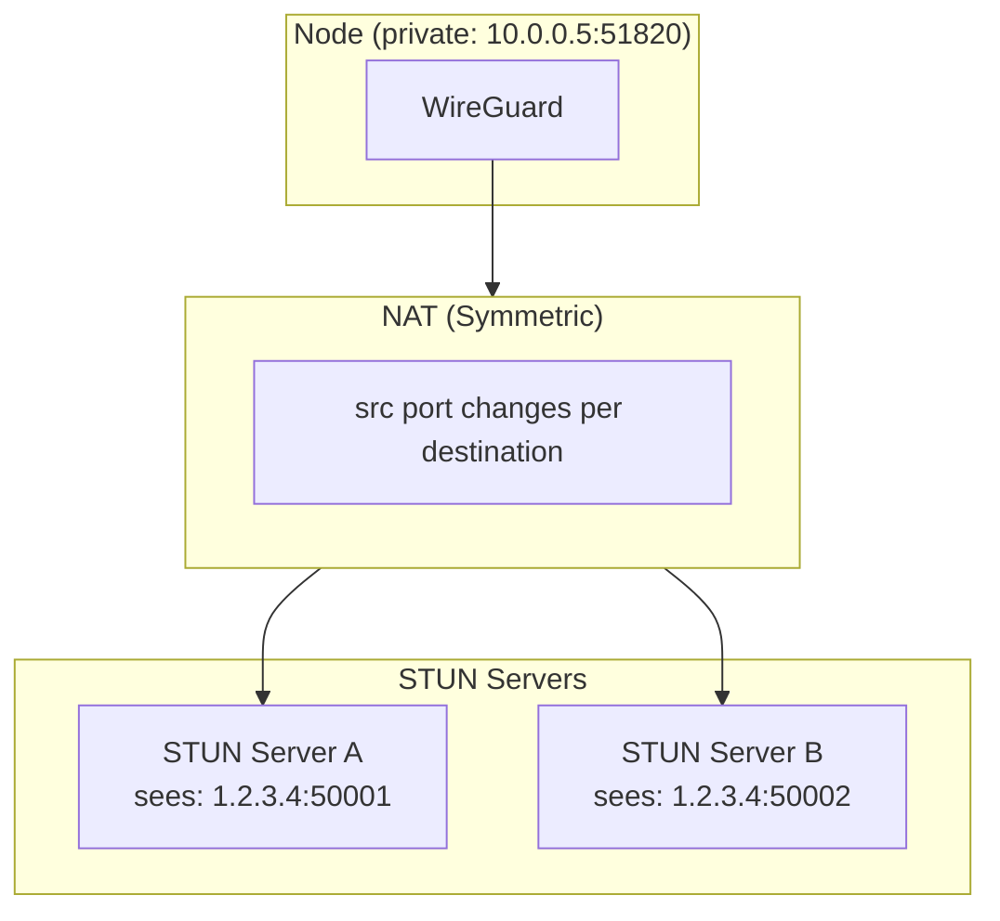
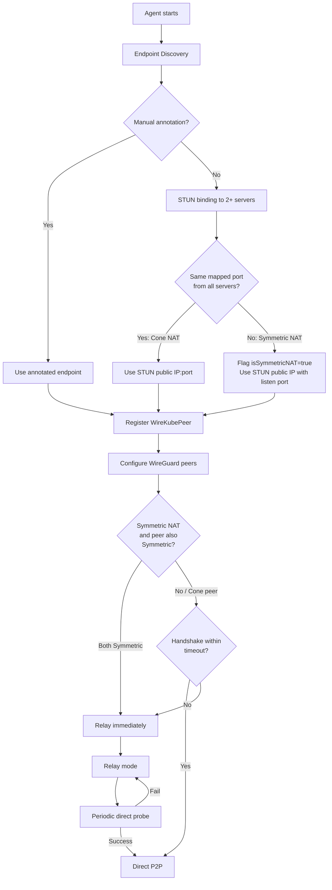
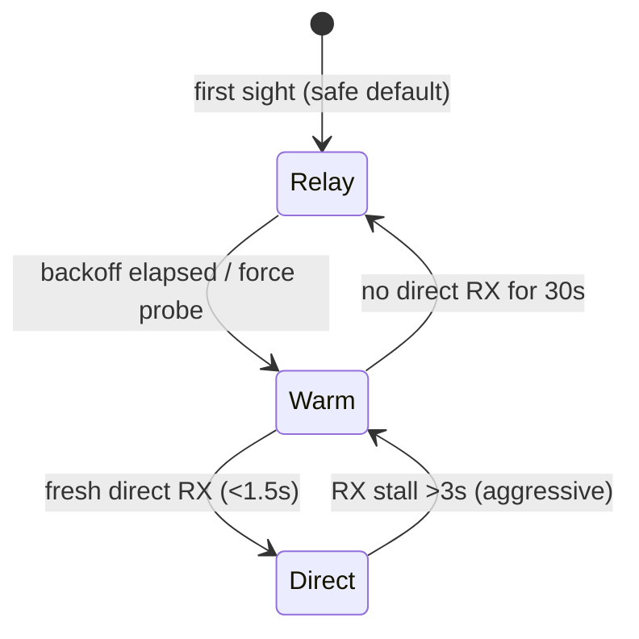

# NAT Traversal

WireKube implements a multi-stage NAT traversal strategy inspired by
[Tailscale's approach](https://tailscale.com/blog/how-nat-traversal-works)
and its magicsock / disco protocol. The core idea: relay is **always warm**,
direct is an **opportunistic overlay** that duplicates packets on both legs
while the path is being proven, and a small cross-peer signalling channel
on the relay closes the gap when the failure is asymmetric.

## NAT Types

| NAT Type | Mapping Behavior | WireGuard P2P | WireKube Strategy |
|----------|-----------------|---------------|-------------------|
| **Open (no NAT)** | **STUN reflects a local interface IP** | **Direct** | **No traversal, no port-restriction probe** |
| Full Cone | Endpoint-Independent | Direct | STUN discovery |
| Restricted Cone | Endpoint-Independent | Direct (with keepalive) | STUN discovery |
| Port Restricted Cone | Endpoint-Independent | Usually works | STUN discovery |
| **Symmetric (EDM)** | **Endpoint-Dependent** | **Fails** | **Relay fallback** |

!!! tip "Open vs Cone"
    Public-IP-on-NIC cloud instances (Oracle Cloud shapes, NCloud direct
    attach, bare-metal servers with a routable address) are classified as
    `open` rather than `cone`. They skip port-restriction detection and
    relay warm-up entirely. The agent infers this by checking whether the
    STUN-reflected IP is present on any local interface.

### Why Symmetric NAT Breaks WireGuard



In Symmetric NAT, the NAT gateway assigns a **different external port for each
destination**. STUN discovers `1.2.3.4:50001` when talking to server A, but a
peer trying to send to `1.2.3.4:50001` gets a different mapping — the packet
never arrives.

### Cloud Provider NAT Behavior

All major cloud NAT gateways use Symmetric NAT:

| Provider | NAT Product | NAT Type |
|----------|------------|----------|
| AWS | NAT Gateway | Symmetric |
| GCP | Cloud NAT | Symmetric |
| Azure | Azure NAT Gateway | Symmetric |
| OCI | NAT Gateway | Symmetric |

Most home/ISP routers use Cone NAT (STUN-based P2P works).

!!! info "When is relay needed?"
    Relay is needed only when **both** peers are behind Symmetric NAT. Cone ↔
    Symmetric pairs achieve direct P2P: the Symmetric side initiates a
    handshake to the Cone peer's stable STUN endpoint; the Cone NAT accepts
    the packet (Endpoint-Independent Filtering), and WireGuard responds to
    the actual source address. Each node publishes its `natType` in its
    WireKubePeer status, so peers can determine the optimal transport path.

## Traversal Strategy



### Stage 1: Endpoint Discovery

The agent runs through the discovery chain on startup:

1. **Manual annotation** (`wirekube.io/endpoint`) — Highest priority, no network calls
2. **STUN** — Binding request to 2+ configured STUN servers. If mapped ports differ between servers, the node is classified as Symmetric NAT.
3. **AWS IMDSv2** — EC2 metadata service for Elastic IP lookup
4. **UPnP / NAT-PMP** — Request port mapping from gateway router
5. **Node InternalIP** — Last resort fallback

For Symmetric NAT nodes, the agent uses the STUN-discovered public IP combined
with the configured WireGuard listen port as its registered endpoint. The port
won't match the actual NAT mapping, but it provides a valid public IP for peers
to attempt direct connections (which will fail, triggering relay).

### Stage 2: Direct P2P or Relay

After endpoint discovery:

- **Cone NAT / Public IP**: Agent configures WireGuard with the peer's discovered
  endpoint and waits for a handshake.
- **Symmetric NAT → Cone/Public peer**: Agent tries direct. The Symmetric side
  initiates a handshake to the Cone peer's stable endpoint. Cone NAT accepts
  the incoming packet, WireGuard responds to the actual source address, and a
  bidirectional tunnel is established.
- **Symmetric NAT → Symmetric NAT peer**: Relay is activated immediately (both
  sides change ports per destination — direct P2P is impossible without a birthday
  attack). The peer's `natType` field in its WireKubePeer status is used to make
  this decision.
- **Handshake timeout**: If any peer's handshake doesn't complete within
  `handshakeTimeoutSeconds` (default 30s), relay is activated for that peer.

### ICE-like Negotiation

WireKube implements an ICE-like (Interactive Connectivity Establishment)
negotiation protocol to optimize peer connectivity. Unlike full ICE/STUN/TURN,
it leverages WireGuard's built-in handshake as the connectivity check and
Kubernetes CRDs as the signaling channel.

#### Candidate Types

Each agent gathers connectivity candidates and publishes them in its
WireKubePeer status:

| Type | Description | Priority |
|------|-------------|----------|
| `host` | Node's internal/LAN IP + WG listen port | 100 |
| `srflx` | STUN-discovered public endpoint | 200 (cone) / 50 (symmetric) |
| `relay` | Relay server available | 10 |
| `prflx` | WireGuard-observed endpoint (learned during handshake) | — |

#### NAT Type Matrix

The agent evaluates the NAT type of both sides to select the optimal strategy:

| Local NAT | Peer NAT | Strategy |
|-----------|----------|----------|
| Open | Any | Direct immediately — no probe, no warm-up |
| Cone | Cone | Direct probe via STUN endpoints (high success rate) |
| Cone | Symmetric | Probe with cone's stable endpoint; symmetric peer's keepalive opens pinhole |
| Symmetric | Cone | Probe peer's stable endpoint; our NAT creates mapping for response |
| Symmetric | Symmetric | Birthday attack (if enabled) or relay fallback |

#### Same-NAT Detection

When two peers share the same public IP (behind the same NAT gateway), STUN
endpoints are unreliable — the NAT can only forward a given external port to one
internal host. WireKube detects this by comparing STUN-discovered IPs and
switches to the peer's `host` candidate (internal LAN IP) for direct
communication. If the host candidate probe fails (e.g., peers are in different
VPCs sharing a NAT gateway), it falls back to relay.

#### Birthday Attack (Symmetric ↔ Symmetric)

For two Symmetric NAT peers, no direct path exists through normal means. The
birthday attack opens many UDP sockets simultaneously (256 by default), sending
probes to predicted port ranges on the peer's public IP. With enough entropy,
the probability of finding a matching port pair is approximately 1 − e^(−n²/2k)
where n is the number of probes and k is the port range.

!!! warning "Birthday attack considerations"
    Some NAT gateways may interpret the burst of UDP probes as a port-scanning
    attack and temporarily block the source. Birthday attack is **disabled by
    default** and can be enabled via:

    - **Cluster-wide**: `WireKubeMesh.spec.natTraversal.birthdayAttack: enabled`
    - **Per-peer override**: annotation `wirekube.io/birthday-attack: enabled` on the WireKubePeer

    Priority: peer annotation > mesh global > default (disabled).

#### Endpoint Reflection

When a direct connection succeeds, the WireGuard kernel module learns the
peer's actual NAT-mapped endpoint (which may differ from the STUN-discovered
one). The agent detects this change and patches the WireKubePeer CRD so other
nodes also learn the correct endpoint. To prevent flapping with Symmetric NAT
ports, endpoint updates for same-IP-different-port cases are only applied when
ICE confirms the connection is stable.

### Bimodal Warm-Relay Datapath

The custom `WireKubeBind` (sitting between wireguard-go and the network)
runs every peer in one of three modes:

| Mode | Direct UDP | Relay TCP | When it applies |
|------|-----------|-----------|-----------------|
| `PathModeDirect` | ✓ | auto (stale >3s) | Fresh receive evidence within the trust window |
| `PathModeWarm` | ✓ | ✓ (every packet) | Probing, demoting, or hinted by peer |
| `PathModeRelay` | — | ✓ | Explicit give-up on direct (symmetric↔PRC etc.) |

Key properties:

- **Warm duplicates every packet** on both legs. WireGuard's replay window
  dedupes on the receiver, so bimodal send is correctness-free.
- **Direct auto-upgrades to dual-send on stale receive**. Inside `Send()`,
  if the peer is in `PathModeDirect` but `DirectHealth.LastSeen` is older
  than `directTrustWindow` (3s), this packet is also sent on the relay
  leg. The failover blackout is thus bounded by the trust window — not by
  the agent's sync interval.
- **Error-based fallback is intentionally absent**. UDP `WriteToUDP` only
  errors on local socket failures; using it as a reachability signal
  would actively mask the inbound-only blackhole case that hints fix.

### Disco-Style Bimodal Hints

Local staleness alone cannot recover from **asymmetric UDP drops** (e.g.
iptables INPUT DROP on one side only). The blocked side sees stale
receive and fires bimodal, but the unblocked side keeps sending
direct-only because its outbound traffic is still succeeding. Without a
signal, the receiving peer only learns about the outage when the FSM
finally demotes the path ~30s later.

WireKube borrows Tailscale's disco idea but reuses the existing relay
TCP connection as the signalling channel instead of inventing a new
protocol:

```
peer A                  relay                  peer B
  |                       |                      |
  | (DirectHealth stale)  |                      |
  | MsgBimodalHint(B) --->|                      |
  |                       | MsgBimodalHint(A) -->|
  |                       |                      | armed: 10s dual-send window
  |                       |                      |
  | <-- relay reply (A reachable via relay) ---- |
```

Rate-limited to one hint per peer per 250 ms; the receiving side arms a
10-second dual-send window on that peer. The FSM continues to run as
before — hints are a datapath accelerator, not a replacement for the
mode transitions.

### Per-Peer FSM (`PathMonitor`)

Each peer carries a finite state machine whose only input is the
direct-receive watermark:



`Warm → Direct` is conservative, `Direct → Warm` is aggressive. `Warm →
Relay` (30s) is the only slow transition, and bimodal send keeps the
datapath working the entire time.

### Stage 3: Relay Fallback

When relay is activated for a peer:

1. Agent connects to the relay server (or relay pool) via TCP
2. Registers its WireGuard public key with the relay
3. Creates a local UDP proxy (`127.0.0.1:random → 127.0.0.1:<wg-port>`)
4. Sets the peer's WireGuard endpoint to the proxy's local address
5. All subsequent WireGuard traffic for this peer routes through the relay

The relay connection auto-reconnects with exponential backoff (1s–30s) if the
TCP connection drops. Existing UDP proxies are preserved across reconnections.

### Stage 4: Direct Path Recovery

Every `directRetryIntervalSeconds` (default 120s), the agent probes relayed
peers to check if direct connectivity has become available:

1. Temporarily set the peer's WireGuard endpoint back to the direct address
2. Wait for the next sync cycle to check WireGuard stats
3. If a successful handshake is detected on the non-proxy endpoint → upgrade to direct
4. If no handshake → cancel probe, resume relay, wait for next retry interval

!!! note "Skipping futile probes"
    The agent skips direct probes for peers whose `WireKubePeer.Status.NATType`
    is `symmetric` when the local node is also Symmetric NAT. This prevents
    wasting cycles probing paths that cannot succeed (both sides use endpoint-
    dependent mapping).

## Transport Modes and NAT Type Reporting

Each agent publishes two transport-related fields in its WireKubePeer status:

**`natType`** — The node's detected NAT mapping behavior. One of `open`,
`cone`, `port-restricted-cone`, `symmetric`, or empty if detection was
inconclusive. Other agents use this to decide whether direct P2P is
possible and what strategy to apply.

**`peerTransports`** — A per-peer map recording the transport mode to each
remote peer (e.g., `{"node-worker1": "direct", "node-worker7": "relay"}`).
This gives full visibility into which paths use relay.

**`transportMode`** — Aggregate derived from `peerTransports`:

| Mode | Meaning |
|------|---------|
| `direct` | All peers connected via direct P2P |
| `relay` | All peers via relay |
| `mixed` | Some peers direct, some relayed |

Both `natType` and `transportMode` appear as kubectl print columns (`NAT`, `Mode`)
for quick inspection: `kubectl get wirekubepeers`.

Each agent only updates its **own** node's status. This prevents
conflicting updates from multiple agents and eliminates status flapping.

## Relay Protocol

See [Relay System](relay.md) for the full relay protocol specification.

## Performance

| Scenario | Typical Latency | Notes |
|----------|----------------|-------|
| Direct P2P (same VPC) | 0.5 – 2 ms | WireGuard overhead only |
| Relay (same region) | 1.5 – 3 ms | Added TCP hop through relay |
| Relay (cross-region) | 40 – 60 ms | Dominated by geographic distance |

The relay adds minimal latency within the same region because it only
introduces one additional TCP hop (agent ↔ relay ↔ agent).
