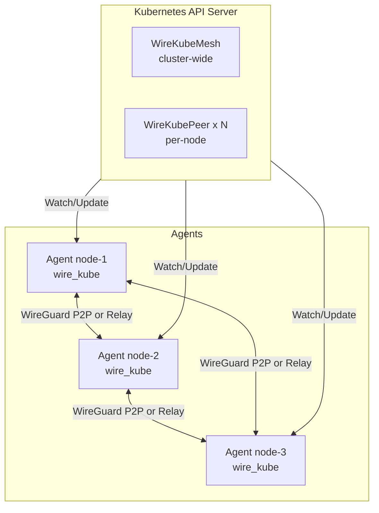

# Architecture Overview

## Components



### Agent (DaemonSet)

The agent runs on every node labeled with `wirekube.io/vpn-enabled=true`.
It is responsible for:

1. **Interface management** — Creates and configures the WireGuard interface
2. **Key management** — Generates and persists WireGuard key pairs
3. **Peer registration** — Creates/updates WireKubePeer CRDs
4. **Peer synchronization** — Watches all WireKubePeer CRDs and configures WireGuard
5. **Endpoint discovery** — Determines the best reachable address via STUN, annotations, etc.
6. **NAT detection** — Identifies Symmetric NAT and triggers relay fallback
7. **Relay client** — Connects to relay server when direct P2P is impossible
8. **Route management** — Adds `/32` routes for peer node IPs

### Relay Server

The relay server bridges WireGuard UDP packets over TCP for peers behind Symmetric NAT.
It is a simple, stateless packet forwarder that:

- Accepts TCP connections from agents
- Maps WireGuard public keys to TCP connections
- Forwards framed UDP packets between agents
- Cannot decrypt traffic (no access to WireGuard private keys)

### CRDs

**WireKubeMesh** — Singleton resource defining mesh-wide configuration:

- WireGuard listen port and interface name
- STUN server list
- Relay configuration (mode, provider, endpoints)

**WireKubePeer** — One per mesh-participating node:

- WireGuard public key
- Discovered endpoint (ip:port)
- AllowedIPs (node IP /32)
- Status (connected, transport mode, discovery method)

## Traffic Flow

WireKube creates a **node-level mesh**, not a pod-level overlay.

### Route Strategy

```
                     CNI routes (metric ~100)
Pod A ---- pod CIDR ---- CNI (Cilium, etc.) ---- Pod B

                     WireKube routes (metric 200)
Node A ---- nodeIP/32 ---- wire_kube ---- Node B
```

WireKube inserts **only `/32` routes for node IPs** with metric 200.
Pod CIDR routes managed by the CNI are untouched (lower metric = higher priority).

!!! warning "Critical Design Rule"
    Never insert pod CIDR routes through `wire_kube`. This would break CNI
    functionality, especially with Cilium's kube-proxy replacement.

### Packet Path (Direct P2P)

```
1. Packet destined for remote node IP
2. Kernel routing: nodeIP/32 → dev wire_kube
3. WireGuard encrypts packet
4. UDP packet sent to peer's public endpoint
5. Peer's WireGuard decrypts
6. Delivered to local stack
```

### Packet Path (Relay)

```
1. Packet destined for remote node IP
2. Kernel routing: nodeIP/32 → dev wire_kube
3. WireGuard encrypts → UDP to local proxy (127.0.0.1:random)
4. UDP proxy reads packet → frames it as MsgData
5. Sends over TCP to relay server
6. Relay forwards to destination agent's TCP connection
7. Destination proxy delivers UDP to local WireGuard (127.0.0.1:51820)
8. WireGuard decrypts
9. Delivered to local stack
```

## Design Principles

1. **Cloud-agnostic** — No reliance on cloud-specific features (VPC peering, etc.)
2. **CNI-safe** — Only routes node IPs, never pod CIDRs
3. **Graceful degradation** — Direct P2P → STUN → Relay (automatic fallback)
4. **Minimal privileges** — `NET_ADMIN` + `SYS_MODULE` only
5. **Stable relay** — Once in relay mode, stay in relay (no flip-flop)
