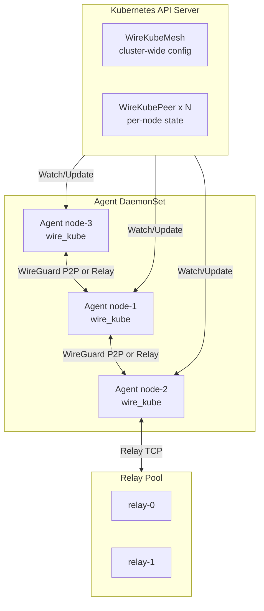

# Architecture Overview

## Components



WireKube consists of the following deployed components:

| Component | Runs as | Purpose |
|-----------|---------|---------|
| **Agent** | DaemonSet (`hostNetwork: true`) | Manages WireGuard interface, discovers endpoints, syncs peers, handles relay failover, direct recovery, and gateway forwarding |
| **Relay** | Deployment + Service | Bridges WireGuard UDP over TCP for peers behind Symmetric NAT |
| **wirekubectl** | CLI | Status inspection and peer management |
| **Admin web** | Relay sidecar | Manages external peers through the Kubernetes API |

### Agent (DaemonSet)

The default manifest runs the agent on every node except nodes labeled `wirekube.io/proxy-node=true`. It uses `hostNetwork: true`, `privileged: true`, and `appArmorProfile: Unconfined`, which are required for reliable TUN access on common Ubuntu 24.04 and containerd configurations. The agent is responsible for:

1. **Userspace WireGuard** — Runs wireguard-go and owns a TUN named `wire_kube`. The kernel WireGuard backend has been removed; on upgrade from older versions the agent deletes any existing kernel `wire_kube` link and recreates it as a TUN.
2. **Custom `WireKubeBind`** — Sits between wireguard-go and the network and runs the bimodal warm-relay datapath (see [NAT Traversal](nat-traversal.md)). Also sends and receives `MsgBimodalHint` disco frames via the relay for asymmetric-failover recovery.
3. **Key management** — Generates and persists WireGuard key pairs
4. **Peer registration** — Creates/updates its own WireKubePeer CRD (including mesh overlay IP from `meshCIDR` and, optionally, the node's private address via `autoAllowedIPs`)
5. **Peer synchronization** — Watches all WireKubePeer CRDs and configures wireguard-go peers; the per-peer `PathMonitor` FSM commits `Direct/Warm/Relay` decisions into the Bind
6. **Endpoint discovery** — Determines the best reachable address via STUN, annotations, etc.
7. **NAT detection** — RFC 5780 multi-server STUN to classify `open` / `cone` / `port-restricted-cone` / `symmetric`
8. **Relay client** — Connects to the relay pool and stays connected (relay is always warm, not just a fallback)
9. **Relay auto-reconnect** — Exponential backoff (1s–30s) on TCP connection drops
10. **Route management** — Adds connected peer and gateway AllowedIPs to routing table 22347
11. **IPSec bypass** — Sets `disable_xfrm` and `disable_policy` on the WireGuard interface
12. **State reconciliation** — Repairs routing rules during sync and removes interface state during graceful shutdown

### Relay Server

The relay server bridges WireGuard UDP packets over TCP for peers behind Symmetric NAT.
It is a connection-stateful packet forwarder that:

- Accepts TCP connections from agents
- Maps WireGuard public keys to TCP connections
- Forwards framed UDP packets between agents
- Cannot decrypt traffic (no access to WireGuard private keys)
- Sees relay metadata such as registered public keys, peer relationships, frame sizes, and timing unless an outer TLS transport is used
- Does not currently authenticate ownership of a registered WireGuard public key
- Supports auto-reconnect from agents with exponential backoff
- Can be scaled horizontally via a Headless Service (relay pool)

### CRDs

**WireKubeMesh** — Singleton resource defining mesh-wide configuration:

- WireGuard listen port and interface name
- `meshCIDR` — private CIDR for the overlay. Each node gets a
  deterministic `/32` derived from its node name; that IP becomes the
  peer's primary AllowedIPs entry.
- `autoAllowedIPs.includeNodeInternalIP` — optional flag that also
  publishes each node's **private** address (never public) alongside
  the overlay IP for legacy references.
- STUN server list (minimum 2 for NAT detection)
- Relay configuration (mode, provider, endpoints, timeouts)

**WireKubePeer** — One per mesh-participating node:

- WireGuard public key
- Discovered endpoint (ip:port)
- AllowedIPs (typically the deterministic mesh IP `/32`, optionally
  augmented with the node's private IP)
- Status: connected, NAT type (`open`/`cone`/`port-restricted-cone`/
  `symmetric`), transport mode (`direct`/`relay`/`mixed`), per-peer
  `connections` map, discovery method

**WireKubeGateway** — Virtual gateway for cross-VPC routing:

- PeerRefs: ordered list of gateway peers (HA failover)
- ClientRefs: peers that route through this gateway
- Routes: CIDR ranges reachable through the gateway
- SNAT and health check configuration
- See [Virtual Gateway](gateway.md) for the full design.

## Traffic Flow

WireKube creates a **node-level mesh**, not a pod-level overlay.

### Route Strategy

```
                     Main/CNI routing tables
Pod A ---- pod CIDR ---- CNI (Cilium, etc.) ---- Pod B

                     WireKube table 22347
Node A ---- AllowedIP ---- wire_kube ---- Node B
```

WireKube installs connected peer AllowedIPs and gateway CIDRs in table `22347`. An IP rule at priority `200` consults that table and falls through to the main table when no WireKube route matches.

!!! warning "Critical Design Rule"
    Never insert pod CIDR routes through `wire_kube`. This would break CNI
    functionality, especially with Cilium's kube-proxy replacement.

### Routing Internals

- **fwmark `0x574B`** on WireGuard socket packets → main routing table (avoids packet loop)
- **Custom routing table `22347`** (`0x574B`) isolates WireGuard routes from the main table
- **IP rule priority 200** selects the WireKube table; routes themselves do not set metric 200
- **`disable_xfrm=1`** and **`disable_policy=1`** on wire_kube → bypasses IPSec xfrm policies

### Packet Path (Direct P2P)

```
1. Packet destined for remote node IP
2. Kernel routing: nodeIP/32 → dev wire_kube (table 22347)
3. WireGuard encrypts packet
4. UDP packet marked with fwmark 0x574B → uses main table → sent via physical interface
5. Peer's WireGuard decrypts
6. Delivered to local stack
```

### Packet Path (Relay)

```
1. Packet destined for remote node IP
2. Kernel routing: nodeIP/32 → dev wire_kube
3. WireGuard encrypts the packet and the custom userspace Bind selects the relay leg
4. Bind frames the encrypted packet as [4B length][1B type=0x02][32B dest pubkey][payload]
5. Relay pool sends the frame over TCP to a relay server
6. Relay forwards it to the destination agent's TCP connection
7. Destination relay client delivers the encrypted packet directly to the destination Bind
8. WireGuard decrypts the packet
9. Packet is delivered to the local stack
```

## NAT Traversal Overview

Inspired by [Tailscale's approach](https://tailscale.com/blog/how-nat-traversal-works):

1. **STUN discovery** — Query 2+ STUN servers; compare mapped ports for NAT type detection
2. **Relay availability** — When configured, relay connects immediately and provides the safe starting path
3. **Direct promotion** — Same-VPC and compatible NAT pairs are probed and promoted to direct
4. **Continuous recovery** — Stale direct paths demote to relay and are periodically probed again

See [NAT Traversal](nat-traversal.md) for the full strategy.

## Design Principles

1. **Cloud-agnostic** — No reliance on cloud-specific features (VPC peering, etc.)
2. **CNI-aware** — Keeps WireKube routes in a dedicated table and expects operators to avoid overlapping AllowedIPs; gateway routes may intentionally include non-node CIDRs
3. **Graceful path selection** — Relay availability → direct promotion → relay recovery on failure
4. **Explicit privileges** — The bundled userspace-WireGuard DaemonSet uses `privileged: true`, `NET_ADMIN`, `SYS_MODULE`, an unconfined AppArmor profile, and a mounted TUN device
5. **Structured direct upgrade** — Relayed peers are periodically probed; skips peers that self-report as relay-only (Symmetric NAT)
6. **Per-node status ownership** — Each agent updates only its own `transportMode` to prevent cross-agent status flapping
7. **IPSec coexistence** — xfrm bypass prevents conflicts with existing site-to-site tunnels
8. **State repair** — Graceful cleanup plus periodic routing rule reconciliation
