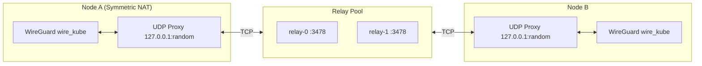
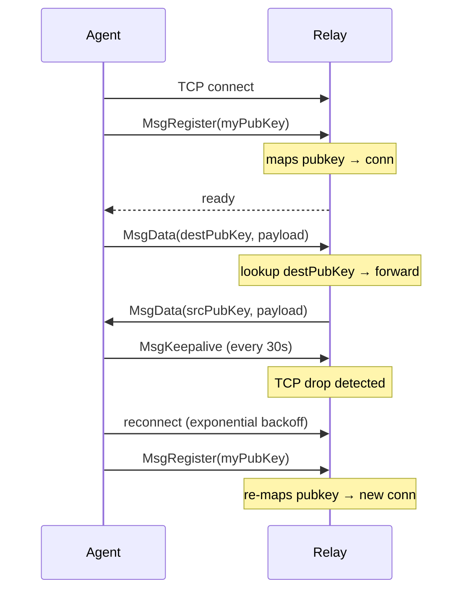
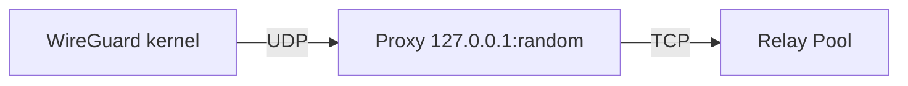
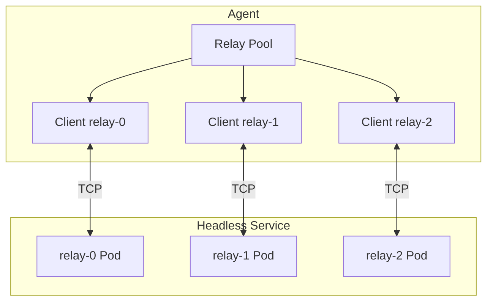

# Relay System

The WireKube relay server bridges WireGuard UDP packets over TCP for peers
that cannot establish direct P2P connections (Symmetric NAT, restrictive firewalls).

## Design



## Protocol

### Frame Format

All messages are framed with a length prefix:

| Field | Size | Description |
|-------|------|-------------|
| Length | 4 bytes (uint32) | Total message length |
| Type | 1 byte | Message type code |
| Body | variable | Message payload |

### Message Types

| Type | Code | Body | Description |
|------|------|------|-------------|
| `MsgRegister` | `0x01` | 32-byte WireGuard public key | Agent registers itself with the relay |
| `MsgData` | `0x02` | 32-byte dest pubkey + UDP payload | Forward WireGuard packet to peer |
| `MsgKeepalive` | `0x03` | (empty) | Keep TCP connection alive (30s interval) |
| `MsgNATProbe` | `0x04` | 4-byte IPv4 + 2-byte port | Ask relay to send a UDP probe back to the agent — used for port-restriction detection |
| `MsgBimodalHint` | `0x05` | 32-byte dest pubkey (server rewrites to sender pubkey on forward) | Disco-style asymmetric-failure signal; instructs the destination peer to dual-send on both direct and relay legs |
| `MsgError` | `0xFF` | Error message string | Relay reports an error |

!!! note "Why a separate hint frame"
    Agents cannot detect asymmetric one-way UDP drops from their own
    observations: on the sender side `WriteToUDP` still succeeds, and on
    the unblocked receiver the direct-receive watermark stays fresh. The
    hint frame lets the blocked side push a short "please dual-send to
    me" request to the peer through the already-warm relay, so failover
    converges within the trust window instead of waiting for the FSM to
    time out the path (~30s). The relay rewrites the body to the sender
    pubkey so the receiver can authenticate who sent it.

### Connection Lifecycle



## Auto-Reconnect

The relay client implements automatic reconnection with exponential backoff:

- **Backoff range**: 1 second (initial) to 30 seconds (max)
- **Trigger**: Any read/write error on the TCP connection, or connection close
- **Behavior**: Sets `connected=false`, closes the old connection, signals reconnect
- **Registration**: On reconnect, re-sends `MsgRegister` to re-associate the public key
- **Proxy persistence**: Existing UDP proxies are preserved across reconnections

The `connected` state is tracked via `atomic.Bool` for lock-free access from
the agent's main sync loop.

## Local UDP Proxy

Each relayed peer gets a dedicated UDP proxy running on localhost.

### Why a Local Proxy?

WireGuard is a kernel-level interface that speaks UDP only. It cannot
directly use a TCP connection. The proxy bridges this gap:



### Socket Strategy

The proxy uses `net.DialUDP` to create a **connected** UDP socket:

```go
localAddr  := &net.UDPAddr{IP: net.IPv4(127, 0, 0, 1), Port: 0}
remoteAddr := &net.UDPAddr{IP: net.IPv4(127, 0, 0, 1), Port: wgPort}
conn, _ := net.DialUDP("udp4", localAddr, remoteAddr)
```

This gives the proxy a stable local address (e.g., `127.0.0.1:54321`) that
WireGuard uses as the peer's endpoint. Since the socket is **connected** to
the WireGuard port, `conn.Write()` uses `write(2)` instead of `sendto(2)`,
which is important for [Cilium compatibility](cni-compatibility.md).

### Adaptive Write

The proxy implements a two-tier write strategy:

1. **Standard**: `conn.Write(payload)` — uses Go's `net.UDPConn`
2. **Fallback**: `syscall.Write(dupFD, payload)` — raw syscall on a duplicated fd

If `conn.Write()` returns `EPERM` (e.g., from Cilium BPF hooks), the proxy
switches to `syscall.Write` mode for all subsequent writes. This is tracked
via an `atomic.Bool` for lock-free access.

### Sender Interface

The proxy sends data through a `Sender` interface:

```go
type Sender interface {
    SendToPeer(destPubKey [32]byte, payload []byte) error
}
```

This abstraction allows the proxy to work with either a single `Client` or
the `Pool`, making the relay layer pluggable.

## Relay Pool

The relay pool manages connections to **multiple relay server instances** for
scalability and high availability.

### Architecture



### How It Works

1. **DNS Discovery**: The pool resolves the relay address (typically a Kubernetes
   Headless Service) to get all pod IPs.
2. **Full Registration**: Agents connect to and register on **all** discovered relay
   instances. This ensures any relay can deliver packets to any agent.
3. **Send Strategy**: When sending a packet, the pool tries each connected relay
   in order until one succeeds.
4. **Periodic Re-resolution**: Every 30 seconds, the pool re-resolves DNS to detect
   scale-up/scale-down events. New replicas get connected; stale entries are removed.
5. **Per-Client Reconnect**: Each client in the pool has its own auto-reconnect loop,
   so individual relay failures don't affect the rest.

### Scaling Relay

To scale the relay:

1. Deploy as a `Deployment` with multiple replicas
2. Create a **Headless Service** (`clusterIP: None`) pointing to the relay pods
3. The agent's pool resolves the Headless Service DNS → gets all pod IPs
4. Each agent registers on all replicas → any replica can route to any agent

```yaml
apiVersion: v1
kind: Service
metadata:
  name: wirekube-relay
  namespace: wirekube-system
spec:
  clusterIP: None
  selector:
    app: wirekube-relay
  ports:
    - port: 3478
      targetPort: 3478
```

### Data Handler Callback

When the pool receives data from any relay, it routes the packet to the correct
local UDP proxy based on the source WireGuard public key:

```
Relay → Pool.handleData(srcKey, payload) → proxies[srcKey].DeliverToWireGuard(payload)
```

## Managed Relay Discovery

For `provider: managed`, the agent needs to connect to the relay before the mesh
tunnel is up (chicken-and-egg problem). The agent resolves this by querying the
Kubernetes Service API for the relay's externally reachable address:

1. **ExternalIPs** — Manually configured public IPs on the Service
2. **LoadBalancer Ingress** — Cloud-assigned external IP or hostname
3. **NodePort** — Service NodePort via a cluster node's public IP (ExternalIP
   or public InternalIP for cloud providers like OCI)

ClusterIP DNS is intentionally **not** used as a fallback because CoreDNS
resolution depends on a functioning CNI, which may not be available on
hybrid/NAT'd nodes before the mesh tunnel is established. If no external address
is found, the agent retries with exponential backoff until the Service becomes
externally reachable (e.g., LoadBalancer IP is assigned).

## Deployment Options

### Managed Relay (In-Cluster)

```bash
kubectl apply -f config/relay/deployment.yaml
```

Configure in WireKubeMesh:

```yaml
spec:
  relay:
    provider: managed
    managed:
      replicas: 1
      serviceType: LoadBalancer
      port: 3478
```

### External Relay

Deploy on any machine with a public IP or behind a TCP load balancer:

```bash
wirekube-relay --addr :3478
```

Configure in WireKubeMesh:

```yaml
spec:
  relay:
    provider: external
    external:
      endpoint: "relay.example.com:3478"
      transport: tcp
```

### Behind a TCP Load Balancer

```
Internet ---- TCP LB :3478 ---- Relay Pod/Server :3478
```

The relay's TCP transport was specifically designed to work with TCP-only
load balancer offerings.

## Capacity

A single relay instance can handle thousands of concurrent connections.
Each connection is a lightweight TCP socket with minimal CPU overhead —
the relay only forwards opaque encrypted packets without any decryption.
