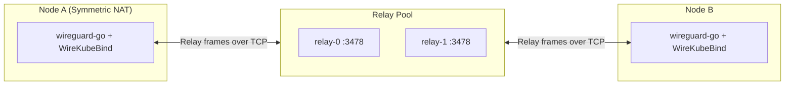
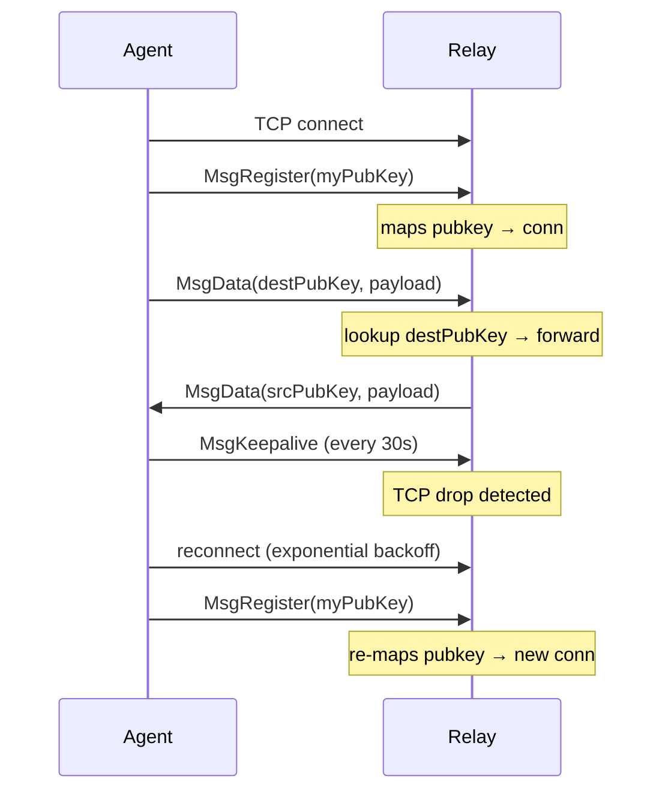
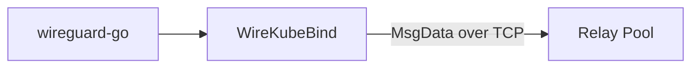
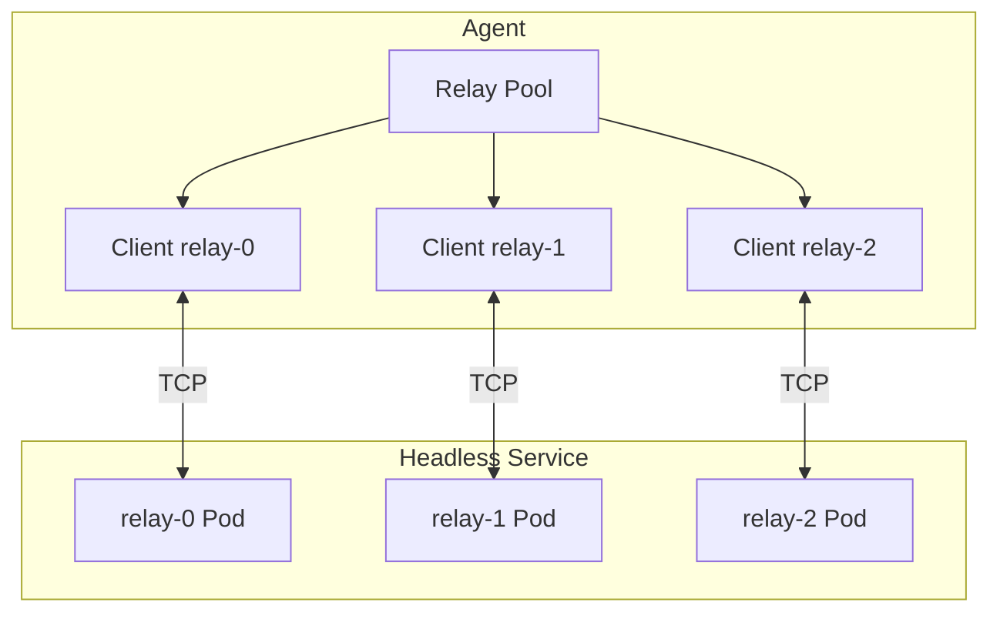

# Relay System

The WireKube relay server bridges WireGuard UDP packets over TCP for peers
that cannot establish direct P2P connections (Symmetric NAT, restrictive firewalls).

## Design



## Protocol

### Frame Format

All messages are framed with a length prefix:

| Field | Size | Description |
|-------|------|-------------|
| Length | 4 bytes (uint32) | Total message length |
| Type | 1 byte | Message type code |
| Body | variable | Message payload |

### Message Types

| Type | Code | Body | Description |
|------|------|------|-------------|
| `MsgRegister` | `0x01` | 32-byte WireGuard public key | Agent registers itself with the relay |
| `MsgData` | `0x02` | 32-byte dest pubkey + UDP payload | Forward WireGuard packet to peer |
| `MsgKeepalive` | `0x03` | (empty) | Keep TCP connection alive (30s interval) |
| `MsgNATProbe` | `0x04` | 4-byte IPv4 + 2-byte port | Ask relay to send a UDP probe back to the agent — used for port-restriction detection |
| `MsgBimodalHint` | `0x05` | 32-byte dest pubkey (server rewrites to sender pubkey on forward) | Disco-style asymmetric-failure signal; instructs the destination peer to dual-send on both direct and relay legs |
| `MsgRelayProbe` | `0x06` | 8-byte token | Measure relay-to-agent responsiveness |
| `MsgForwarderRegister` | `0x10` | UDP port + ingress key + external key | Legacy external-peer forwarder registration |
| `MsgForwarderUnregister` | `0x11` | UDP port | Legacy external-peer forwarder removal |
| `MsgForwarderStats` | `0x12` | UDP port and counters | Legacy forwarder statistics |
| `MsgIngressProbe` | `0x13` | ingress key list or RTT result list | Probe candidate external-peer ingress agents |
| `MsgExternalData` | `0x20` | source token + source address + WireGuard payload | Carry shared-listener external-peer traffic |
| `MsgError` | `0xFF` | Error message string | Relay reports an error |

!!! note "Why a separate hint frame"
    Agents cannot detect asymmetric one-way UDP drops from their own
    observations: on the sender side `WriteToUDP` still succeeds, and on
    the unblocked receiver the direct-receive watermark stays fresh. The
    hint frame lets the blocked side push a short "please dual-send to
    me" request to the peer through the already-warm relay, so failover
    converges within the trust window instead of waiting for the FSM to
    time out the path (~30s). The relay rewrites the body to the sender
    pubkey so the receiver can associate the hint with a peer. This is relay-provided identity metadata, not cryptographic proof that the sender owns that WireGuard key.

### Connection Lifecycle



## Auto-Reconnect

The relay client implements automatic reconnection with exponential backoff:

- **Backoff range**: 1 second (initial) to 30 seconds (max)
- **Trigger**: Any read/write error on the TCP connection, or connection close
- **Behavior**: Sets `connected=false`, closes the old connection, signals reconnect
- **Registration**: On reconnect, re-sends `MsgRegister` to re-associate the public key
- **Path persistence**: Bind relay path state remains configured while clients reconnect

The `connected` state is tracked via `atomic.Bool` for lock-free access from
the agent's main sync loop.

## Userspace Bind Delivery

The current agent uses wireguard-go with `WireKubeBind`. Relay packets do not need to be translated through a localhost UDP proxy in the default userspace path.

### Outbound Path

`WireKubeBind.Send` selects direct, warm, or relay delivery per peer. On the relay leg it hands the already encrypted WireGuard packet to the relay pool, which writes a `MsgData` frame over TCP.



### Inbound Path

The relay pool parses the incoming frame and invokes Bind delivery with the sender key and encrypted payload. Wireguard-go then authenticates and decrypts the inner WireGuard packet.

The legacy `UDPProxy` implementation remains in the codebase as a fallback for engines without direct Bind delivery, but it is not the normal path of the bundled userspace engine.

## Relay Pool

The relay pool manages connections to **multiple relay server instances** for
scalability and high availability.

### Architecture



### How It Works

1. **DNS Discovery**: The pool resolves the relay address (typically a Kubernetes
   Headless Service) to get all pod IPs.
2. **Full Registration**: Agents connect to and register on **all** discovered relay
   instances. This ensures any relay can deliver packets to any agent.
3. **Send Strategy**: When sending a packet, the pool tries each connected relay
   in order until one succeeds.
4. **Periodic Re-resolution**: Every 30 seconds, the pool re-resolves DNS to detect
   scale-up/scale-down events. New replicas get connected; stale entries are removed.
5. **Per-Client Reconnect**: Each client in the pool has its own auto-reconnect loop,
   so individual relay failures don't affect the rest.

### Scaling Relay

To scale the relay:

1. Deploy as a `Deployment` with multiple replicas
2. Create a **Headless Service** (`clusterIP: None`) pointing to the relay pods
3. The agent's pool resolves the Headless Service DNS → gets all pod IPs
4. Each agent registers on all replicas → any replica can route to any agent

```yaml
apiVersion: v1
kind: Service
metadata:
  name: wirekube-relay
  namespace: wirekube-system
spec:
  clusterIP: None
  selector:
    app.kubernetes.io/name: wirekube-relay
  ports:
    - port: 3478
      targetPort: 3478
```

### Data Handler Callback

When the pool receives data from any relay, it routes the packet to the correct
local UDP proxy based on the source WireGuard public key:

```
Relay → Pool.handleData(srcKey, payload) → proxies[srcKey].DeliverToWireGuard(payload)
```

## Managed Relay Endpoint

For `provider: managed`, the agent connects to the headless `wirekube-relay-control.<namespace>.svc.cluster.local` Service. This is the simplest path for nodes with working cluster DNS and service routing.

Nodes that cannot reach that Service during bootstrap must use `provider: external`. Set `external.endpoint` to the relay's public LoadBalancer address or a reachable node IP and NodePort. The relay process is the same; only the agent's entry point changes.

## Deployment Options

### Managed Relay (In-Cluster)

```bash
kubectl apply -f config/relay/deployment.yaml
```

Configure in WireKubeMesh:

```yaml
spec:
  relay:
    provider: managed
    managed:
      replicas: 1
      serviceType: LoadBalancer
      port: 3478
```

### External Relay

Deploy on any machine with a public IP or behind a TCP load balancer:

```bash
wirekube-relay --addr :3478
```

Configure in WireKubeMesh:

```yaml
spec:
  relay:
    provider: external
    external:
      endpoint: "relay.example.com:3478"
      transport: tcp
```

### Behind a TCP Load Balancer

```
Internet ---- TCP LB :3478 ---- Relay Pod/Server :3478
```

The relay's TCP transport was specifically designed to work with TCP-only load balancer offerings.

HTTP application load balancers and Kubernetes Ingress controllers generally cannot carry this raw TCP protocol. See [Relay Entry Points](../guides/relay-entrypoints.md) for the recommended LoadBalancer path, the NodePort alternative, and HTTP CONNECT forward-proxy examples.

The implemented [WebSocket Relay Endpoint](websocket-relay.md) adds `wss://.../relay` with Kubernetes-issued bearer-token authentication for ALB and Ingress environments. Easy install selects it with `--relay-transport wss --relay-endpoint wss://HOST/PATH`.

## Capacity

Each agent connection is a TCP socket and the relay does not decrypt the inner WireGuard payload. Capacity has not yet been published from a repeatable load-test benchmark, so operators should validate connection and bandwidth limits for their workload.

## Security Boundary

WireGuard payloads remain end-to-end encrypted, but the raw relay TCP stream exposes registered public keys, source/destination relationships, frame types, sizes, timing, NAT probe targets, and external-peer source metadata. The current `MsgRegister` flow does not prove ownership of the supplied WireGuard public key, so a public relay should not be treated as an authenticated control plane.

The optional public HTTP endpoint uses WebSocket over TLS and a Kubernetes-issued bearer token. TLS protects the outer relay stream and server identity; the token authenticates and authorizes the connecting agent. See [WebSocket Relay Endpoint](websocket-relay.md).
