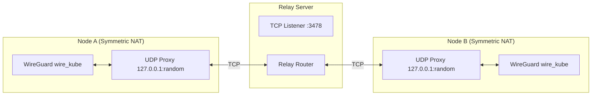
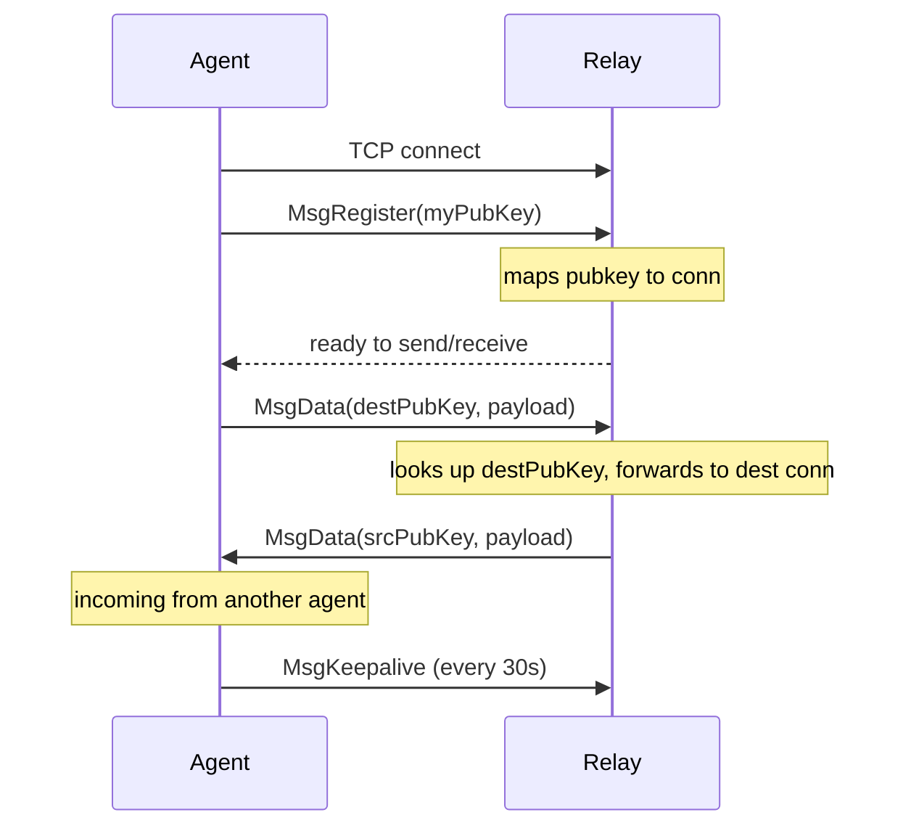
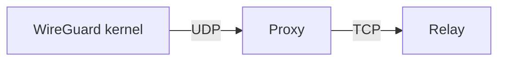

# Relay System

The WireKube relay server bridges WireGuard UDP packets over TCP for peers
that cannot establish direct P2P connections (Symmetric NAT, restrictive firewalls).

## Design



## Protocol

### Frame Format

All messages are framed with a length prefix:

| Field | Size | Description |
|-------|------|-------------|
| Length | 4 bytes (uint32) | Length of the message |
| Type | 1 byte | Message type code |
| Body | variable | Message payload |

### Message Types

| Type | Code | Body | Description |
|------|------|------|-------------|
| `MsgRegister` | `0x01` | 32-byte WireGuard public key | Agent registers itself with the relay |
| `MsgData` | `0x02` | 32-byte dest pubkey + UDP payload | Forward WireGuard packet to peer |
| `MsgKeepalive` | `0x03` | (empty) | Keep TCP connection alive (30s interval) |
| `MsgError` | `0xFF` | Error message string | Relay reports an error |

### Connection Lifecycle



## Local UDP Proxy

Each relayed peer gets a dedicated UDP proxy running on localhost.

### Why a Local Proxy?

WireGuard is a kernel-level interface that speaks UDP only. It cannot
directly use a TCP connection. The proxy bridges this gap:



### Socket Strategy

The proxy uses `net.DialUDP` to create a **connected** UDP socket:

```go
localAddr  := &net.UDPAddr{IP: net.IPv4(127, 0, 0, 1), Port: 0}      // random port
remoteAddr := &net.UDPAddr{IP: net.IPv4(127, 0, 0, 1), Port: wgPort}  // 51820

conn, _ := net.DialUDP("udp4", localAddr, remoteAddr)
```

This gives the proxy a stable local address (e.g., `127.0.0.1:54321`) that
WireGuard uses as the peer's endpoint. Since the socket is **connected** to
the WireGuard port, `conn.Write()` uses `write(2)` instead of `sendto(2)`,
which is important for [Cilium compatibility](cni-compatibility.md).

### Adaptive Write

The proxy implements a two-tier write strategy:

1. **Standard**: `conn.Write(payload)` — uses Go's `net.UDPConn`
2. **Fallback**: `syscall.Write(dupFD, payload)` — raw syscall on a duplicated fd

If `conn.Write()` returns `EPERM` (e.g., from Cilium BPF hooks), the proxy
switches to `syscall.Write` mode for all subsequent writes. This is tracked
via an `atomic.Bool` for lock-free access.

## Relay Deployment

### External Relay

Deploy the relay binary on any machine with a public IP or behind a TCP load balancer:

```bash
wirekube-relay --addr :3478
```

Configure in WireKubeMesh:

```yaml
spec:
  relay:
    provider: external
    external:
      endpoint: "relay.example.com:3478"
      transport: tcp
```

### Managed Relay (In-Cluster)

Deploy the relay as a Kubernetes Deployment + LoadBalancer Service using
the manifests in `config/relay/`:

```bash
kubectl apply -f config/relay/deployment.yaml
```

Configure in WireKubeMesh:

```yaml
spec:
  relay:
    provider: managed
```

The agent connects to `wirekube-relay.wirekube-system.svc.cluster.local:3478`.

### Behind a TCP Load Balancer

For cloud environments, place the relay behind a TCP NLB:

```
Internet ---- TCP NLB :3478 ---- Relay Pod/Server :3478
```

!!! note "UDP Load Balancers"
    Some cloud providers (e.g., NCloud JPN) do not support UDP load balancers.
    The relay's TCP transport was specifically designed to work with TCP-only
    load balancer offerings.

## Scalability

### Current State

A single relay instance maintains an in-memory map of `pubkey → TCP connection`.
All agents must connect to the same relay instance (or use LB sticky sessions).

### Future: Horizontal Scaling

For scaling beyond a single relay:

1. **Redis/NATS pub/sub** — Relay instances share peer registrations via a message broker.
   Any relay can forward to any agent through the broker.

2. **Relay-to-relay forwarding** — Relay instances connect to each other.
   If the destination agent is on a different relay, traffic is forwarded relay-to-relay.

3. **Client-side multi-relay** — Agent connects to multiple relays for redundancy.

### Capacity

A single relay instance can handle thousands of concurrent connections.
Each connection is a lightweight TCP socket with minimal CPU overhead
(the relay only forwards opaque encrypted packets).
