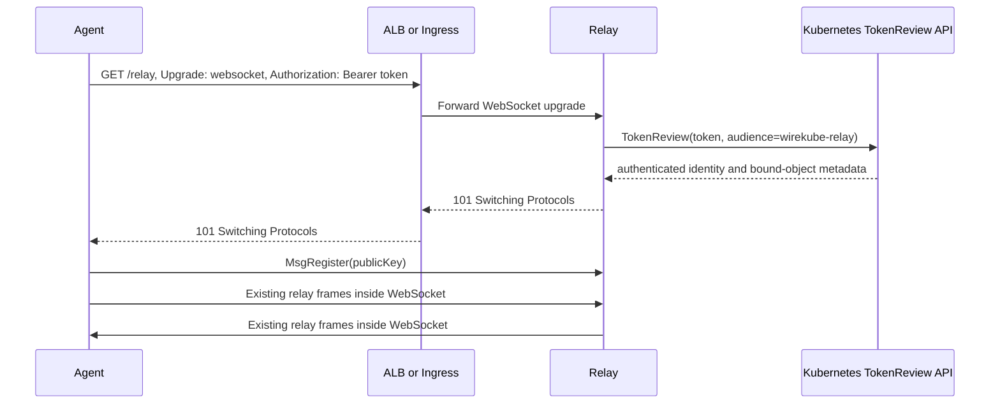

# WebSocket Relay Endpoint

Status: implemented as the optional `wirekube-relay-ws` gateway.

## Goal

Expose the WireKube relay as `wss://relay.example.com/relay` so agents can connect through HTTP-aware load balancers and Ingress controllers while preserving the existing relay frame protocol and WireGuard end-to-end encryption.

## Why WebSocket over HTTPS

Binding the raw relay protocol to TCP port 443 does not make it HTTPS and does not make it compatible with ALB or HTTP Ingress. WebSocket provides a standard HTTP Upgrade handshake, a long-lived bidirectional stream, and broad support across ALB, reverse proxies, Ingress controllers, and enterprise networks.

The external connection is WSS. TLS may terminate in the relay process or at a trusted ALB/Ingress, with an internal WebSocket hop from the terminator to the relay. End-to-end TLS to the relay Pod is preferable when the cluster network is not trusted.

## Connection Flow



The bearer token must be sent in the `Authorization` header and never in the URL. Query-string tokens leak through access logs, browser history, proxy metrics, and tracing systems.

## Token UX

Use Kubernetes ServiceAccount tokens with a dedicated audience instead of mTLS client certificates. Kubernetes signs the token, supports expiry, exposes a standard TokenReview API, and already provides `kubectl` and projected-volume issuance flows.

For an in-cluster DaemonSet, mount a projected ServiceAccount token with `audience: wirekube-relay` and a short expiration. Kubelet rotates the token automatically.

For manual testing or an agent outside the normal DaemonSet flow, create a dedicated ServiceAccount whose identity is mapped to one WireKubePeer, then issue a short-lived token:

```bash
kubectl -n wirekube-system create serviceaccount wirekube-relay-peer-node-a
kubectl -n wirekube-system create token wirekube-relay-peer-node-a --audience=wirekube-relay --duration=1h
```

The relay validates the token with Kubernetes TokenReview and accepts only configured ServiceAccounts, namespaces, and bound Pod or Node identities. TokenReview authentication alone is not enough if every agent shares the same unbound identity: the relay must bind the authenticated Pod, Node, or dedicated ServiceAccount identity to the expected `WireKubePeer.spec.publicKey` before accepting `MsgRegister`.

`kubectl create token` tokens expire naturally but do not have a convenient per-token revocation object. Use short TTLs; for a dedicated manual ServiceAccount, deleting or removing authorization for that ServiceAccount revokes future TokenReview acceptance. A future `wirekubectl relay token issue --peer <name>` command can wrap ServiceAccount creation, token issuance, Secret storage, and cleanup without changing the underlying Kubernetes authentication model.

For a relay running outside the cluster, TokenReview requires restricted Kubernetes API access. Offline JWT verification against the cluster issuer is possible but weakens immediate revocation; TokenReview is the preferred first implementation.

## Authorization Model

Authentication answers which Kubernetes workload presented the token. Authorization must additionally verify all of the following:

1. Token audience is exactly `wirekube-relay`.
2. Token is unexpired and accepted by TokenReview.
3. ServiceAccount and namespace are allowlisted.
4. Bound Pod or Node identity matches the connecting agent.
5. Registered WireGuard public key matches the `WireKubePeer` owned by that node.
6. A connection may register only one identity and cannot replace another node's authenticated session.

This closes the current raw relay behavior where any client can register an arbitrary 32-byte public key and disconnect the previous connection using the same key.

## Transport Shape

Keep the existing relay frame format unchanged. The simplest Go implementation can adapt a WebSocket to `net.Conn` semantics and continue using `ReadFrame` and `WriteFrame`; alternatively, one complete WireKube frame can be carried in each binary WebSocket message. The stream adapter approach minimizes protocol changes, while message-per-frame makes limits and observability clearer.

The endpoint should expose:

| Path | Purpose |
|------|---------|
| `/relay` | Authenticated WebSocket relay stream |
| `/healthz` | Process liveness without authentication |
| `/readyz` | Readiness including raw relay backend connectivity |

Reject normal HTTP bodies, unauthenticated upgrades, unsupported origins when browser access is enabled, oversized frames, and connections that do not register within a short deadline.

## Configuration Shape

The agent selects exactly one relay transport from `external.transport`. `tcp` uses the raw endpoint, while `ws` and `wss` require `external.controlEndpoint`. The raw `external.endpoint` remains separate because external WireGuard peers still need the UDP relay address.

```yaml
relay:
  provider: external
  external:
    endpoint: "203.0.113.10:3478"
    controlEndpoint: "wss://relay.example.com/relay"
    transport: wss
```

For projected ServiceAccount tokens, `authSecretRef` is not required; the agent reads the rotated projected token from `/var/run/secrets/wirekube-relay/token`. `authSecretRef` remains reserved for manually issued tokens and non-DaemonSet clients.

Do not override the selected endpoint with a DaemonSet environment variable. Upgrade every agent while the mesh remains on `transport: tcp`, verify the new version, then change the WireKubeMesh to `transport: wss` and restart agents in a controlled rollout. An old agent treats `controlEndpoint` as raw TCP and cannot safely consume a WSS URL.

The WSS gateway should run with at least two replicas on different nodes. A single gateway replica turns one Pod or node failure into loss of every WSS relay session even though the raw TCP relay is still healthy.

## Compatibility

WSS is intended for HTTP-aware load balancers and Ingress controllers. Raw TCP remains the lower-overhead option for direct reachability, NLB, and NodePort. HTTP CONNECT remains a separate client-to-forward-proxy transport and should not be conflated with the relay's own WSS endpoint. Agents never keep raw TCP and WSS sessions active for the same public key at the same time because the relay permits only one active registration per public key.
