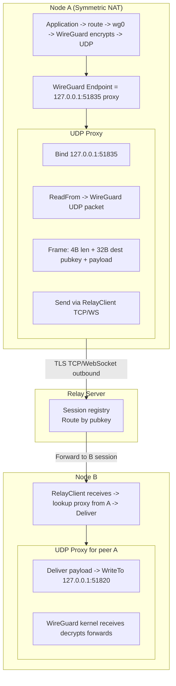
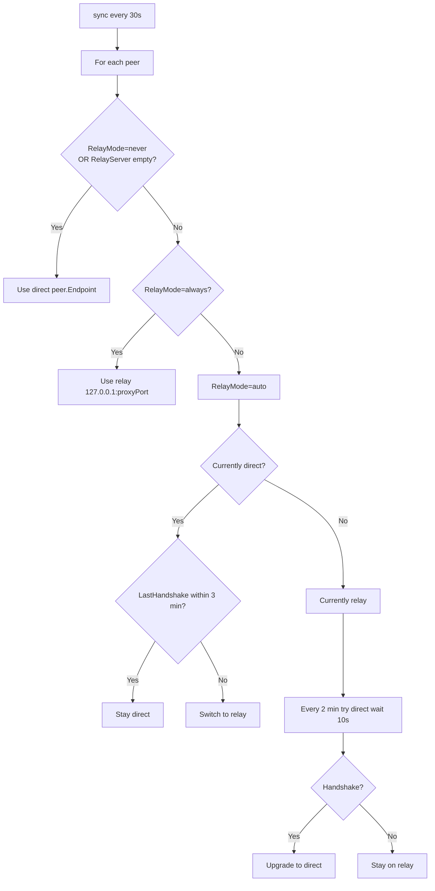
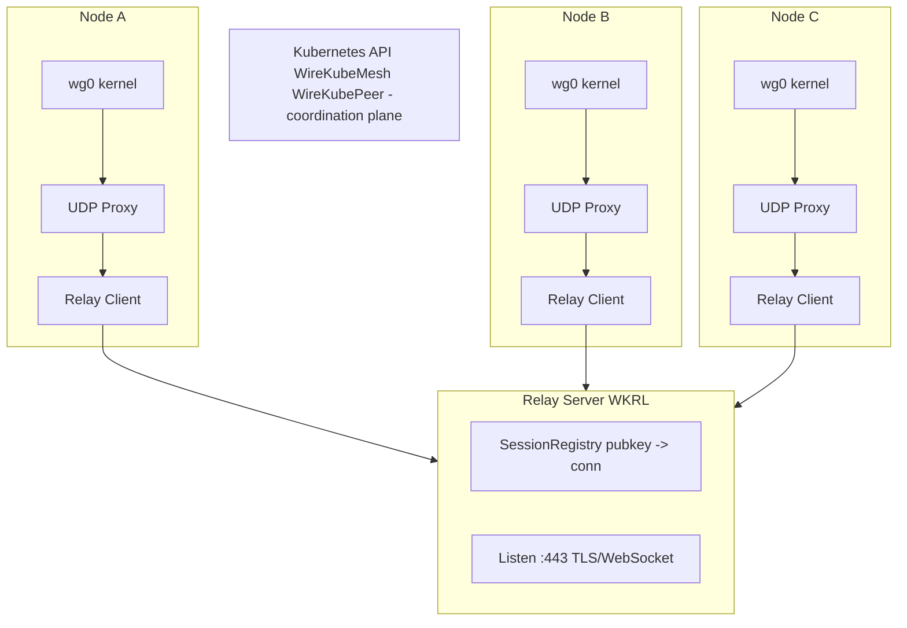

# Tailscale DERP Analysis & WireKube Relay (WKRL) Design

> Comprehensive analysis of Tailscale's DERP relay system and detailed design for WireKube Relay (WKRL), a relay fallback for kernel WireGuard when direct P2P fails (Symmetric NAT, restrictive firewalls).

---

## Part 1: Tailscale DERP Analysis

### 1.1 How DERP Works — Protocol, Transport, Packet Flow

#### Protocol Overview

**DERP** (Designated Encrypted Relay for Packets) is Tailscale's packet relay system that addresses peers by **WireGuard public key** instead of IP address. It relays two packet types:

1. **Disco** — Discovery messages used during NAT traversal (ICE-like side channel)
2. **Encrypted WireGuard packets** — Fallback when UDP is blocked or NAT traversal fails

#### Transport Layer

| Layer | Technology |
|-------|------------|
| **Primary** | HTTPS (port 443) with HTTP/2 or HTTP/1.1 |
| **Upgrade** | HTTP → WebSocket upgrade (via `derphttp` package) |
| **TLS** | Required in production; Let's Encrypt, GCP, or manual certs |
| **Path** | `/derp` endpoint; probe at `/derp/probe` and `/derp/latency-check` |

**Key insight:** DERP-over-HTTP makes traffic look like normal WebSocket traffic. Even with TLS interception (fake root CA), traffic appears as standard WebSocket unless the interceptor specifically detects DERP. This helps bypass corporate proxies and restrictive firewalls.

#### Packet Flow (High Level)

```
+-----------------------------------------------------------------------------------+
|                        Tailscale DERP Packet Flow                                 |
+-----------------------------------------------------------------------------------+
|                                                                                   |
|  Device A (Tailscale)              DERP Server              Device B              |
|  +-------------------+          +-----------------+       +-----------------+     |
|  | wireguard-go      |          |                 |       | wireguard-go    |     |
|  | (userspace WG)    |          |  derpserver     |       | (userspace WG)  |     |
|  |       |           |          |       |         |       |       |         |     |
|  |       | WireGuard | HTTPS/WS |       |         |HTTPS/ |       |         |     |
|  |       | packets   |<-------->| Route by        |  WS   |       |         |     |
|  |       | (encrypt) |key-based | public key      |<----->|       |         |     |
|  |       |           | framing  |                 |       |       |         |     |
|  +-------------------+          +-----------------+       +-----------------+     |
|                                                                                   |
|  Tailscale uses userspace WireGuard -- inject/receive packets programmatically.   |
|  DERP server is stateless: lookup dest key -> forward frame.                      |
+-----------------------------------------------------------------------------------+
```

**Flow:**
1. Client A connects to DERP via HTTPS, upgrades to WebSocket
2. Client A registers with its WireGuard public key
3. Client B does the same
4. When A sends a packet for B: A sends `{dest: B's pubkey, payload: encrypted WG packet}` over the WebSocket
5. DERP server looks up B's active session, forwards payload to B's WebSocket
6. B receives, decrypts with WireGuard, delivers to local stack

---

### 1.2 How Tailscale Detects DERP vs Direct P2P

Tailscale uses a **hierarchical fallback** strategy:

| Priority | Method | When Used |
|----------|--------|-----------|
| 1 | **Direct P2P (UDP)** | NAT traversal succeeds; vast majority of traffic |
| 2 | **Peer Relays** | NAT traversal fails but another Tailscale node can relay (same tailnet) |
| 3 | **DERP Servers** | Last resort when direct and peer relay both fail |

**Detection logic (conceptual):**
- **Direct attempt first:** Tailscale tries UDP hole punching, STUN, disco pings
- **Handshake timeout:** If no WireGuard handshake within ~30–60s, mark peer unreachable via direct
- **Fallback to DERP:** Switch endpoint to DERP region where peer is connected
- **Periodic re-probe:** Periodically retry direct; if handshake succeeds, upgrade from DERP to direct

**DERP Map:** Coordination server distributes a "DERP Map" to all clients:
- Lists available DERP regions (e.g., `nyc`, `sf`, `fra`)
- Each client picks a "DERP home" based on latency
- Clients report DERP home to coordination server; peers learn where to find each other via DERP

---

### 1.3 DERP Interaction with WireGuard — Kernel vs Userspace

| Aspect | Tailscale (Userspace WG) | WireKube (Kernel WG) |
|--------|--------------------------|------------------------|
| **Packet source** | wireguard-go generates WG packets in userspace | Kernel generates WG packets |
| **Packet sink** | wireguard-go receives, decrypts, injects to stack | Kernel receives on wg0, decrypts, forwards |
| **DERP integration** | Direct: wireguard-go can send/receive via DERP client in same process | **Indirect:** Must proxy — kernel WG only speaks UDP to an endpoint |
| **Endpoint control** | Programmatic: "send this packet to DERP for peer B" | Must change WireGuard peer endpoint to proxy address |

**Critical difference:** Tailscale's wireguard-go is **tightly integrated** with the DERP client. When DERP is used, wireguard-go doesn't "send to an endpoint" — it hands packets to the DERP client, which frames and sends over HTTPS/WS. The kernel WireGuard in WireKube has no such hook; it only sends UDP to `peer.Endpoint`.

**Implication for WireKube:** We must run a **local UDP proxy** that:
1. WireGuard sends to (endpoint = 127.0.0.1:proxyPort)
2. Proxy encapsulates UDP → TCP/HTTPS → Relay
3. Relay forwards to peer's agent
4. Peer's proxy decapsulates → injects to WireGuard's listen port

---

### 1.4 DERP Latency/Performance Overhead

| Factor | Impact |
|--------|--------|
| **Extra hop** | 2× one-way latency (A→Relay→B vs A→B) |
| **TCP/WebSocket** | Head-of-line blocking; one lost packet delays subsequent |
| **Shared infrastructure** | Tailscale's DERP is shared; throughput limits for fairness |
| **Real-world** | Users report 10–12× slower when using DERP vs direct (international) |

**Typical overhead:**
- **Latency:** +RTT(Client→Relay) + RTT(Relay→Peer). If relay is regional, ~2× base RTT.
- **Throughput:** DERP is optimized for availability, not raw speed. Peer relays (self-hosted) perform better.

---

### 1.5 DERP Server Deployment and Discovery

#### Deployment

- **Binary:** `cmd/derper` (open source, BSD-3-Clause)
- **Listen:** HTTPS :443 (default), HTTP :80 for ACME challenge
- **STUN:** Optional UDP :3478 on same host
- **Config:** JSON file with node private key; mesh key for DERP-to-DERP meshing
- **TLS:** Let's Encrypt, GCP, or manual certs

#### Discovery

- **Coordination server** (Tailscale control plane) distributes **DERP Map** to clients
- Map contains: region ID, hostname, IPv4/IPv6, port
- Clients probe `/derp/latency-check` to pick "DERP home" (lowest latency)
- Clients report DERP home to coordination server; peers learn "B is at DERP region 4"

#### Self-Hosted DERP

- Users can run custom DERP servers
- Configure via Tailscale admin: add custom DERP regions to the map
- `--mesh-with` for DERP-to-DERP meshing (relays forward to each other)

---

## Part 2: WireKube Relay (WKRL) Design

### 2.1 Transport: TCP vs HTTPS vs WebSocket

| Option | Pros | Cons | Recommendation |
|--------|------|------|-----------------|
| **Raw TCP** | Simple, low overhead | Blocked by many firewalls; no TLS | Use behind VPN or private network |
| **TLS TCP** | Encrypted, often allowed | Some proxies inspect/drop non-HTTP | Good for Phase 1 |
| **HTTPS + WebSocket** | Looks like web traffic; bypasses most proxies | More complex; slightly higher overhead | **Phase 2** for restrictive environments |

**Recommendation:**
- **Phase 1:** TLS-wrapped TCP (or plain TCP behind reverse proxy with TLS termination)
- **Phase 2:** WebSocket over HTTPS (`wss://`) for environments that only allow HTTP(S)

---

### 2.2 Packet Flow: UDP WireGuard → Relay (TCP) → UDP WireGuard

Kernel WireGuard **only** sends/receives UDP. The relay speaks TCP/HTTPS. The bridge is a **local UDP proxy** per peer (or multiplexed).




**Inbound injection detail:** WireGuard identifies peers by the **inner** encrypted payload (sender's public key), not by outer UDP source. So when we `WriteTo(127.0.0.1:51820, payload)`, the kernel accepts it. The source address we use doesn't need to match the peer's configured endpoint — WireGuard will decrypt and route by inner key.

**Bidirectional:** Same proxy handles both directions. Outbound: WireGuard → proxy → relay. Inbound: relay → proxy.Deliver() → WriteTo(wgListenPort).

---

### 2.3 Agent Integration: P2P Failure Detection and Relay Switch




**Handshake timeout:** WireGuard typically fails handshake in 5–15s under NAT. We use 30s to avoid premature relay switch.

---

### 2.4 CRD Design for Relay Configuration

#### WireKubeMesh.Spec Additions

```yaml
# WireKubeMesh.spec
relayServers:                    # List of relay servers (for HA / regional)
  - host: relay.example.com
    port: 443
  - host: relay-eu.example.com
    port: 443
relayServer: "relay.example.com:443"   # Deprecated single-server; use relayServers
relayMode: "auto"                # auto | always | never
relayMeshKeyRef:                 # Optional: Secret reference for mesh key
  name: wirekube-relay-secret
  key: mesh-key
```

#### WireKubePeer.Status Additions

```yaml
# WireKubePeer.status
transportMode: "relay"           # direct | relay
relayLatencyMs: 45
relayServer: "relay.example.com:443"   # Which relay (when using relay)
```

#### WireKubePeer.Spec (optional override)

```yaml
forceRelay: true   # Per-peer: always use relay for this peer
```

---

### 2.5 Expected Latency Overhead

| Scenario | Direct P2P | Via Relay | Overhead |
|----------|------------|-----------|----------|
| Same region (relay nearby) | 5 ms | 12 ms | ~2× |
| Cross-region | 80 ms | 170 ms | ~2× |
| International | 150 ms | 320 ms | ~2× |

**Formula:** Relay RTT ≈ RTT(A→Relay) + RTT(Relay→B). Optimal placement: relay in same region as one or both peers.

---

### 2.6 Relay Deployment

#### Option A: Standalone Binary

```bash
wirekube-relay --listen :443 --mesh-key "$MESH_KEY" --tls-cert /path/to/cert.pem --tls-key /path/to/key.pem
```

#### Option B: Kubernetes Deployment

```yaml
apiVersion: apps/v1
kind: Deployment
metadata:
  name: wirekube-relay
spec:
  replicas: 1
  template:
    spec:
      containers:
        - name: relay
          image: wirekube/relay:latest
          ports:
            - containerPort: 443
          env:
            - name: WIREKUBE_RELAY_MESH_KEY
              valueFrom:
                secretKeyRef:
                  name: wirekube-relay-secret
                  key: mesh-key
---
apiVersion: v1
kind: Service
metadata:
  name: wirekube-relay
spec:
  type: LoadBalancer
  ports:
    - port: 443
      targetPort: 443
```

#### Option C: Behind Reverse Proxy (nginx/Caddy)

- Relay listens on 127.0.0.1:9443 (plain TCP or TLS)
- nginx/Caddy terminates TLS on :443, proxies to relay
- Handles ACME/Let's Encrypt automatically

#### Discovery

- **WireKube:** No coordination server. Relay addresses come from **WireKubeMesh.Spec.RelayServers** (or `RelayServer`).
- Users deploy relay(s) and configure mesh CR. Agents read mesh CR, connect to configured relay(s).
- Future: `WireKubeRelay` CRD for operator-managed relay discovery (optional).

---

## Part 3: Architecture Summary

### 3.1 Component Diagram




### 3.2 Key Design Decisions

| Decision | Rationale |
|----------|-----------|
| **UDP proxy per peer** | Clear 1:1 mapping; WireGuard endpoint = 127.0.0.1:proxyPort; no multiplexing complexity |
| **Length-prefixed framing** | Simple, robust; 4-byte header; supports keepalive (len=0) |
| **Destination pubkey in frame** | Relay routes by key; no need for separate control channel per packet |
| **Mesh key auth** | Prevents unauthorized relay use; multi-tenant safe |
| **RelayMode=auto** | Best UX: try direct first, fall back when needed |
| **TCP first, WebSocket phase 2** | Simpler MVP; WebSocket for restrictive environments later |

---

## References

- [Tailscale DERP Servers](https://tailscale.com/kb/1232/derp-servers)
- [Tailscale Connection Types](https://tailscale.com/kb/1257/connection-types)
- [Custom DERP Servers](https://tailscale.com/kb/1118/custom-derp-servers)
- [tailscale.com/derp](https://pkg.go.dev/tailscale.com/derp) (protocol docs)
- [tailscale.com/derp/derphttp](https://pkg.go.dev/tailscale.com/derp/derphttp) (HTTP/WebSocket transport)
- [WireKube Relay Design](./relay-design.md) — implementation details, package structure, CRD changes
