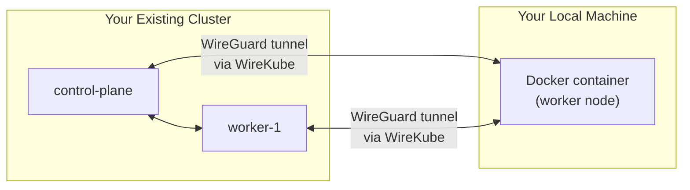

# Local Playground: Join a Docker Node to Your Cluster

This guide shows how to run a Docker container on your local machine and join
it to your **existing** Kubernetes cluster as a worker node. This simulates
adding a remote node from a completely different network — the exact scenario
WireKube is designed for.



## Prerequisites

- An existing Kubernetes cluster (any provider — EKS, GKE, AKS, kubeadm, k3s, etc.)
- `kubectl` with cluster-admin access
- Docker on your local machine
- The `kindest/node` image (includes kubelet, kubeadm, and containerd):

```bash
docker pull kindest/node:v1.34.0
```

---

## Option A: Join with kubeadm

Use this if your cluster was bootstrapped with kubeadm and you can generate
join tokens.

### Step 1: Run the Node Container

```bash
docker run -d --privileged \
  --name=wirekube-node --hostname=wirekube-node \
  --tmpfs=/tmp --tmpfs=/run \
  --volume=/var \
  --volume=/lib/modules:/lib/modules:ro \
  --security-opt=seccomp=unconfined \
  --cgroupns=private \
  --tty \
  kindest/node:v1.34.0
```

Wait for containerd to be ready:

```bash
until docker exec wirekube-node crictl info >/dev/null 2>&1; do sleep 3; done
echo "containerd ready"
```

### Step 2: Create a Join Token

On your cluster's control plane:

```bash
kubeadm token create --print-join-command
```

This outputs something like:

```
kubeadm join 10.0.0.5:6443 --token abcdef.0123456789abcdef \
  --discovery-token-ca-cert-hash sha256:...
```

### Step 3: Join the Cluster

Write a join configuration and execute it inside the container.
Replace `<API_SERVER>`, `<TOKEN>`, and `<CA_HASH>` with values from Step 2:

```bash
NODE_IP=$(docker inspect -f '{{range.NetworkSettings.Networks}}{{.IPAddress}}{{end}}' wirekube-node)

cat <<EOF | docker exec -i wirekube-node tee /tmp/kubeadm-join.yaml > /dev/null
apiVersion: kubeadm.k8s.io/v1beta4
kind: JoinConfiguration
discovery:
  bootstrapToken:
    apiServerEndpoint: <API_SERVER>
    token: <TOKEN>
    caCertHashes:
      - <CA_HASH>
nodeRegistration:
  name: wirekube-node
  criSocket: unix:///run/containerd/containerd.sock
  kubeletExtraArgs:
  - name: node-ip
    value: "${NODE_IP}"
EOF

docker exec wirekube-node kubeadm join \
  --config=/tmp/kubeadm-join.yaml \
  --ignore-preflight-errors=all
```

Skip to [Deploy WireKube](#deploy-wirekube) below.

---

## Option B: Join with TLS Bootstrap (without kubeadm)

Use this if your cluster does not use kubeadm, or you want to understand the
raw kubelet bootstrap process. This works with any Kubernetes cluster that
supports the bootstrap token API.

### Step 1: Run the Node Container

Same as Option A:

```bash
docker run -d --privileged \
  --name=wirekube-node --hostname=wirekube-node \
  --tmpfs=/tmp --tmpfs=/run \
  --volume=/var \
  --volume=/lib/modules:/lib/modules:ro \
  --security-opt=seccomp=unconfined \
  --cgroupns=private \
  --tty \
  kindest/node:v1.34.0

until docker exec wirekube-node crictl info >/dev/null 2>&1; do sleep 3; done
```

### Step 2: Create a Bootstrap Token

Create a token in your cluster that kubelet can use for initial authentication:

```bash
# Generate a token in the format [a-z0-9]{6}.[a-z0-9]{16}
TOKEN_ID=$(openssl rand -hex 3)
TOKEN_SECRET=$(openssl rand -hex 8)
TOKEN="${TOKEN_ID}.${TOKEN_SECRET}"

kubectl apply -f - <<EOF
apiVersion: v1
kind: Secret
metadata:
  name: bootstrap-token-${TOKEN_ID}
  namespace: kube-system
type: bootstrap.kubernetes.io/token
stringData:
  token-id: "${TOKEN_ID}"
  token-secret: "${TOKEN_SECRET}"
  usage-bootstrap-authentication: "true"
  usage-bootstrap-signing: "true"
  auth-extra-groups: system:bootstrappers:worker
EOF

echo "Bootstrap token: ${TOKEN}"
```

Authorize the bootstrap group to create CSRs:

```bash
kubectl apply -f - <<'EOF'
apiVersion: rbac.authorization.k8s.io/v1
kind: ClusterRoleBinding
metadata:
  name: bootstrap-node-csr
roleRef:
  apiGroup: rbac.authorization.k8s.io
  kind: ClusterRole
  name: system:node-bootstrapper
subjects:
- apiGroup: rbac.authorization.k8s.io
  kind: Group
  name: system:bootstrappers:worker
---
apiVersion: rbac.authorization.k8s.io/v1
kind: ClusterRoleBinding
metadata:
  name: bootstrap-node-csr-approve
roleRef:
  apiGroup: rbac.authorization.k8s.io
  kind: ClusterRole
  name: system:certificates.k8s.io:certificatesigningrequests:nodeclient
subjects:
- apiGroup: rbac.authorization.k8s.io
  kind: Group
  name: system:bootstrappers:worker
EOF
```

### Step 3: Copy the CA Certificate

```bash
# For kubeadm-based clusters:
kubectl -n kube-system get cm kubeadm-config -o jsonpath='{.data}' > /dev/null 2>&1 \
  && kubectl -n kube-system get secret -l type=bootstrap.kubernetes.io/token > /dev/null

# Extract CA cert from your kubeconfig or cluster
kubectl config view --raw -o jsonpath='{.clusters[0].cluster.certificate-authority-data}' \
  | base64 -d > /tmp/wk-ca.crt

docker exec wirekube-node mkdir -p /etc/kubernetes/pki
docker cp /tmp/wk-ca.crt wirekube-node:/etc/kubernetes/pki/ca.crt
```

### Step 4: Write the Bootstrap Kubeconfig

This kubeconfig uses the bootstrap token for initial authentication. After
connecting, kubelet automatically requests a client certificate and writes
its own permanent kubeconfig.

```bash
API_SERVER=$(kubectl config view --raw -o jsonpath='{.clusters[0].cluster.server}')
CA_DATA=$(base64 -w0 /tmp/wk-ca.crt)

cat <<EOF | docker exec -i wirekube-node tee /etc/kubernetes/bootstrap-kubelet.conf > /dev/null
apiVersion: v1
kind: Config
clusters:
- cluster:
    certificate-authority-data: ${CA_DATA}
    server: ${API_SERVER}
  name: kubernetes
contexts:
- context:
    cluster: kubernetes
    user: kubelet-bootstrap
  name: bootstrap
current-context: bootstrap
users:
- name: kubelet-bootstrap
  user:
    token: ${TOKEN}
EOF
```

### Step 5: Write the Kubelet Configuration

```bash
NODE_IP=$(docker inspect -f '{{range.NetworkSettings.Networks}}{{.IPAddress}}{{end}}' wirekube-node)
CLUSTER_DNS=$(kubectl get svc -n kube-system kube-dns -o jsonpath='{.spec.clusterIP}')

cat <<EOF | docker exec -i wirekube-node tee /var/lib/kubelet/config.yaml > /dev/null
apiVersion: kubelet.config.k8s.io/v1beta1
kind: KubeletConfiguration
authentication:
  anonymous:
    enabled: false
  webhook:
    enabled: true
  x509:
    clientCAFile: /etc/kubernetes/pki/ca.crt
authorization:
  mode: Webhook
clusterDNS:
  - ${CLUSTER_DNS}
clusterDomain: cluster.local
failSwapOn: false
rotateCertificates: true
serverTLSBootstrap: true
EOF
```

### Step 6: Start Kubelet

```bash
docker exec -d wirekube-node kubelet \
  --bootstrap-kubeconfig=/etc/kubernetes/bootstrap-kubelet.conf \
  --kubeconfig=/etc/kubernetes/kubelet.conf \
  --config=/var/lib/kubelet/config.yaml \
  --container-runtime-endpoint=unix:///run/containerd/containerd.sock \
  --node-ip=${NODE_IP} \
  --hostname-override=wirekube-node
```

### Step 7: Verify the Node Joined

```bash
# Check for the node (may take a few seconds)
kubectl get nodes -w
```

The node will appear as `NotReady` until a CNI plugin assigns it a pod CIDR.
If your cluster's CNI DaemonSet tolerates all nodes, it will install
automatically. Otherwise, you may need to add a toleration or label.

---

## Deploy WireKube

At this point, `wirekube-node` is registered in your cluster but may not have
full network connectivity to other nodes — it is behind Docker's NAT, on a
completely different network. This is exactly the problem WireKube solves.

### Step 1: Load the WireKube Image

The agent runs as a DaemonSet inside the node, so the image must be available
in the node's containerd:

```bash
docker pull inerplat/wirekube:latest
docker save inerplat/wirekube:latest -o /tmp/wirekube.tar
docker cp /tmp/wirekube.tar wirekube-node:/tmp/wirekube.tar
docker exec wirekube-node ctr -n k8s.io images import /tmp/wirekube.tar
```

### Step 2: Install WireKube

```bash
kubectl apply -f config/crd/
kubectl apply -f config/agent/rbac.yaml
kubectl create namespace wirekube-system --dry-run=client -o yaml | kubectl apply -f -
kubectl apply -f config/agent/daemonset.yaml
```

### Step 3: Create the WireKubeMesh

```bash
kubectl apply -f - <<'EOF'
apiVersion: wirekube.io/v1alpha1
kind: WireKubeMesh
metadata:
  name: default
spec:
  listenPort: 51822
  interfaceName: wire_kube
  mtu: 1420
  stunServers:
    - stun.cloudflare.com:3478
    - stun.l.google.com:19302
  autoAllowedIPs:
    strategy: node-internal-ip
EOF
```

### Step 4: Verify

```bash
# All nodes should appear as WireKubePeers
kubectl get wirekubepeers -o wide

# Check WireGuard tunnel on the Docker node
docker exec wirekube-node wg show wire_kube

# Ping a cluster node from the Docker node through the tunnel
CLUSTER_NODE_IP=$(kubectl get nodes -o jsonpath='{.items[0].status.addresses[?(@.type=="InternalIP")].address}')
docker exec wirekube-node ping -c 3 -I wire_kube ${CLUSTER_NODE_IP}
```

You should see WireGuard handshakes completing and successful pings through
the `wire_kube` interface — even though the Docker container and your cluster
nodes are on completely different networks.

---

## Cleanup

```bash
docker rm -f wirekube-node
rm -f /tmp/wk-ca.crt /tmp/wirekube.tar
```

To remove WireKube from your cluster:

```bash
kubectl delete -f config/agent/ --ignore-not-found
kubectl delete wirekubemesh --all
kubectl delete wirekubepeers --all
kubectl delete -f config/crd/ --ignore-not-found
```

---

## Next Steps

- [Configuration](configuration.md) — Relay modes, STUN servers, and mesh options
- [NAT Traversal](../architecture/nat-traversal.md) — How WireKube handles different NAT types
- [EKS Hybrid Nodes](eks-hybrid-nodes.md) — Production deployment with EKS
- [Monitoring](../operations/monitoring.md) — Prometheus metrics and Grafana dashboards
