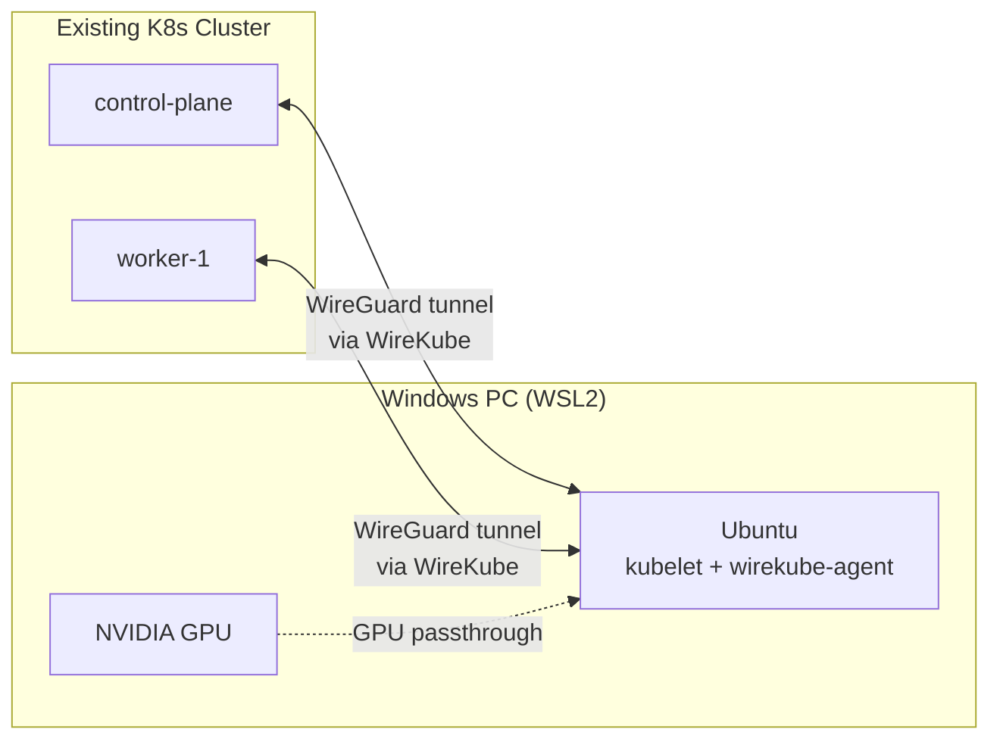

# WSL2 GPU Node: Windows PC to Kubernetes GPU Worker

This guide turns a freshly formatted Windows PC with an NVIDIA GPU into a
Kubernetes GPU worker node, connected to your existing cluster via WireKube.



## Prerequisites

| Requirement | Detail |
|-------------|--------|
| Windows | 11 22H2+ or 10 22H2+ |
| NVIDIA GPU | Any CUDA-capable GPU |
| NVIDIA Driver | 535+ (Windows side — NOT in WSL2) |
| Existing K8s cluster | kubeadm, k3s, EKS, etc. with `kubectl` access |
| Network | Outbound internet from the Windows PC |

---

## Phase 1: Windows Setup

### 1.1 Install NVIDIA Driver (Windows Side)

Download and install the latest NVIDIA Game Ready or Studio driver from
[nvidia.com/drivers](https://www.nvidia.com/drivers). **Do NOT install a
driver inside WSL2** — the Windows driver provides GPU access to WSL2
automatically.

After installation, verify from PowerShell:

```powershell
nvidia-smi
```

### 1.2 Configure .wslconfig

Create `C:\Users\<USERNAME>\.wslconfig` in Notepad **before** installing WSL2:

```ini
[wsl2]
memory=16GB
swap=0
networkingMode=mirrored
dnsTunneling=false
kernelCommandLine=systemd.unified_cgroup_hierarchy=1 cgroup_no_v1=all

[experimental]
autoMemoryReclaim=gradual
```

!!! critical "kernelCommandLine is essential"
    `cgroup_no_v1=all` forces pure cgroup v2. Without this, Cilium's
    Socket LB (kube-proxy replacement) cannot intercept pod traffic,
    causing `dial tcp 10.96.0.1:443: i/o timeout` on all ClusterIP services.

!!! critical "dnsTunneling must be disabled"
    `networkingMode=mirrored` enables `dnsTunneling` by default, which binds
    `10.255.255.254/32` to the `lo` interface. Cilium detects this as a
    NodePort-capable primary address and uses it for BPF LB SNAT — causing
    all Pod-to-ClusterIP traffic to be SNATed to an unreachable loopback IP
    instead of the node's real IP. Result: `i/o timeout` on every service call.

!!! note "Why mirrored networking?"
    `networkingMode=mirrored` gives WSL2 the same IP as the Windows host,
    making NAT traversal simpler — WireKube's STUN sees the real router-mapped
    endpoint instead of a double-NAT (Windows NAT + router NAT).

### 1.3 Install WSL2

Open **PowerShell as Administrator**:

```powershell
# Check available distributions
wsl --list --online

# Install Ubuntu (pick the version shown in the list)
wsl --install -d Ubuntu-24.04
```

!!! tip "Distribution name varies by system"
    Run `wsl --list --online` first and use the name shown (e.g. `Ubuntu`,
    `Ubuntu-24.04`). `Ubuntu` installs the latest available LTS.

Reboot when prompted. After reboot, Ubuntu will launch and ask you to create
a username and password.

Verify:

```powershell
wsl --list --verbose
# Should show Ubuntu with VERSION 2
```

---

## Phase 2: WSL2 Environment Setup

All commands from here run **inside WSL2 (Ubuntu)**.

### 2.1 Verify cgroup v2 and GPU

```bash
# cgroup v2 — file MUST exist
stat /sys/fs/cgroup/cgroup.controllers

# GPU access
nvidia-smi
```

If `/sys/fs/cgroup/cgroup.controllers` does not exist, `.wslconfig`
`kernelCommandLine` was not applied. Double check the file path and
content, then `wsl --shutdown` from PowerShell and retry.

### 2.2 System Update

```bash
sudo apt update && sudo apt upgrade -y
```

### 2.3 Configure /etc/wsl.conf

```bash
sudo tee /etc/wsl.conf <<'EOF'
[boot]
systemd=true
command="mount --make-shared / && mkdir -p /var/run/netns && mount --bind /var/run/netns /var/run/netns && mount --make-shared /var/run/netns && ip link set eth0 mtu 1500"
EOF
```

Apply immediately (without restart):

```bash
sudo mount --make-shared /
sudo mkdir -p /var/run/netns
sudo mount --bind /var/run/netns /var/run/netns
sudo mount --make-shared /var/run/netns
sudo ip link set eth0 mtu 1500
```

!!! warning "Without shared mount propagation"
    CNI pods (Cilium, Flannel, etc.) will fail with:
    `path "/var/run/netns" is mounted on "/" but it is not a shared or slave mount`

### 2.4 Install containerd

```bash
sudo apt install -y containerd

# Generate default config
sudo mkdir -p /etc/containerd
containerd config default | sudo tee /etc/containerd/config.toml > /dev/null

# Enable SystemdCgroup
sudo sed -i 's/SystemdCgroup = false/SystemdCgroup = true/' /etc/containerd/config.toml

sudo systemctl restart containerd
```

### 2.5 Install NVIDIA Container Toolkit

WSL2 uses the Windows host GPU driver, but the container runtime still needs
nvidia-container-toolkit to expose the GPU inside containers.

```bash
curl -fsSL https://nvidia.github.io/libnvidia-container/gpgkey \
  | sudo gpg --dearmor -o /usr/share/keyrings/nvidia-container-toolkit-keyring.gpg

curl -s -L https://nvidia.github.io/libnvidia-container/stable/deb/nvidia-container-toolkit.list \
  | sed 's#deb https://#deb [signed-by=/usr/share/keyrings/nvidia-container-toolkit-keyring.gpg] https://#g' \
  | sudo tee /etc/apt/sources.list.d/nvidia-container-toolkit.list

sudo apt update
sudo apt install -y nvidia-container-toolkit

# Configure containerd to use nvidia runtime
sudo nvidia-ctk runtime configure --runtime=containerd

# Generate CDI spec (required for WSL2 — GPU is exposed via /dev/dxg, not /dev/nvidia*)
sudo mkdir -p /etc/cdi
sudo nvidia-ctk cdi generate --output=/etc/cdi/nvidia.yaml

sudo systemctl restart containerd
```

### 2.5 Install WireGuard

```bash
sudo apt install -y wireguard-tools

# Verify kernel module (built-in on most WSL2 kernels)
sudo modprobe wireguard && echo "OK" || echo "FAIL"
```

!!! warning "WSL2 Kernel WireGuard Support"
    The default WSL2 kernel (5.15+) includes WireGuard. If `modprobe`
    fails, update WSL2 with `wsl --update` and retry.

### 2.6 Install Kubernetes Components

```bash
sudo apt install -y apt-transport-https ca-certificates curl gpg

# IMPORTANT: Match the cluster's Kubernetes version
# Check your cluster version: kubectl version
K8S_VERSION=v1.34  # <-- change to match your cluster

sudo mkdir -p /etc/apt/keyrings
curl -fsSL "https://pkgs.k8s.io/core:/stable:/${K8S_VERSION}/deb/Release.key" \
  | sudo gpg --dearmor -o /etc/apt/keyrings/kubernetes-apt-keyring.gpg

echo "deb [signed-by=/etc/apt/keyrings/kubernetes-apt-keyring.gpg] \
  https://pkgs.k8s.io/core:/stable:/${K8S_VERSION}/deb/ /" \
  | sudo tee /etc/apt/sources.list.d/kubernetes.list

sudo apt update
sudo apt install -y kubelet kubeadm kubectl
sudo apt-mark hold kubelet kubeadm kubectl
```

### 2.7 Disable Swap

```bash
sudo swapoff -a
sudo sed -i '/swap/d' /etc/fstab
```

### 2.8 Enable Required Kernel Modules and sysctl

```bash
cat <<EOF | sudo tee /etc/modules-load.d/k8s.conf
overlay
br_netfilter
EOF

sudo modprobe overlay
sudo modprobe br_netfilter

cat <<EOF | sudo tee /etc/sysctl.d/k8s.conf
net.bridge.bridge-nf-call-iptables  = 1
net.bridge.bridge-nf-call-ip6tables = 1
net.ipv4.ip_forward                 = 1
EOF

sudo sysctl --system
```

---

## Phase 3: Join the Kubernetes Cluster

### Option A: kubeadm join (kubeadm-based clusters)

On your **existing cluster's control plane**, create a join token:

```bash
kubeadm token create --print-join-command
```

On the **WSL2 node**:

```bash
sudo systemctl enable --now kubelet

sudo kubeadm join <API_SERVER>:6443 \
  --token <TOKEN> \
  --discovery-token-ca-cert-hash sha256:<HASH> \
  --ignore-preflight-errors=all
```

!!! tip "kubeadm config version mismatch"
    If you get `cannot unmarshal object into Go struct field ... extraArgs`,
    the cluster's `kubeadm-config` ConfigMap uses v1beta3 map-style
    `extraArgs` but your kubeadm expects v1beta4 array-style. Either
    update the ConfigMap or use a JoinConfiguration file:

    ```bash
    cat <<EOF > /tmp/join-config.yaml
    apiVersion: kubeadm.k8s.io/v1beta4
    kind: JoinConfiguration
    discovery:
      bootstrapToken:
        apiServerEndpoint: "<API_SERVER>:6443"
        token: "<TOKEN>"
        caCertHashes:
          - "sha256:<HASH>"
    EOF
    sudo kubeadm join --config /tmp/join-config.yaml
    ```

### Option B: k3s agent (k3s clusters)

```bash
K3S_URL="https://<K3S_SERVER>:6443"
K3S_TOKEN="<your-k3s-token>"

curl -sfL https://get.k3s.io | \
  INSTALL_K3S_EXEC="agent" \
  K3S_URL="${K3S_URL}" \
  K3S_TOKEN="${K3S_TOKEN}" \
  sh -
```

### Verify Node Joined

```bash
kubectl get nodes
# WSL2 node should appear (may be NotReady until CNI is set up)
```

---

## Phase 4: Deploy WireKube

WireKube must be deployed **before** the GPU Operator. The WSL2 node is
behind NAT and not directly reachable from the cluster — without WireKube
tunnels, the control plane cannot reach kubelet (port 10250), so
`kubectl exec/logs` and DaemonSet pod scheduling will fail.

### 4.1 Install WireKube on the Cluster

If WireKube is not already deployed on your cluster:

```bash
kubectl apply -f config/crd/
kubectl apply -f config/agent/rbac.yaml
kubectl create namespace wirekube-system --dry-run=client -o yaml | kubectl apply -f -
kubectl apply -f config/agent/daemonset.yaml
```

### 4.2 Create or Update WireKubeMesh

```bash
kubectl apply -f - <<'EOF'
apiVersion: wirekube.io/v1alpha1
kind: WireKubeMesh
metadata:
  name: default
spec:
  listenPort: 51822
  interfaceName: wire_kube
  mtu: 1420
  stunServers:
    - stun.cloudflare.com:3478
    - stun.l.google.com:19302
  autoAllowedIPs:
    strategy: node-internal-ip
  relay:
    mode: auto
    provider: managed
    handshakeTimeoutSeconds: 30
    directRetryIntervalSeconds: 120
EOF
```

!!! note "MTU"
    WSL2's default `eth0` MTU is 1420. The boot command in Phase 2.3
    raises it to 1500 so WireGuard MTU 1420 works without fragmentation.
    If you skip that step, set this to 1360.

### 4.3 Verify WireKube Connectivity

```bash
# Check all peers
kubectl get wirekubepeers -o wide

# Check WireGuard on WSL2 node
wg show wire_kube

# Ping a cluster node through the tunnel
ping -c 3 -I wire_kube <CLUSTER_NODE_IP>

# Verify kubectl exec works
kubectl exec <any-pod-on-wsl2-node> -- hostname
```

---

## Phase 5: GPU Operator

The [NVIDIA GPU Operator](https://docs.nvidia.com/datacenter/cloud-native/gpu-operator/latest/index.html)
automates device plugin, GPU feature discovery, and DCGM metrics exporter.
WSL2 requires special handling for driver and toolkit components.

### 5.1 Install GPU Operator via Helm

WSL2 requires two flags that differ from standard deployments:

- **`driver.enabled=false`** — WSL2 uses the Windows host GPU driver, not an
  in-cluster driver pod.
- **`toolkit.enabled=false`** — The operator's toolkit DaemonSet tries to
  create `/dev/nvidia*` device nodes, which don't exist on WSL2 (GPU is
  exposed via `/dev/dxg`). We already installed nvidia-container-toolkit
  manually in Phase 2.5.

```bash
helm repo add nvidia https://helm.ngc.nvidia.com/nvidia
helm repo update

helm install gpu-operator nvidia/gpu-operator \
  --namespace gpu-operator \
  --create-namespace \
  --set driver.enabled=false \
  --set toolkit.enabled=false
```

### 5.2 Label the WSL2 Node for GPU Discovery

WSL2 has no PCI bus, so NFD (Node Feature Discovery) cannot auto-detect the
GPU. Add the NVIDIA PCI vendor label manually:

```bash
NODE_NAME=<wsl2-node-name>

# NFD PCI label (triggers GPU Operator to deploy on this node)
kubectl label node ${NODE_NAME} feature.node.kubernetes.io/pci-10de.present=true
```

### 5.3 Verify GPU Operator

```bash
# All pods on WSL2 node should be Running
kubectl get pods -n gpu-operator -o wide --field-selector spec.nodeName=<wsl2-node-name>

# Check GPU is allocatable
kubectl describe node <wsl2-node-name> | grep -A5 "Allocatable" | grep nvidia
# Should show: nvidia.com/gpu: 1
```

---

## Phase 6: Test GPU Workload

GPU pods on WSL2 **must** use `runtimeClassName: nvidia`. Without it,
containers cannot find `nvidia-smi` or access the GPU — WSL2 exposes the
GPU via `/dev/dxg` and CDI mounts, not `/dev/nvidia*`.

```bash
kubectl apply -f - <<'EOF'
apiVersion: v1
kind: Pod
metadata:
  name: gpu-test
spec:
  runtimeClassName: nvidia
  restartPolicy: Never
  containers:
  - name: cuda-test
    image: nvidia/cuda:12.6.2-base-ubuntu24.04
    command: ["nvidia-smi"]
    resources:
      limits:
        nvidia.com/gpu: 1
EOF

# Wait and check result
kubectl logs -f gpu-test
kubectl delete pod gpu-test
```

You should see `nvidia-smi` output showing your GPU from inside the
Kubernetes pod running on the WSL2 node.

### GPU Benchmark (Optional)

Measure actual TFLOPS with PyTorch matmul across FP32, FP16, and BF16
precisions. This validates that the GPU is performing at expected levels
and that WSL2 passthrough introduces no overhead.

```bash
kubectl apply -f - <<'EOF'
apiVersion: v1
kind: Pod
metadata:
  name: matmul-bench
spec:
  runtimeClassName: nvidia
  restartPolicy: Never
  containers:
  - name: bench
    image: pytorch/pytorch:2.6.0-cuda12.6-cudnn9-runtime
    command: ["python3", "-c"]
    args:
    - |
      import torch, time

      device = torch.device("cuda")
      props = torch.cuda.get_device_properties(0)
      print(f"GPU: {props.name}")
      print(f"VRAM: {props.total_memory / 1024**3:.1f} GB")
      print(f"SM count: {props.multi_processor_count}")
      print(f"Compute: {props.major}.{props.minor}")
      print()

      sizes = [1024, 2048, 4096, 8192]
      dtypes = [
          ("FP32",  torch.float32),
          ("FP16",  torch.float16),
          ("BF16",  torch.bfloat16),
      ]

      a = torch.randn(1024, 1024, device=device)
      for _ in range(20):
          torch.mm(a, a)
      torch.cuda.synchronize()

      print(f"{'Size':>6} | {'FP32 TFLOPS':>12} | {'FP16 TFLOPS':>12} | {'BF16 TFLOPS':>12}")
      print("-" * 56)

      for n in sizes:
          row = f"{n:>6}"
          for name, dt in dtypes:
              a = torch.randn(n, n, device=device, dtype=dt)
              b = torch.randn(n, n, device=device, dtype=dt)
              for _ in range(5):
                  torch.mm(a, b)
              torch.cuda.synchronize()

              iters = 50
              start = time.perf_counter()
              for _ in range(iters):
                  torch.mm(a, b)
              torch.cuda.synchronize()
              elapsed = time.perf_counter() - start

              flops = 2 * n**3 * iters / elapsed
              tflops = flops / 1e12
              row += f" | {tflops:>10.2f}  "
          print(row)
    resources:
      limits:
        nvidia.com/gpu: 1
EOF

kubectl wait --for=condition=Ready pod/matmul-bench --timeout=300s 2>/dev/null
kubectl logs -f matmul-bench
kubectl delete pod matmul-bench
```

!!! note "Reading the results"
    Ada Lovelace GPUs (RTX 40xx) report FP32 specs including FP32+INT32
    dual-issue. Pure FP32 matmul achieves ~50% of the advertised TFLOPS —
    this is expected. FP16/BF16 should reach ~100% of spec. For example,
    RTX 4060 (15.1 TFLOPS advertised): expect ~7.5 FP32, ~30 FP16/BF16.

### LLM Serving Test (Optional)

Deploy an LLM using vLLM to verify end-to-end GPU inference. For 8GB VRAM
GPUs, use an AWQ-quantized model to fit within memory:

```bash
kubectl apply -f - <<'EOF'
apiVersion: v1
kind: Pod
metadata:
  name: llm-test
  labels:
    app: llm-test
spec:
  runtimeClassName: nvidia
  restartPolicy: Never
  containers:
  - name: vllm
    image: vllm/vllm-openai:latest
    args:
      - "--model"
      - "Qwen/Qwen3-4B-AWQ"
      - "--quantization"
      - "awq"
      - "--max-model-len"
      - "4096"
      - "--gpu-memory-utilization"
      - "0.85"
      - "--enforce-eager"
    ports:
    - containerPort: 8000
    resources:
      limits:
        nvidia.com/gpu: 1
    env:
    - name: HF_HUB_CACHE
      value: /tmp/hf-cache
EOF
```

Wait for the model to load (~3-5 min for first pull):

```bash
kubectl logs -f llm-test
# Wait until you see "Application startup complete."
```

Test inference:

```bash
kubectl exec llm-test -- curl -s http://localhost:8000/v1/chat/completions \
  -H "Content-Type: application/json" \
  -d '{
    "model": "Qwen/Qwen3-4B-AWQ",
    "messages": [{"role": "user", "content": "Hello, what can you do?"}],
    "max_tokens": 100
  }'
```

Clean up:

```bash
kubectl delete pod llm-test gpu-test
```

---

## WSL2 Auto-Start (Optional)

WSL2 does not start services automatically on Windows boot. Create a
scheduled task to start kubelet and containerd on login.

From **PowerShell as Admin**:

```powershell
$Action = New-ScheduledTaskAction -Execute "wsl" `
  -Argument "-d Ubuntu -u root -- bash -c 'systemctl start containerd && systemctl start kubelet'"
$Trigger = New-ScheduledTaskTrigger -AtLogOn
Register-ScheduledTask -TaskName "WSL2-K8s-Start" -Action $Action -Trigger $Trigger `
  -Description "Start K8s services in WSL2" -RunLevel Highest
```

---

## Troubleshooting

### Pods cannot reach ClusterIP services (i/o timeout)

**Symptom:** `dial tcp 10.96.0.1:443: i/o timeout` from pods on WSL2 node.
hostNetwork pods work fine.

**Cause:** cgroup v1. Cilium's Socket LB needs cgroup v2 to attach BPF
programs to pod cgroups.

**Fix:** Ensure `.wslconfig` has:

```ini
kernelCommandLine=systemd.unified_cgroup_hierarchy=1 cgroup_no_v1=all
```

Then `wsl --shutdown` and verify `stat /sys/fs/cgroup/cgroup.controllers`.

### Pods cannot reach ClusterIP services — dnsTunneling SNAT

**Symptom:** Same `i/o timeout` as above, but cgroup v2 is confirmed. `conntrack -L` shows Pod-to-API-server connections SNATed to `10.255.255.254` (loopback) instead of the node's real IP.

**Cause:** `networkingMode=mirrored` enables `dnsTunneling` by default, binding `10.255.255.254/32` to `lo`. Cilium's BPF LB picks this as the SNAT source for service traffic. The API server cannot route replies back to a loopback address.

**Diagnosis:**

```bash
# Check if the address exists on lo
ip addr show lo | grep 10.255.255.254

# Check Cilium node-addresses — 10.255.255.254 should NOT be NodePort=true
kubectl exec <cilium-pod> -- cilium-dbg shell -- db/show node-addresses

# Check conntrack — reply dst should be the node IP, not 10.255.255.254
conntrack -L -d <API_SERVER_IP> 2>/dev/null
```

**Fix:** Add `dnsTunneling=false` to `.wslconfig`:

```ini
[wsl2]
networkingMode=mirrored
dnsTunneling=false
```

Then `wsl --shutdown` from PowerShell and restart.

### CNI pods fail: "not a shared or slave mount"

**Cause:** WSL2 defaults to private mount propagation.

**Fix:** See Phase 2.3 — `/etc/wsl.conf` `command=` with `mount --make-shared`.

### Cilium iptables error: unknown option "--transparent"

**Symptom:** `iptables: unknown option "--transparent"` in cilium-agent logs.

**Cause:** WSL2 kernel lacks `xt_socket` module. This only affects Cilium's
L7 transparent proxy — basic networking and service routing still work via
BPF if cgroup v2 is enabled.

### MTU issues: large packets dropped

**Symptom:** Small pings work but `kubectl exec`, TLS, or large transfers fail.

**Cause:** WSL2's default `eth0` MTU is 1420. WireGuard adds ~60 bytes
overhead, so WireGuard MTU 1420 on a 1420 underlay causes fragmentation.

**Fix:** Ensure Phase 2.3 boot command includes `ip link set eth0 mtu 1500`.
Verify with `ip link show eth0`.

### nvidia-smi works in WSL2 but not in pods

**Cause:** Missing `runtimeClassName: nvidia` in pod spec. WSL2 exposes GPU
via `/dev/dxg` and CDI — without the nvidia RuntimeClass, containerd does not
mount the GPU devices into the container.

**Fix:** Add `runtimeClassName: nvidia` to the pod spec (see Phase 6).

### Cilium not ready after WSL2 restart

**Symptom:** Cilium agent shows 0/1 ready after `wsl --shutdown` and restart.

**Cause:** `KUBE-FIREWALL` iptables chain may contain a DROP rule that blocks
loopback traffic needed by Cilium's health checks.

**Fix:**

```bash
sudo iptables -F KUBE-FIREWALL
sudo systemctl restart kubelet
```

### WireGuard module not found

**Cause:** WSL2 kernel too old or missing module.

**Fix:** Update WSL2 from PowerShell: `wsl --update`, then `wsl --shutdown`
and retry. The default WSL2 kernel 5.15+ includes WireGuard.

### NAT traversal: double NAT

If WireKube detects Symmetric NAT and cannot establish direct P2P:

1. Ensure `.wslconfig` has `networkingMode=mirrored`
2. Consider port-forwarding UDP 51822 on your router to the Windows PC
3. Deploy a WireKube relay if not already running
4. Check NAT type: `kubectl get wirekubepeer <node> -o jsonpath='{.status.natType}'`

---

## Next Steps

- [Configuration](../getting-started/configuration.md) — Relay modes, STUN servers, and mesh options
- [NAT Traversal](../architecture/nat-traversal.md) — How WireKube handles different NAT types
- [Monitoring](../operations/monitoring.md) — Prometheus metrics and Grafana dashboards
- [EKS Hybrid Nodes](eks-hybrid-nodes.md) — Production deployment with EKS
