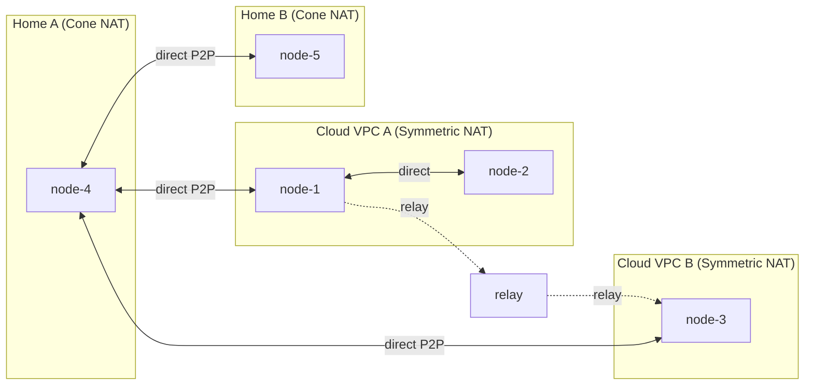

# WireKube

**Serverless P2P WireGuard Mesh VPN for Kubernetes**

WireKube creates a WireGuard mesh network between Kubernetes nodes using CRDs as the coordination plane. No central VPN server, no external etcd, no coordination service. Nodes discover each other through `WireKubePeer` CRDs and establish direct WireGuard tunnels. Cone ↔ Symmetric NAT pairs achieve direct P2P (the Cone side's stable mapping enables handshake). Only Symmetric ↔ Symmetric pairs fall back to TCP relay.

The NAT traversal design draws from [Tailscale's architecture](https://tailscale.com/blog/how-nat-traversal-works): relay-first for immediate connectivity, parallel direct path probing, and transparent upgrade when a better path is found.

---

## Why WireKube?

Kubernetes clusters increasingly span multiple clouds, VPCs, and on-premises networks. Traditional solutions (VPC peering, dedicated VPN appliances, complex overlays) are expensive, rigid, or vendor-locked. WireKube takes a different approach:

- **No central VPN server** — Kubernetes API itself is the control plane
- **Works everywhere** — AWS, GCP, Azure, OCI, bare metal, home labs behind NAT
- **Handles Symmetric NAT** — RFC 5780 detection, Cone ↔ Symmetric direct P2P, Symmetric ↔ Symmetric relay with reconnect
- **Relay resilience** — Auto-reconnect with exponential backoff, multi-instance pool, direct path recovery
- **IPSec coexistence** — xfrm bypass prevents conflicts with existing site-to-site tunnels
- **CNI compatible** — Routes only node IPs (`/32`), never touches pod CIDRs
- **Crash-safe** — initContainer cleanup + routing table isolation survives pod crashes and node reboots

## Key Features

| Feature | Description |
|---------|-------------|
| **Serverless Mesh** | K8s CRDs for coordination — no VPN server needed |
| **Three-tier NAT Traversal** | STUN discovery → direct P2P → TCP relay fallback |
| **Symmetric NAT Detection** | RFC 5780 multi-server STUN identifies endpoint-dependent mapping |
| **Relay Auto-Reconnect** | Exponential backoff (1s–30s), proxy persistence across reconnections |
| **Relay Pool Scaling** | DNS-based multi-instance discovery with failover |
| **Direct Path Recovery** | Periodic probing upgrades relayed peers back to direct |
| **IPSec Bypass** | `disable_xfrm` + `disable_policy` on WireGuard interface |
| **Multi-Cloud / Multi-Arch** | Any K8s cluster, `amd64` + `arm64` |
| **CNI Safe** | Routes only node IPs, pod CIDRs untouched |

## How It Works

1. The **Agent DaemonSet** runs on each node with `hostNetwork: true`
2. Each agent creates a WireGuard interface (`wire_kube`) and generates a key pair
3. STUN discovery finds the node's public endpoint and detects NAT type
4. The agent registers itself as a **WireKubePeer** CRD with its public key and endpoint
5. All agents watch all WireKubePeer CRDs and configure WireGuard peers
6. Direct P2P handshake is attempted first; if it times out, traffic routes through the **TCP relay**
7. The relay preserves WireGuard end-to-end encryption — it cannot decrypt traffic
8. Periodically, the agent re-probes direct paths and upgrades back from relay when possible

## Quick Links

- [Quick Start](getting-started/quickstart.md) — Get a mesh running in 5 minutes
- [Architecture](architecture/overview.md) — How WireKube works under the hood
- [NAT Traversal](architecture/nat-traversal.md) — STUN, relay, and direct recovery
- [Relay Design](architecture/relay.md) — Protocol, failover, and scaling
- [Troubleshooting](operations/troubleshooting.md) — Common issues and fixes
- [CRD Reference](reference/crds.md) — Complete CRD specification
