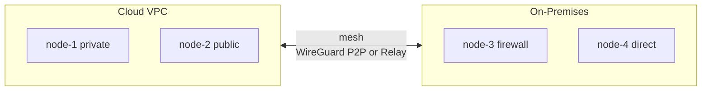

# WireKube

**Serverless P2P WireGuard Mesh VPN for Kubernetes**

WireKube creates a WireGuard mesh network between Kubernetes nodes using CRDs as the coordination plane. No central VPN server required.

---

## Why WireKube?

Kubernetes nodes often span multiple VPCs, clouds, or on-premises data centers.
Traditional approaches require VPC peering, dedicated VPN appliances, or complex
overlay networks. WireKube takes a different approach:

- **No central VPN server** — Kubernetes API itself is the control plane
- **Works everywhere** — AWS, GCP, Azure, NCloud, bare metal, home labs
- **Handles Symmetric NAT** — Automatic relay fallback for restrictive NAT environments
- **CNI compatible** — Works alongside Cilium, Calico, AWS VPC CNI without modifications
- **Lightweight** — Single Go binary, ~10MB memory per node

## Key Features

| Feature | Description |
|---------|-------------|
| **Serverless Mesh** | No dedicated VPN server — uses K8s CRDs for coordination |
| **Universal NAT Traversal** | STUN discovery + TCP relay for Symmetric NAT |
| **Multi-Cloud** | Works across any Kubernetes cluster, any provider |
| **CNI Safe** | Routes only node IPs (/32), never touches pod CIDRs |
| **Multi-Arch** | amd64 and arm64 support |
| **Minimal Privileges** | Only needs `NET_ADMIN` + `SYS_MODULE` capabilities |

## How It Works

1. **Agent DaemonSet** runs on each labeled node
2. Agent creates a WireGuard interface (`wire_kube`) and generates a key pair
3. Agent registers itself as a **WireKubePeer** CRD
4. Agent watches all WireKubePeer CRDs and configures WireGuard peers
5. Endpoint discovery determines the best reachable address
6. If direct P2P fails (Symmetric NAT), traffic routes through a **TCP relay**

## Quick Links

- [Quick Start](getting-started/quickstart.md) — Get a mesh running in 5 minutes
- [Architecture](architecture/overview.md) — How WireKube works under the hood
- [Troubleshooting](operations/troubleshooting.md) — Common issues and fixes
- [CRD Reference](reference/crds.md) — Complete CRD specification
