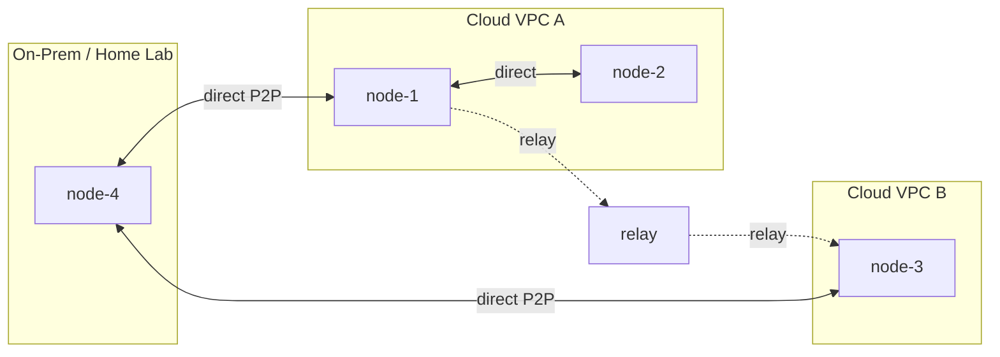

# WireKube

**Connect Kubernetes nodes across any network — no VPN server required.**

WireKube builds a WireGuard mesh between your Kubernetes nodes using only CRDs for coordination. It automatically handles NAT traversal, falls back to TCP relay when direct P2P isn't possible, and preserves WireGuard's end-to-end encryption throughout.

The NAT traversal design draws from [Tailscale's architecture](https://tailscale.com/blog/how-nat-traversal-works): relay-first for immediate connectivity, parallel direct path probing, and transparent upgrade when a better path is found.

---

## When Do You Need WireKube?

Kubernetes clusters increasingly span multiple clouds, VPCs, and on-premises networks. Traditional solutions — VPC peering, dedicated VPN appliances, complex overlays — are expensive, rigid, or vendor-locked.

WireKube is for you if:

- **Your nodes span multiple networks** — Multi-cloud, hybrid cloud, or edge nodes that need to communicate directly without VPC peering or VPN appliances.
- **You have nodes behind NAT** — On-premises or home lab nodes behind restrictive NATs that need to join a cloud-hosted cluster. WireKube detects NAT types and finds the best path automatically.
- **You use managed K8s with remote nodes** — EKS Hybrid Nodes or similar setups where remote workers lack direct network connectivity to the control plane VPC.
- **You want lightweight node-to-node encryption** — WireGuard encryption between nodes without deploying a full VPN infrastructure or modifying your CNI.

## Key Features

| Feature | Description |
|---------|-------------|
| **No coordination server** | Kubernetes CRDs are the only control plane — no external dependencies |
| **Automatic NAT traversal** | STUN discovery → direct P2P → TCP relay fallback, fully automatic |
| **Direct path recovery** | Periodically re-probes relayed peers and upgrades to direct when possible |
| **Virtual Gateway** | Cross-VPC routing with HA failover via `WireKubeGateway` CRD |
| **CNI compatible** | Routes only node IPs (`/32`); never touches pod CIDRs |
| **Relay pool scaling** | DNS-based multi-instance relay discovery with automatic failover |
| **Prometheus metrics** | Peer latency, traffic, connection state, transport mode on `:9090/metrics` |
| **Multi-arch** | `linux/amd64` and `linux/arm64` |

## How It Works

1. An **Agent DaemonSet** runs on each node, creates a WireGuard interface, and discovers its public endpoint via STUN
2. Each agent registers itself as a **WireKubePeer** CRD with its public key and endpoint
3. All agents watch all WireKubePeer CRDs and configure WireGuard peers accordingly
4. Direct P2P handshake is attempted first; if it times out, traffic routes through the **TCP relay**
5. The relay preserves WireGuard end-to-end encryption — it cannot decrypt traffic
6. Periodically, the agent re-probes direct paths and upgrades back from relay when possible

No coordination server, no external etcd, no control plane beyond the Kubernetes API itself.

## Quick Links

- [Quick Start](getting-started/quickstart.md) — Get a mesh running in minutes
- [Local Playground](guides/local-playground.md) — Try WireKube with Docker containers
- [Installation](getting-started/installation.md) — Detailed setup guide
- [Configuration](getting-started/configuration.md) — WireKubeMesh spec, relay modes, annotations
- [Architecture](architecture/overview.md) — How WireKube works under the hood
- [NAT Traversal](architecture/nat-traversal.md) — STUN, ICE negotiation, relay protocol
- [Gateway](architecture/gateway.md) — Cross-VPC routing with WireKubeGateway
- [Monitoring](operations/monitoring.md) — Prometheus metrics and Grafana dashboards
- [Troubleshooting](operations/troubleshooting.md) — Common issues and fixes
- [CRD Reference](reference/crds.md) — Complete API specification
