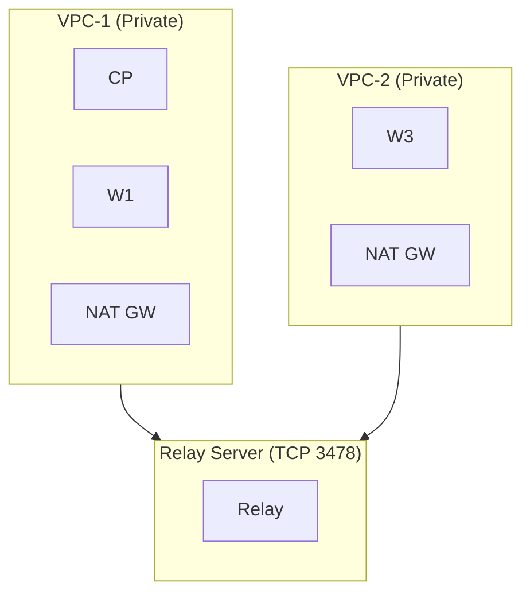
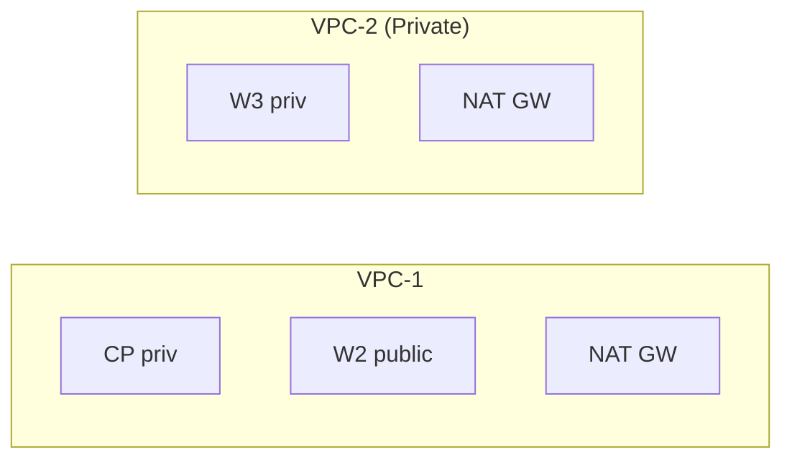
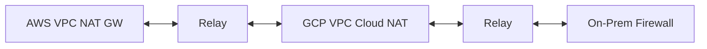
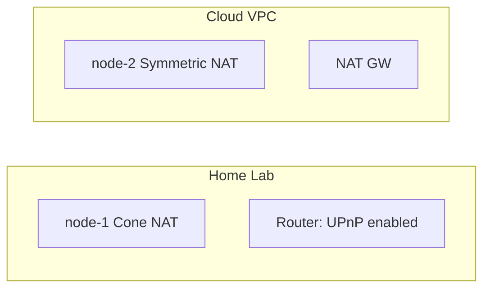
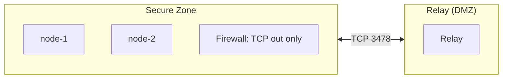
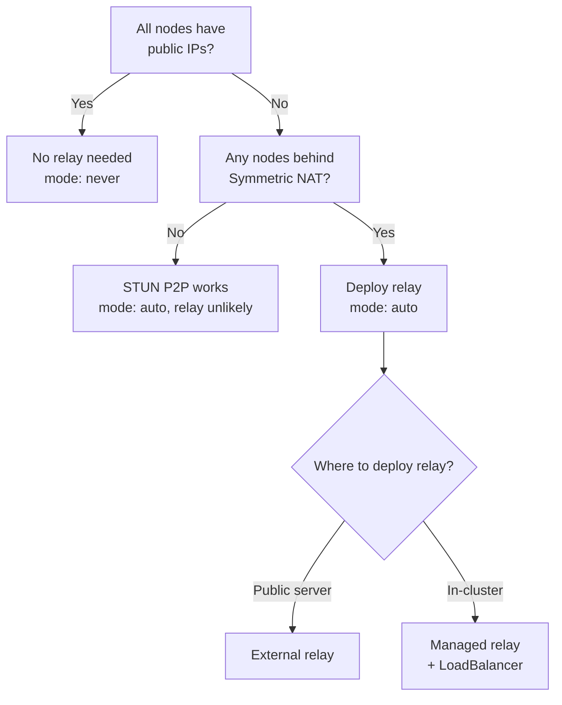

# Deployment Topologies

WireKube adapts to various network topologies automatically. This page
describes common deployment patterns and their expected behavior.

## Topology 1: All Private (Cloud NAT)

All nodes are in private subnets behind NAT gateways.

| Path | Mode | Why |
|------|------|-----|
| CP ↔ W1 (same VPC) | Direct | Same subnet, no NAT |
| CP ↔ W3 (cross VPC) | Relay | Both behind Symmetric NAT |
| W1 ↔ W3 (cross VPC) | Relay | Both behind Symmetric NAT |

**Relay is essential.** Without it, cross-VPC communication is impossible
when both sides are behind Symmetric NAT.

## Topology 2: Mixed (Private + Public)

Some nodes have public IPs, others are behind NAT.

| Path | Mode | Why |
|------|------|-----|
| CP ↔ W2 (same VPC) | Direct | Same subnet |
| W2 ↔ W3 (cross VPC) | Direct | W2 has public IP, W3 can reach it directly |
| CP ↔ W3 (cross VPC) | Relay | Both behind Symmetric NAT |

**Public IP nodes act as anchor points.** Any peer can reach them directly
via their public endpoint. This reduces relay dependency.

## Topology 3: Multi-Cloud

Nodes span multiple cloud providers.

| Path | Mode | Why |
|------|------|-----|
| AWS ↔ GCP | Relay | Both behind Symmetric NAT (cloud NAT) |
| AWS ↔ On-Prem (public) | Direct | On-prem has public IP |
| GCP ↔ On-Prem (public) | Direct | On-prem has public IP |

WireKube works identically across clouds. The relay server can be deployed
anywhere with TCP reachability from all nodes.

## Topology 4: Home Lab + Cloud

Mix of home network nodes and cloud nodes.

| Path | Mode | Why |
|------|------|-----|
| Home ↔ Cloud (private) | Relay | Cloud node is Symmetric NAT |
| Home ↔ Cloud (public IP) | Direct | Cloud node has public IP |
| Home ↔ Home (same LAN) | Direct | Same network |

Home routers typically use Cone NAT, which supports STUN-based endpoint
discovery. However, if the remote peer is behind Symmetric NAT, direct
P2P still fails — relay is needed.

## Topology 5: Air-Gapped with Bastion

Nodes behind a strict firewall with only outbound TCP allowed.

WireKube's TCP relay works through firewalls that allow outbound TCP.
Agents initiate outbound TCP connections to the relay — no inbound
ports need to be opened on the node's firewall.

## Choosing the Right Topology

