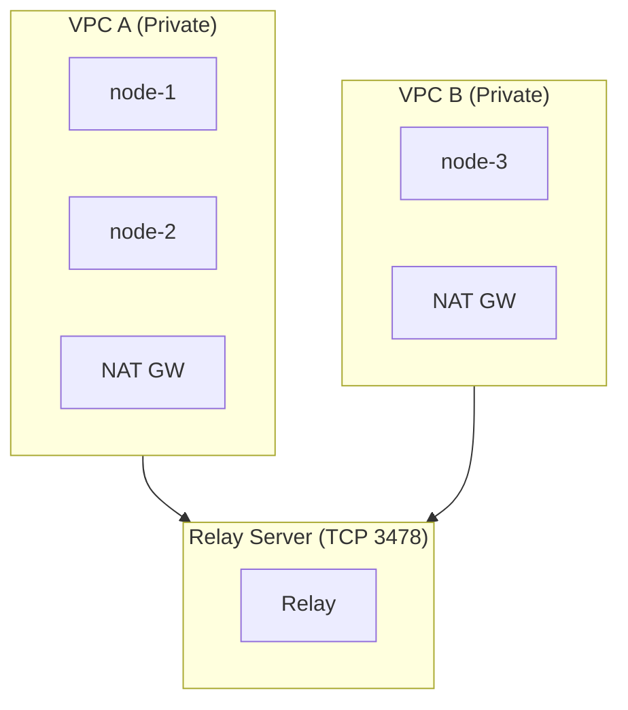
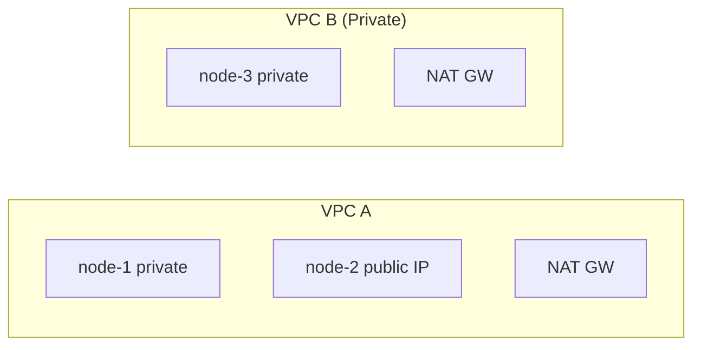
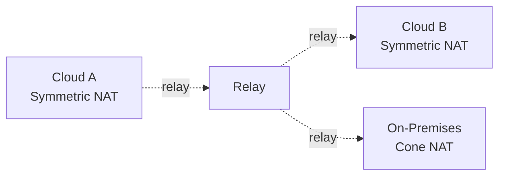
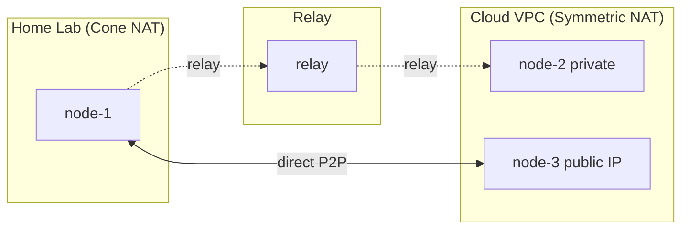
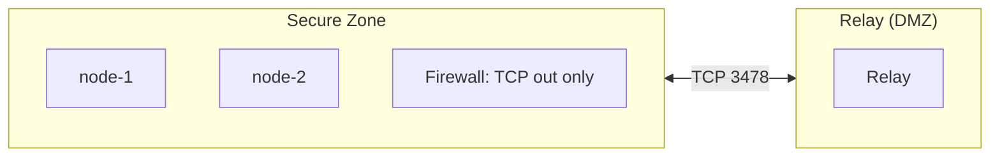
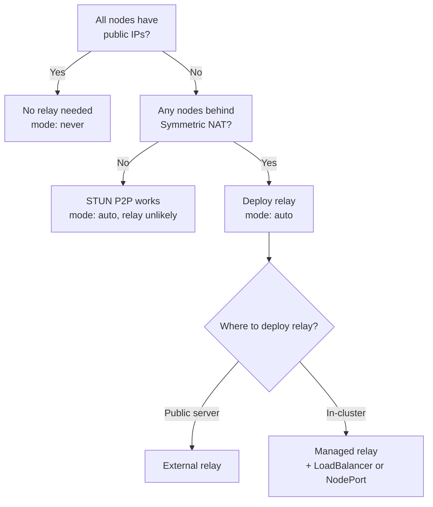

# Deployment Topologies

WireKube adapts to various network topologies automatically. This page
describes common deployment patterns and their expected behavior.

## Topology 1: All Private (Cloud NAT)

All nodes are in private subnets behind NAT gateways.

| Path | Mode | Why |
|------|------|-----|
| node-1 ↔ node-2 (same VPC) | Direct | Same subnet, no NAT between them |
| node-1 ↔ node-3 (cross VPC) | Relay | Both behind Symmetric NAT |
| node-2 ↔ node-3 (cross VPC) | Relay | Both behind Symmetric NAT |

**Relay is essential.** Without it, cross-VPC communication is impossible
when both sides are behind Symmetric NAT.

## Topology 2: Mixed (Private + Public)

Some nodes have public IPs, others are behind NAT.

| Path | Mode | Why |
|------|------|-----|
| node-1 ↔ node-2 (same VPC) | Direct | Same subnet |
| node-2 ↔ node-3 (cross VPC) | Direct | node-2 has public IP; node-3 can reach it |
| node-1 ↔ node-3 (cross VPC) | Relay | Both behind Symmetric NAT |

**Public IP nodes act as anchor points.** Any peer can reach them directly
via their public endpoint. This reduces relay dependency.

## Topology 3: Multi-Cloud

Nodes span multiple cloud providers, all behind Symmetric NAT.

| Path | Mode | Why |
|------|------|-----|
| Cloud A ↔ Cloud B | Relay | Both behind Symmetric NAT |
| On-Prem (Cone) ↔ Cloud A (Symmetric) | Relay | Symmetric side proactively uses relay |
| On-Prem (Cone) ↔ Cloud B (Symmetric) | Relay | Same reason |
| On-Prem ↔ On-Prem (Cone ↔ Cone) | Direct P2P | Both Cone NAT, STUN endpoints stable |

WireKube works identically across clouds. The relay server can be deployed
anywhere with TCP reachability from all nodes.

## Topology 4: Home Lab + Cloud

Mix of home network nodes and cloud nodes.

| Path | Mode | Why |
|------|------|-----|
| Home (Cone) ↔ Cloud (Symmetric NAT) | Relay | Symmetric side proactively enables relay |
| Home (Cone) ↔ Cloud (public IP) | Direct P2P | Public IP always reachable |
| Home ↔ Home (same LAN) | Direct | Same network |
| Cloud (Symmetric) ↔ Cloud (Symmetric, different VPC) | Relay | Both behind Symmetric NAT |

Home routers typically use Cone NAT (Endpoint-Independent Mapping).
In WireKube, Symmetric NAT nodes proactively enable relay for all
peers — so Cone-to-Symmetric pairs also use relay. Direct P2P only
works between Cone-to-Cone peers or when the remote has a public IP.

## Topology 5: Air-Gapped with Outbound TCP

Nodes behind a strict firewall with only outbound TCP allowed.

WireKube's TCP relay works through firewalls that allow outbound TCP.
Agents initiate outbound TCP connections to the relay — no inbound
ports need to be opened on the node's firewall.

## Choosing the Right Topology

