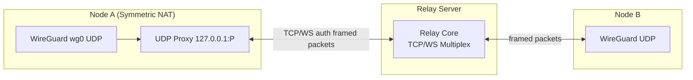

# WireKube Relay System — Implementation Design

> Design for relay fallback when direct WireGuard P2P fails (Symmetric NAT, restrictive firewalls).
> Similar to Tailscale DERP / WebRTC TURN.

---

## 1. Overview



---

## 2. Go Package Structure

- **cmd/**
  - operator/main.go
  - agent/main.go
  - relay/main.go *(NEW: Relay server binary)*
  - wirekubectl/main.go
- **pkg/**
  - **relay/** *(NEW: Shared relay protocol)*
    - protocol.go — Framing, message types, constants
    - auth.go — Mesh key / public key auth
    - conn.go — TCP/WS connection wrapper
  - **agent/**
    - agent.go, endpoint.go
    - **relay/** *(NEW: Agent-side relay client)*
      - client.go — RelayClient, connects to relay
      - udpproxy.go — Local UDP proxy (127.0.0.1:port)
      - fallback.go — P2P vs relay decision logic
      - pool.go — Port allocation for proxies
    - nat/
  - wireguard/interface.go
- **internal/**
  - **relay/** *(NEW: Server-side, not exported)*
    - server.go — Accept connections, route packets
    - session.go — Per-agent session state
    - router.go — Route packets by peer public key

---

## 3. Protocol Framing (UDP over TCP)

WireGuard UDP packets must be framed over TCP/WebSocket. Use a simple length-prefixed binary protocol:

```go
// pkg/relay/protocol.go

package relay

import "encoding/binary"

const (
	// Frame header: 4 bytes length (big-endian) + payload
	// Max UDP payload: 65535 (WireGuard max ~1420 typically)
	MaxFrameSize = 65536
	HeaderSize   = 4
)

// Frame format:
// [4 bytes: payload length (uint32 BE)] [N bytes: payload]
// For data frames: payload = [32 bytes dest pubkey][UDP bytes]
// Length 0 = keepalive / ping (no payload)
// Length 0xFFFFFFFF = error/close (payload = error message)

func WriteFrame(conn io.Writer, payload []byte) error {
	length := uint32(len(payload))
	if length > MaxFrameSize {
		return ErrFrameTooLarge
	}
	return binary.Write(conn, binary.BigEndian, length)
	// then conn.Write(payload)
}

func ReadFrame(conn io.Reader) ([]byte, error) {
	var length uint32
	if err := binary.Read(conn, binary.BigEndian, &length); err != nil {
		return nil, err
	}
	if length == 0 {
		return nil, nil // keepalive
	}
	if length == 0xFFFFFFFF {
		// read error message
	}
	if length > MaxFrameSize {
		return nil, ErrInvalidFrame
	}
	buf := make([]byte, length)
	_, err := io.ReadFull(conn, buf)
	return buf, err
}
```

**Control messages** (sent before first data frame):

```go
// Client -> Server: Register
type RegisterMsg struct {
	Version   uint8    // 1
	PublicKey [32]byte // WireGuard public key (agent identity)
	MeshKey   string   // Optional: shared secret for mesh auth
}

// Server -> Client: RegisterAck
type RegisterAckMsg struct {
	Version uint8
	OK      bool
	Reason  string // if !OK
}

// Client -> Server: ConnectToPeer (request relay to peer)
type ConnectToPeerMsg struct {
	PeerPublicKey [32]byte
}

// Server -> Client: PeerConnected / PeerDisconnected
```

---

## 4. Relay Server Binary (cmd/relay/main.go)

### 4.1 Responsibilities

- Listen on TCP (and optionally WebSocket) for agent connections
- Authenticate agents via WireGuard public key + optional mesh key
- Maintain a registry: `publicKey → active session`
- When agent A sends a packet for peer B: lookup B's session, forward frame
- Handle reconnection (same publicKey replaces old session)

### 4.2 Key Types

```go
// internal/relay/server.go

type Server struct {
	listenAddr string
	meshKey    string   // optional, from env
	sessions   *SessionRegistry
}

type SessionRegistry struct {
	mu       sync.RWMutex
	sessions map[string]*Session // key = base64(publicKey)
}

type Session struct {
	PublicKey [32]byte
	Conn      net.Conn
	SendCh    chan []byte
	Done      chan struct{}
}
```

### 4.3 Packet Routing

Data frames include a destination peer public key (32 bytes) prefix:

```
Frame format for data: [4B length][32B dest pubkey][N bytes UDP payload]
```

```
Agent A sends frame {dest: B's pubkey, payload: UDP bytes}
  -> Server looks up B's Session
  -> If found: enqueue frame to B's SendCh (strip dest, forward payload only)
  -> If not: drop (or buffer briefly for reconnecting peer)
```

### 4.4 Deployment

- Standalone binary: `wirekube-relay --listen :443 --mesh-key <secret>`
- Env override: `WIREKUBE_RELAY_MESH_KEY`
- Deploy anywhere: cloud VM, K8s Service with LoadBalancer, container behind nginx
- TLS: use reverse proxy (nginx, Caddy) for termination; relay speaks plain TCP internally or use `--tls-cert` / `--tls-key`

---

## 5. Agent-Side Relay Client (pkg/agent/relay/)

### 5.1 RelayClient

```go
// pkg/agent/relay/client.go

type RelayClient struct {
	relayAddr   string        // e.g. "relay.example.com:443"
	meshKey     string
	publicKey   [32]byte
	conn        net.Conn
	proxies     map[string]*UDPProxy // key = peer public key (base64)
	mu          sync.RWMutex
	reconnectCh chan struct{}
}

func (c *RelayClient) Connect(ctx context.Context) error
func (c *RelayClient) RegisterPeer(peerPubKey string, proxy *UDPProxy) error
func (c *RelayClient) UnregisterPeer(peerPubKey string)
func (c *RelayClient) SendToPeer(peerPubKey string, payload []byte) error
func (c *RelayClient) Close() error
```

### 5.2 UDP Proxy Design

**One proxy per peer** (recommended). Simpler, no multiplexing logic, clear 1:1 mapping.

**Packet flow (bidirectional):**

| Direction | Source | Sink |
|-----------|--------|------|
| **Outbound** | WireGuard sends to 127.0.0.1:listenPort (peer endpoint) | Proxy reads from UDP socket → forwards to relay via TCP |
| **Inbound** | Relay delivers packet from remote agent | Proxy writes to 127.0.0.1:wgListenPort (WireGuard's listen port) |

**Key insight:** WireGuard identifies peers by the inner encrypted payload (sender's public key), not by outer UDP source. So when we inject packets via `WriteTo(127.0.0.1:wgListenPort)`, WireGuard accepts them. We use the **same** UDP socket for both directions: it is bound to 127.0.0.1:listenPort, so WireGuard (with endpoint 127.0.0.1:listenPort) expects replies from that address. Our `WriteTo` uses that socket, so the source is correct.

**WireGuard keepalive and handshake:** No special handling. They are normal UDP packets; proxy forwards them transparently.

```go
// pkg/agent/relay/udpproxy.go

// UDPProxy bridges WireGuard UDP ↔ Relay TCP for one peer.
// - Binds 127.0.0.1:listenPort (WireGuard peer endpoint points here)
// - Outbound: WireGuard sends -> proxy ReadFrom -> relay.SendToPeer
// - Inbound: relay delivers -> proxy WriteTo(127.0.0.1:wgListenPort) -> WireGuard receives
type UDPProxy struct {
	listenPort   int       // allocated port; WireGuard uses this as peer endpoint
	wgListenPort int       // WireGuard's listen port; we inject received packets here
	peerPubKey   string
	relay        *RelayClient
	conn         *net.UDPConn
	done         chan struct{}
}

func (p *UDPProxy) Start() error
func (p *UDPProxy) Stop()
func (p *UDPProxy) Deliver(payload []byte)  // called by RelayClient when packet arrives from relay
```

### 5.3 Port Allocation

```go
// pkg/agent/relay/pool.go

const (
	RelayProxyPortMin = 51830
	RelayProxyPortMax = 51920
)

type PortPool struct {
	used map[int]struct{}
	mu   sync.Mutex
}

func (p *PortPool) Allocate() (int, error)
func (p *PortPool) Release(port int)
```

---

## 6. CRD Changes

### 6.1 WireKubeMesh

```go
// pkg/api/v1alpha1/wirekubemesh_types.go — additions to Spec

// RelayServer is the address of the relay server for NAT traversal fallback.
// Format: "host:port" (e.g. "relay.example.com:443").
// When empty, relay fallback is disabled.
// +optional
RelayServer string `json:"relayServer,omitempty"`

// RelayMode controls when the agent uses the relay.
// - "auto": try direct P2P first, fall back to relay on handshake failure
// - "always": always use relay for all peers (testing/debugging)
// - "never": never use relay (default when RelayServer is empty)
// +kubebuilder:default=auto
// +kubebuilder:validation:Enum=auto;always;never
RelayMode string `json:"relayMode,omitempty"`

// RelayMeshKey is an optional shared secret for relay authentication.
// When set, agents must present this to connect.
// For production: use RelayMeshKeyFromSecret instead to avoid storing in CR.
// +optional
RelayMeshKey string `json:"relayMeshKey,omitempty"`

// RelayMeshKeyFromSecret references a Secret containing the mesh key.
// Format: "namespace/name" or "name" (same namespace as operator).
// Key in Secret: "mesh-key" or "relay-mesh-key"
// +optional
RelayMeshKeyFromSecret string `json:"relayMeshKeyFromSecret,omitempty"`
```

### 6.2 WireKubePeer Status

```go
// pkg/api/v1alpha1/wirekubepeer_types.go — additions to Status

// TransportMode is how we reach this peer: "direct" or "relay"
// +optional
TransportMode string `json:"transportMode,omitempty"`

// RelayLatencyMs is the last measured RTT to peer via relay (when using relay).
// +optional
RelayLatencyMs int64 `json:"relayLatencyMs,omitempty"`
```

### 6.3 WireKubePeer Spec (optional override)

```go
// Per-peer override: force relay for this peer
// +optional
ForceRelay bool `json:"forceRelay,omitempty"`
```

---

## 7. P2P Detection and Fallback Logic

### 7.1 Decision Flow

```go
// pkg/agent/relay/fallback.go

const (
	HandshakeTimeout     = 30 * time.Second
	RelayProbeInterval   = 60 * time.Second
	DirectProbeInterval  = 120 * time.Second
)

// For each peer, agent maintains:
type PeerTransportState struct {
	PeerPubKey    string
	Mode          string // "direct" | "relay" | "unknown"
	LastHandshake time.Time
	LastProbe     time.Time
}

// On sync:
// 1. If RelayMode == "never" or RelayServer == "" -> always direct
// 2. If RelayMode == "always" -> always relay (endpoint = 127.0.0.1:proxyPort)
// 3. If RelayMode == "auto":
//    a. Start with direct (endpoint = peer's discovered endpoint)
//    b. If no handshake within HandshakeTimeout -> switch to relay
//    c. If on relay and LastHandshake > 3min ago -> stay on relay
//    d. Periodic probe: every DirectProbeInterval, try direct again
//       - If handshake succeeds within 10s -> upgrade to direct
//       - Else stay on relay
```

### 7.2 Integration with Agent.sync()

```go
// In agent.go sync():
// 1. Build wgPeers as today
// 2. For each peer, call fallback.DecideEndpoint(peer, mesh, stats)
//    - Returns (endpoint string, useRelay bool)
// 3. If useRelay: endpoint = "127.0.0.1:" + proxyPort, ensure proxy running
// 4. If direct: endpoint = peer.Spec.Endpoint, stop proxy if any
// 5. Update WireKubePeer status: TransportMode, RelayLatencyMs
```

### 7.3 Handshake Timeout Detection

- WireGuard handshake timeout: ~5–15s typically
- We use 30s: if `LastHandshake` is zero or >30s old after first attempt, switch to relay
- GetStats() provides LastHandshake per peer

---

## 8. MTU Considerations

- WireGuard default MTU: 1420
- Relay encapsulation: 4-byte length + payload. Overhead = 4 bytes
- TCP/WebSocket adds more (TCP header ~20, TLS ~40). But we're not doing IP fragmentation — we're framing whole UDP payloads. The UDP payload is already the WireGuard packet (max ~1420). So we're fine.
- Recommendation: use mesh MTU as-is. If issues arise, reduce by 64 (e.g. 1356) for relay peers only.

---

## 9. Error Handling and Reconnection

### 9.1 Relay Client

- Connection drop → exponential backoff reconnect (1s, 2s, 4s, max 60s)
- On reconnect: re-register, re-establish peer proxies
- If relay unavailable: fall back to direct only (no relay)

### 9.2 Relay Server

- Client disconnect → remove from session registry
- Stale session cleanup: remove sessions with no activity for 5 minutes

### 9.3 Proxy Lifecycle

- Proxy starts when peer switches to relay
- Proxy stops when peer switches to direct or peer removed
- Port released to pool on stop

---

## 10. Integration Points with Existing Agent

### 10.1 agent.go Changes

```go
// NewAgent: add optional RelayClient
type Agent struct {
	client     client.Client
	wgMgr      *wireguard.Manager
	nodeName   string
	syncEvery  time.Duration
	relay      *relay.RelayClient  // nil if relay disabled
	fallback   *relay.FallbackMgr
}

// setup(): if mesh.Spec.RelayServer != "" && mesh.Spec.RelayMode != "never":
//   - Create RelayClient, connect in background
//   - Create FallbackMgr with relay client ref

// sync(): for each peer:
//   endpoint, useRelay := a.fallback.DecideEndpoint(ctx, peer, mesh, stats)
//   if useRelay:
//     port := a.relay.EnsureProxy(peer.Spec.PublicKey)
//     endpoint = fmt.Sprintf("127.0.0.1:%d", port)
//   wgPeers[i].Endpoint = endpoint
```

### 10.2 WireGuard Interface

- No changes. We only change the `Endpoint` we pass to SyncPeers.
- When endpoint is 127.0.0.1:port, WireGuard sends to our proxy. Kernel WireGuard unchanged.

### 10.3 main.go

- No structural changes. RelayClient created inside Agent when mesh config specifies relay.

---

## 11. Authentication

### 11.1 Mesh Key (Recommended)

- WireKubeMesh.Spec.RelayMeshKey (or from Secret ref)
- Agent sends mesh key in RegisterMsg
- Relay verifies; rejects if mismatch

### 11.2 Public Key Only

- Relay can allow connections with only WireGuard public key (no mesh key)
- Useful for open relay (less secure)

---

## 12. WebSocket Support (Optional Phase 2)

- Same framing over WebSocket binary frames
- Use `github.com/gorilla/websocket`
- Env: `WIREKUBE_RELAY_USE_WS=true` or relay URL `wss://...`
- Helps with HTTP proxies, load balancers that buffer TCP

---

## 13. Implementation Order

1. **Phase 1: Protocol + Relay Server**
   - pkg/relay/protocol.go, auth.go
   - internal/relay/server.go, session.go, router.go
   - cmd/relay/main.go

2. **Phase 2: Agent Relay Client**
   - pkg/agent/relay/client.go, udpproxy.go, pool.go
   - Manual testing: run relay, two agents with RelayMode=always

3. **Phase 3: CRD + Fallback**
   - WireKubeMesh + WireKubePeer CRD changes
   - pkg/agent/relay/fallback.go
   - Agent integration

4. **Phase 4: Polish**
   - Reconnection, status reporting, wirekubectl relay status

---

## 14. Key Interfaces Summary

```go
// pkg/relay/protocol.go
type FrameReader interface{ ReadFrame() ([]byte, error) }
type FrameWriter interface{ WriteFrame([]byte) error }

// pkg/agent/relay/client.go
type RelayClient interface {
	Connect(ctx context.Context) error
	EnsureProxy(peerPubKey string, wgListenPort int) (listenPort int, err error)
	RemoveProxy(peerPubKey string)
	Close() error
}

// pkg/agent/relay/fallback.go
type FallbackManager interface {
	DecideEndpoint(peer *WireKubePeer, mesh *WireKubeMesh, stats []PeerStats) (endpoint string, useRelay bool)
}
```
